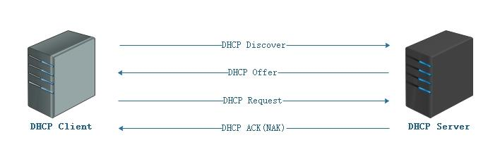

1. DHCP 简介

2. DHCP 工作 原理 （ 租约 四部曲+ 续租） ）

2.1 DHCP 客户端进行 IP 请求

2.2 DHCP 服务器 服务器 响应 请求	

  2.3 DHCP 客户机选择 IP

  2.4 DHCP 服务器确认租约

2.5 DHCP 客户机续租

# 1. DHCP 简介

  DHCP（Dynamic Host Configuration Protocol，动态主机配置协议）是一个工作在应用层的局域网网络协议，数

据传输时使用 UDP 不可靠传输协议工作，通常被应用在大型的局域网络环境中，主要作用是集中的管理、分配网络资

源，使网络环境中的主机能动态的获得 IP 地址、Gateway 地址、DNS 服务器地址等信息，并能够提升地址的使用率。

# 2. DHCP 工作 原理 （ 租约 四部曲+ 续租） ）

# 

## 2.1 DHCP 客户端进行 IP 请求

  当一个 DHCP 客户机启动时，会自动将自己的 IP 地址配置成 0.0.0.0，由于使用 0.0.0.0 不能进行正常通信，所

以客户机就必须通过 DHCP 服务器来获取一个合法的地址。由于客户机不知道 DHCP 服务器的 IP 地址，所以它 使用 0.0.

0 0.0 的地址作为源地址，使用 5 255.255.255.255 作为目标地址，使用 UDP 7 67 端口作为目的端口来广播请求 P IP 地址信

息。广播信息 DHCP Discover 中包含了 DHCP 客户机的 MAC 地址和计算机名，以便使 DHCP 服务器能确定是哪个客户机

发送的请求。

## 2.2 DHCP 服务器 服务器 响应 请求	

  当DHCP服务器接收到客户机请求IP地址的信息时，它就在自己的IP地址池中查找是否有合法的IP地址提供给客户

机。如果有，DHCP服务器就将此IP地址做上标记，加入到DHCP OFFER的消息中，然后DHCP服务器就广播一则包括下列

信息的DHCP OFFER消息：

  DHCP客户机的MAC地址；DHCP服务器提供的合法IP地址；子网掩码；默认网关（路由）；租约的期限；DHCP服务器

的IP地址-MAC。

  因为DHCP客户机还没有IP地址，所以 DHCP 服务器使用自己的 IP 地址作为源地址，使用 255.255.255.255 作为目标地

址，使用 UDP 68 端口作为 源 端 口 来广播 DHCP OFFER 信息

##   2.3 DHCP 客户机选择 IP

  DHCP客户机从接收到的第一个DHCP OFFER消息中选择IP地址，发出IP地址的DHCP服务器将该地址保留，这样该地

址就不能提供给另一个DHCP客户机。当客户机从第一个DHCP服务器接收DHCP OFFER并选择IP地址后，DHCP租约的第三

过程发生。客户机将DHCP REQUEST消息广播到所有的DHCP服务器，表明它接受提供的内容。DHCP REQUEST消息包括为

该客户机提供IP配置的服务器的服务标识符（IP地址）。DHCP服务器查看服务器标识符字段，以确定它自己是否被选

择为指定的客户机提供IP地址，如果那些DHCP OFFER被拒绝，则DHCP服务器会取消提供并保留其IP地址以用于下一个

IP租约请求。

  在客户机选择IP的过程中，虽然客户机选择了IP地址，但是还没有配置IP地址，而在一个网络中可能有几个DHCP

服务器，所以 客户机仍然使用 0.0.0.0 的地址作为源地址，使用 255.255.255.255 作为目标地址，使用 UDP 67 端口作为

目的端口来广播 DHCP REQUEST 信息

##   2.4 DHCP 服务器确认租约

  服务器确认租约： DHCP ACK K

  DHCP服务器接收到DHCP REQUEST消息后，以DHCPACK消息的形式向客户机广播成功的确认，该消息包含有IP地址

的有效租约和其他可能配置的信息。虽然服务器确认了客户机的租约请求，但是客户机还没有收到服务器的DHCPACK

消息，所以 服务器仍然使用自己的 IP 地址作为源地址，使用 255.255.255.255 作为目标地址，使用 UDP 68 端口作为 源

端口来广播 DHCP ACK 信息。当客户机收到DHCP ACK消息时，它就配置了IP地址，完成了TCP/IP的初始化。

服务器 拒绝 租约： DHCP N N ACK （ DH CP NAK ）

  如果DHCP REQUEST不成功，例如客户机试图租约先前的IP地址，但该IP地址不再可用，或者因为客户机移到其他

子网，该IP无效时，DHCP服务器将广播否定确认消息DHCP NACK。当客户机接收到不成功的确认时，它将重新开始DHCP

租约过程。

  注1：如果DHCP客户机无法找到DHCP服务器，它将从TCP/IP的B类网段169.254.0.0/16中挑选一个IP地址作为自己

的IP地址，继续每隔5分钟尝试与DHCP服务器进行通讯，一旦与DHCP服务器取得联系，则客户机放弃自动配置的IP地址，

而使用DHCP服务器分配的IP地址。

  注2：DHCP客户机收到DHCP服务器回应的ACK报文后，通过地址冲突检测（arp）发现服务器分配的地址冲突或者

由于其他原因导致不能使用，则发送DECLINE报文，通知服务器所分配的IP地址不可用。

 

## 2.5 DHCP 客户机续租

## 

  DHCP客户机会在租期过去50%的时候，直接向为其提供IP地址的DHCP服务器发送DHCP REQUEST消息包。如果客户机

接收到该服务器回应的DHCP ACK消息包，客户机就根据包中所提供的新的租期以及其它已经更新的TCP/IP参数，更新

自己的配置，IP租用更新完成。如果没有收到该服务器的回复，则客户机继续使用现有的IP地址，因为当前租期还有

50%。

  如果在租期过去50%的时候没有更新，则DHCP客户机将在租期过去87.5%的时候再次向为其提供IP地址的DHCP服务

器联系。如果还不成功，到租约的100%时候，DHCP客户机必须放弃这个IP地址，重新申请。 如果此时无 DHCP 服务器可

用， DHCP 客户 机会使用 169.254.0.0/16 中随机的一个地址，并且每隔5 5