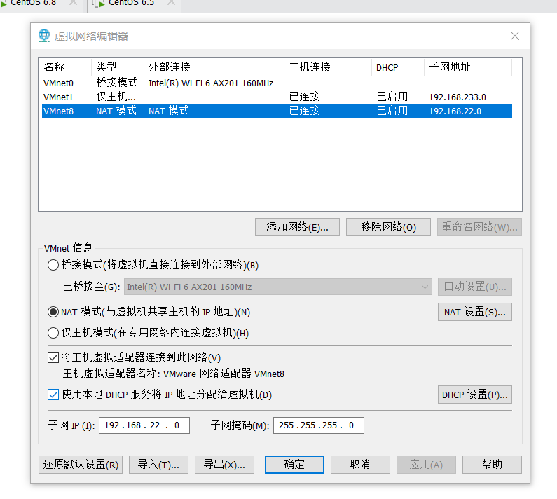
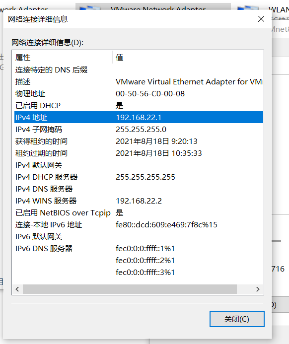
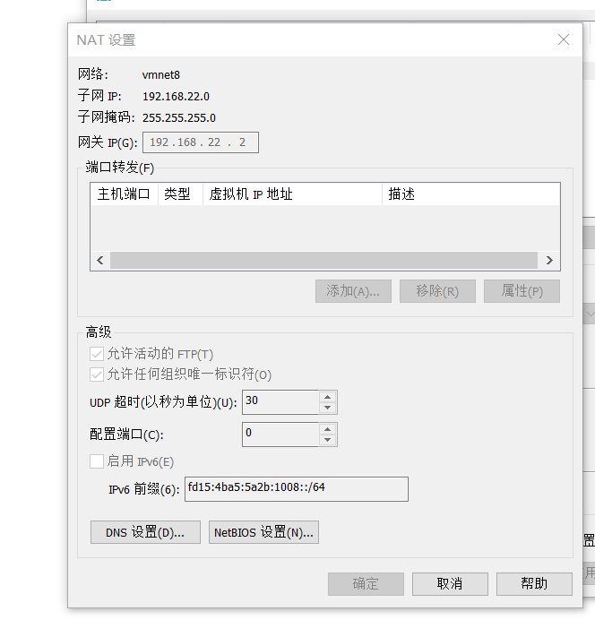
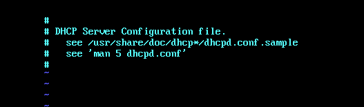

1、 准备实验环境


1）防护的关闭 ：

2）关闭Vmware 虚拟网络编辑器的DHCP功能（需要重启）

3）以为DHCP服务不在启用，所以无法自动获取IP，请手动配置IP

2、 DHCP 相关信息


1)软件 ：


3）端口 号 ：


4）配置文件：


3、 DHCP 配置文件详解


4.、DHCP 实验部署（基本功能试验）

1)安装软件：yum install -y dhcp  ;yum install -y dhcp-common(这个一般是默认安装的）

2）配置DHCP文件：

1）生成配置文件（根据vi    /etc/dhcp/dhcpd.conf提示）


2）修改配置文件


3） 重启服务


4）重启客户机的网卡（客户机设置为自动获取IP，并且不能使用桥接模式）

# 1、 准备实验环境


两台机器，网络连接模式设为自定义VMnet*模式

  （禁止使用桥接模式，因为此模式下DHCP无法关闭）


## 1）防护的关闭 ：


```javascript
1. iptables -L   #查看防火墙是否开启     iptables -F   #暂时关闭防火墙
2. getenforce    # 查看SELinux是否启用  
3. 关闭 Vmware 虚拟网络编辑器的 DHCP 功能 ，切记（永久）
```

## 2）关闭Vmware 虚拟网络编辑器的DHCP功能（需要重启）

- 将DHCP设置，左边框格里的钩去掉，然后点击应用，确定即可：



## 3）以为DHCP服务不在启用，所以无法自动获取IP，请手动配置IP

（如果是net模式，ip不能设置和虚拟网卡的一样，例如下图，IP就不能设置为192.168.22.1)




- net模式下网关默认设置为：192.168.22.2：（如图）




# 2、 DHCP 相关信息


## 1)软件 ：


```javascript
dhcp				 #DHCP服务软件包(需要安装：yum  install -y dhcp)
dhcp-common			 #DHCP命令软件包（默认已安装）
```

2）服务（需要完成配置文件后才能成功启动)：


```javascript
dhcpd 			 #DHCP服务名(启动服务：service dhcpd start)
dhcrelay			 #DHCP中继服务名
```

## 3）端口 号 ：


```javascript
udp 67 				#作为客户端的目标端口，接收客户端的请求DHCP请求

udp 68				 #作为服务器的源端口，用来向客户端回复数据包
```

## 4）配置文件：


```javascript
dhcpd /etc/dhcp/dhcpd.conf 	           		             #此配置文件默认是空的，需要找模板文件重新生成
dhcpd.conf.sample /usr/share/doc/dhcp-4.*.*/dhcpd.conf.sample
           #DHCP的模板配置文件
dhcrelay /etc/sysconfig/dhcrelay					     #该文件时中继配置文件，中继实验中用到
```


# 3、 DHCP 配置文件详解


```javascript
subnet 192.168.88.0 netmask 255.255.255.0｛  	 #声明要分配的网段和子网掩码
range 192.168.88.3 192.168.88.254；       		 #声明可用 IP 地址池
option domain-name "atguigu.com" ; 		 #设置 DNS 域
option domain-name-servers 8.8.8.8 ;		 #设置 DNS 服务器地址
option routers 192.168.88.2； 			 #默认网关的地址
option broadcast-address 192.168.88.255； 		 #广播地址（可不写）
default-lease-time 600； 				 #默认租约（s）
max-lease-time 7200； 			         #最大租约（s）
｝
```


---

# 4.、DHCP 实验部署（基本功能试验）


## 1)安装软件：yum install -y dhcp  ;yum install -y dhcp-common(这个一般是默认安装的）


## 2）配置DHCP文件：

- 打开配置文件： vi  /etc/dhcp/dhcpd.conf:

(如果如下图所示，根据提示寻找真正的配置文件：vi /usr/share/doc/dhcp*/dhcpd.conf.sample)

dhcpd.conf.sample  ：这是一个模板配置文件




## 


## 1）生成配置文件（根据vi    /etc/dhcp/dhcpd.conf提示）


```javascript
cp -a /usr/share/doc/dhcp-4.*.*/dhcpd.conf.sample /etc  /dhcp/dhcpd.conf
```

- 查看配置文件： vi  /usr/share/doc/dhcp-4.*.*/dhcpd.conf.sample

```javascript
root@bogon ~]# vi /usr/share/doc/dhcp-4.2.5/dhcpd.conf.example 

# dhcpd.conf
#
# Sample configuration file for ISC dhcpd
#

# option definitions common to all supported networks...
option domain-name "example.org";
option domain-name-servers ns1.example.org, ns2.example.org;

default-lease-time 600;
max-lease-time 7200;

# Use this to enble / disable dynamic dns updates globally.
#ddns-update-style none;

# If this DHCP server is the official DHCP server for the local
# network, the authoritative directive should be uncommented.
#authoritative;

# Use this to send dhcp log messages to a different log file (you also
# have to hack syslog.conf to complete the redirection).
log-facility local7;

# No service will be given on this subnet, but declaring it helps the 
# DHCP server to understand the network topology.

subnet 10.152.187.0 netmask 255.255.255.0 {
}

# This is a very basic subnet declaration.

"/usr/share/doc/dhcp-4.2.5/dhcpd.conf.example" 104L, 3262C  
```

- 将配置文件（dhcpd.conf.smaple)拷贝到  /etc/dhcp/ 下，并改名为dhcpd.comf:

```javascript
cp -a /usr/share/doc/dhcp-4.*.*/dhcpd.conf.sample /etc  /dhcp/dhcpd.conf
```

## 2）修改配置文件


将配置文件的前几个subnet声明注释掉。修改最后一个subnet声明


注 ： 注意配置文件中每行结尾的分号 和结束大括号 ！


```javascript
subnet 192.168.88.0 netmask 255.255.255.0｛       #subnet子网必须包含本地虚拟网卡IP     
range 192.168.88.3 192.168.88.254；
option domain-name "atguigu.com" ;                #可以不写
option domain-name-servers 8.8.8.8 ;              #可以不写
option routers 192.168.88.2；                     #可以不写
option broadcast-address 192.168.88.255；         #可以不写
default-lease-time 600；
max-lease-time 7200；
｝
```

## 3） 重启服务


```javascript
[root@bogon ~]# service dhcpd start
正在启动 dhcpd：                                           [确定]

```

## 4）重启客户机的网卡（客户机设置为自动获取IP，并且不能使用桥接模式）


- 指定网卡eth0重启：


```javascript
ifdown eth0；ifup eth0
```

-  查看客户机重启后的IP以及网卡的MAC地址：（地址为192.168.22.101  为DHCP服务IP池内的IP）

（MAC地址为：00:0c:29:b8:ba:6d ）

```javascript
[root@localhost ~]# ifconfig
ens33: flags=4163<UP,BROADCAST,RUNNING,MULTICAST>  mtu 1500
        inet 192.168.22.101  netmask 255.255.255.0  broadcast 192.168.22.255
        inet6 fe80::947b:7272:3584:113f  prefixlen 64  scopeid 0x20<link>
        ether 00:0c:29:b8:ba:6d  txqueuelen 1000  (Ethernet)
        RX packets 2244  bytes 190884 (186.4 KiB)
        RX errors 0  dropped 0  overruns 0  frame 0
        TX packets 1437  bytes 203414 (198.6 KiB)
        TX errors 0  dropped 0 overruns 0  carrier 0  collisions 0


```

- 查看HDCP服务日志文件（查看最后10行）：

（ DHCPACK on 192.168.22.101 to 00:0c:29:b8:ba:6d via eth0  

  #把192.168.22.101这个ip分配给了MAC地址为：00:0c:29:b8:ba:6d的网卡  符合，试验成功 ）

```javascript
[root@bogon ~]# tail  -10 /var/log/messages
Aug 18 20:58:03 bogon dhcpd: ns2.example.org: host unknown.
Aug 18 20:58:03 bogon dhcpd: DHCPACK on 192.168.22.101 to 00:0c:29:b8:ba:6d via eth0    #把192.168.22.101这个ip分配给了MAC地址为：00:0c:29:b8:ba:6d的网卡  符合，试验成功
Aug 18 21:01:03 bogon dhcpd: DHCPREQUEST for 192.168.22.100 from 00:50:56:c0:00:08 (DESKTOP-BQNSHI4) via eth0
Aug 18 21:01:03 bogon dhcpd: ns1.example.org: host unknown.
Aug 18 21:01:03 bogon dhcpd: ns2.example.org: host unknown.
Aug 18 21:01:03 bogon dhcpd: DHCPACK on 192.168.22.100 to 00:50:56:c0:00:08 (DESKTOP-BQNSHI4) via eth0    
Aug 18 21:02:34 bogon dhcpd: DHCPREQUEST for 192.168.22.101 from 00:0c:29:b8:ba:6d via eth0
Aug 18 21:02:35 bogon dhcpd: ns1.example.org: host unknown.
Aug 18 21:02:35 bogon dhcpd: ns2.example.org: host unknown.
Aug 18 21:02:35 bogon dhcpd: DHCPACK on 192.168.22.101 to 00:0c:29:b8:ba:6d via eth0

```

