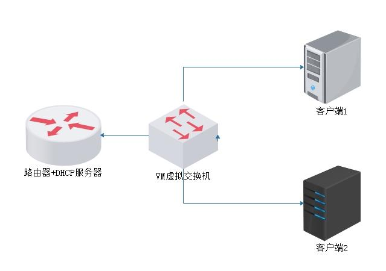

# 1、 超级作用域介绍

# （客户机与服务器必须使用相同的网卡，才可以获取DHCP服务器的IP，如果是不同网卡，需要中继）


DHCP服务器可为单个物理网络上的客户端提供多个作用域租约地址

（解决ip同一个局域网不够用的问题)

 




---

# 2、 实验环境准备


三台虚拟机同一网络模式，一个DHCP服务器，两个客户机


# 3、实验 步骤


## 1）设置DHCP服务器的单臂路由所需子网卡：


```javascript
cp -a ifcfg-eth0  ifcfg-eth0:0 #编辑此文件，修改网卡名和IP地址即可
```

- 修改子网卡eth0:0 

```javascript
[root@localhost network-scripts]# vi ifcfg-eth0:0

DEVICE=eth0:0         #修改设备名
TYPE=Ethernet
ONBOOT=yes
NM_CONTROLLED=yes
BOOTPROTO=none
USERCTL=no
PEERDNS=yes
IPV6INIT=no
DNS1=8.8.8.8

IPADDR=192.168.23.3       #修改IP
NETMASK=255.255.255.0     
GATEWAY=192.168.23.2

```

- ip a

```javascript
2: eth0: <BROADCAST,MULTICAST,UP,LOWER_UP> mtu 1500 qdisc pfifo_fast state UP qlen 1000
    link/ether 00:0c:29:47:15:df brd ff:ff:ff:ff:ff:ff
    inet 192.168.22.3/24 brd 192.168.22.255 scope global eth0
    inet 192.168.23.3/24 brd 192.168.23.255 scope global eth0:0     #子网ip
    inet6 fe80::20c:29ff:fe47:15df/64 scope link 
       valid_lft forever preferred_lft forever

```

2）开启路由转发：


```javascript
vim /etc/sysctl.conf
net.ipv4.ip_forward = 1 #此选项修改为1即可
sysctl -p #刷新内核参数配置文件
```

- 刷新内核参数配置文件

```javascript
[root@localhost network-scripts]# sysctl -p
net.ipv4.ip_forward = 1
net.ipv4.conf.default.rp_filter = 1
net.ipv4.conf.default.accept_source_route = 0
kernel.sysrq = 0
kernel.core_uses_pid = 1
net.ipv4.tcp_syncookies = 1
kernel.msgmnb = 65536
kernel.msgmax = 65536
kernel.shmmax = 68719476736
kernel.shmall = 4294967296

```

## 3）修改/etc/dhcp/dhcpd.conf文件


```javascript
#之前的网段声明和主机声明全都注释掉！

subnet 192.168.88.0 netmask 255.255.255.0｛
option routers 192.168.88.10；
range 192.168.88.100 192.168.88.100；｝
subnet 192.168.99.0 netmask 255.255.255.0｛
option routers 192.168.99.10；
range 192.168.99.100 192.168.99.110；｝
｝
#剩余内容注释掉或删除掉， 切记别落下括号
```

## 4.）重启DHCP服务


```javascript
service dhcpd restart
```

## 5.）分别重启两台机器的网卡，查看获取的地址


```javascript
ifdown eth0；ifup eth0
```

