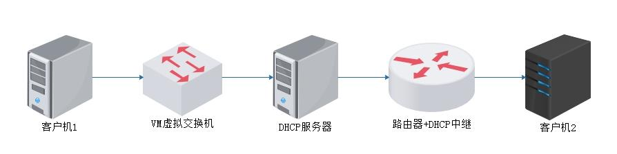
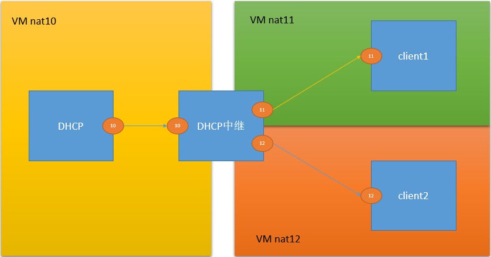

# 1、 DHCP 中继介绍


DHCP Relay（DHCPR）DHCP中继是一个小程序，可以实现在不同子网和物理网段之间处理和转发dhcp信息的功能。





# 2、实验环境准备


DHCP服务器：


```javascript
eth0（192.168.10.10） VMnet10
```

DHCP中继：


```javascript
eth0（192.168.10.20） VMnet10
eth1（100.100.100.20） VMnet11
```

外网客户机：


```javascript
eth0（IP地址自动获取） VMnet11
```

注： 关闭所有防护： iptables 、S S EL inux


# 3、配置 DHCP 服务器


##   1） 软件安装：


```javascript
yum -y install dhcp
```

## 2）修改/etc/dhcp/dhcpd.conf文件：


```javascript
#声明两个subnet，其他无关可以不做操作或删除
subnet 192.168.10.0 netmask 255.255.255.0 ｛ #实验中并未用到该地址池分配IP
range 192.168.10.100 192.168.10.110；
option routers 192.168.10.20；
｝
subnet 100.100.100.0 netmask 255.255.255.0 ｛
range 100.100.100.100 100.100.100.110；
option routers 100.100.100.20；

｝
```

## 3.）重启dhcpd服务：


```javascript
service dhcpd start
```

## 4）指定网关：


```javascript
只能中继器的内网IP为网关地址
```

# 4、 配置 DHCP 中继服务器


1. 网卡配置


```javascript
一块网卡ip=192.168.10.20
一块网卡ip=100.100.100.20
```

## 2. 软件安装


```javascript
yum -y install dhcp
```

## 3. 修改中继配置文件


```javascript
vim /etc/sysconfig/dhcrelay文件
INTERFACES=“eth0 eth1”
DHCPSERVERS=”192.168.10.10”
```

4. 开启路由转发


```javascript
vim /etc/sysctl.conf文件。
netipv4.ip_forward = 1
sysctl -p
```

# 5. 重启中继服务


```javascript
service dhcrelay start
4.4.5 4.4.5 测试 外网主机
重启网卡 ifdown ifup ifconfig
```

# 6、拓展实验




# 


注：此图和 实验规划有所区别，实验规划只是用一台测试机，此图使用了两台

