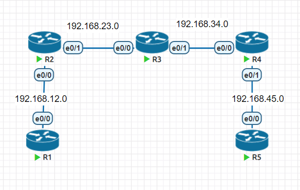

# 1、思科命令简介

- Cisco设备主要有如下三种模式
用户模式，在这个模式下只能进行有限的查看与测试，不能修改和重启设备。


- 特权模式，这这个模式下能进行完整的查看与测试，并且允许恢复出厂设置与重启。

(xxxx)#各种配置模式，在()中的内容就是提示你当前在什么模块下，下面列出常见子配置模式

- R1(config)#全局配置模式，可以配置设备的属性，比如设备名称之类的，并且只有全局配置模式才可以

进入到其他的子配置模式

- R1(config-if)#接配置模式，可以配置这个接口的属性，比如接IP地址，接口状态等等

- R1(dhcp-config)# DHCP配置模式，可以修改这个DHCP池的属性，下面就不一一举例了，用到了再说

# 2、静态路由

- 特点

- 需要通过手工的方式进行添加及维护；

- 适用于组网规模较小的场景，如果网络规模较大，则配置及维护的成本就会很高；

- 无法根据拓扑的变化进行动态的响应（各厂商开发了扩展特性，以便弥补静态路由在这点上的不足）；

- 在大型的网络中，往往采用动、静态路由结合的方式进行部署。

- 配置方式

```
R1(config)# ip route network-address subnet-mask {ip-add | exit-interface}
```



# 3、环回接口

- Loopback接口，也叫环回口，是一个逻辑的、虚拟的接口；

- 使用全局配置命令interface loopback 加上接口编号可创建一个Loopback接口，创建完成后即可

为接口配置IP地址；

- Loopback接口在手工创建后，除非人为shutdown，否则不会DOWN掉；

- Loopback接口常用于：

- 模拟路由器的直连网段，可用于测试；

- 可用于设备管理（Loopback接口比较稳定）；

- 供其他协议使用，例如OSPF、BGP、MPLS等；

- SNMPTraps消息的源地址；

- 其他用途（Loopback接口的用途十分广泛）。

# 4、缺省路由（默认路由）

```
ip route 0.0.0.0 0.0.0.0 [IP|INT] # 出接口的地址
```