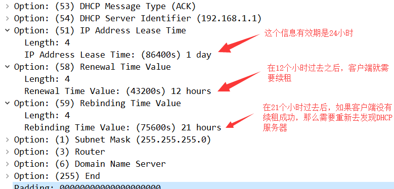

**DHCP实验**

# 1、DHCP配置

## **1）拓扑**


## **2）**路由器配置

```
================R1 配置dhcp服务端==============
R1#conf t
R1(config)#int e0/0
R1(config-if)#ip add 192.168.1.1 255.255.255.0R1(config-if)#no sh
R1(config-if)#ip dhcp pool cisco # 创建一个地址池
R1(dhcp-config)#network 192.168.1.0 /24 # 在地址池中放一个网段
R1(dhcp-config)#default-router 192.168.1.1 # 设置默认网关
R1(dhcp-config)#dns-server 114.114.114.114 114.114.115.115 # 设置主备DNS
R1(dhcp-config)#lease 1 # 租约时间改为1天
R1(dhcp-config)#exit
R1(config)#ip dhcp excluded-address 192.168.1.1 # 设置排除地址
================R2 R3 配置dhcp客户端==============
R3#conf t
Enter configuration commands, one per line. End with CNTL/Z.
R3(config)#int e0/0
R3(config-if)#ip add dhcp
R3(config-if)#no sh
R2#conf t
Enter configuration commands, one per line. End with CNTL/Z.
R2(config)#int e0/0
R2(config-if)#ip add dhcp
R2(config-if)#no sh
```

## 3）在路由器上查看地址池分配的情况

```
R1#show ip dhcp binding
Bindings from all pools not associated with VRF:
IP address     Client-ID/  Lease expiration    Type
 Hardware address/
 User name
192.168.1.2     010c.18a5.e949.00    Jun 17 2020 09:04 AM  Automatic
192.168.1.3     010c.18a5.fca9.00    Jun 17 2020 09:05 AM  Automatic
```

# 2、DHCP工作过程

通过对DHCP获取信息的过程抓包，可以得到如下4个数据包


- Discover 消息是用于客户端向整个内网发送广播，期待DHCP服务器进行回应

- 这个数据包中的重要内容就是：消息类型，客户端ID，主机名，请求获得的信息

- Offer 消息是DHCP服务器对客户的回应

- 这个消息中会回复对方所需要的所有信息

- Request 这个是客户端确认DHCP服务器的消息

- 这个消息和第一个消息差不多，但是消息类别变为 Request ，并且会携带请求的IP地址

- ACK DHCP服务器给客户端的最终确认

- 这个消息和第二个消这个消息息差不多，但是消息类型变为 ACK

# 3、DHCP续租

- DHCP租约更新

- 自动更新租约

- 当约期 >= 50% ，自动尝试更新租约

- 当约期 >= 87.5%，发出广播再次更新租约

- 当约期 >= 100%，客户机停止使用当前IP地址，只能重新DHCP租约的过程。

- 手动更新租约

- Windows：ipconfig /renew 和 /release

- Linux：dhclient -r

**DHCP分配的信息是有有效期的，在DHCP服务器给客户端的数据包中可以明确看到**



为了我们做实验方便，我们将DHCP的租约时间减少到只有两分钟，这样就可以清楚的看到续租的过程

并且我们在客户端获得IP之后，就关闭服务端，让客户端无法续租成功，看客户端是怎么去 Rebinding的

- DHCP服务端操作

```
R1(config)#ip dhcp pool cisco
R1(dhcp-config)#lease 0 0 2 # 租约时间改为2分钟
R1(config)#int e0/0
R1(config-if)#sh # 在客户端获得IP信息之后关闭接口
```


## 总结

- 户端会在租约时间过去 的时候以单播方式请求续租

- 在租约时间过去 的时候以广播的方式请求续租

- 在租约时间过去100%的时候，以广播方式重新发现局域网中的DHCP服务器