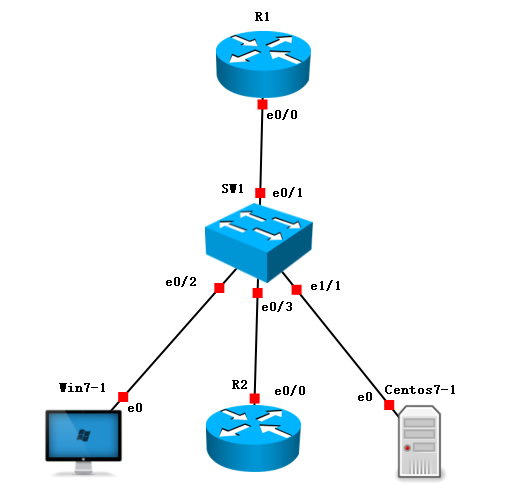
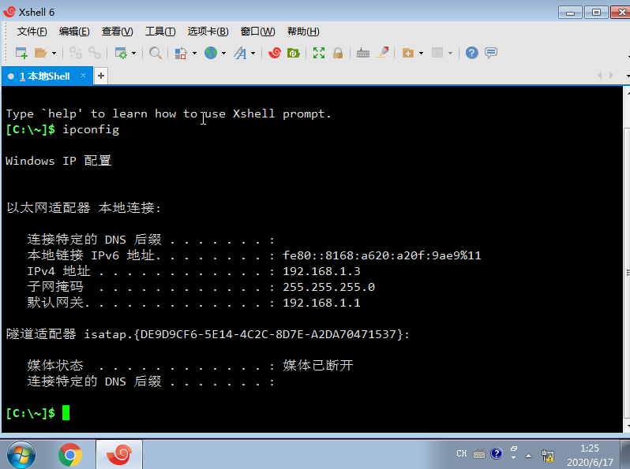
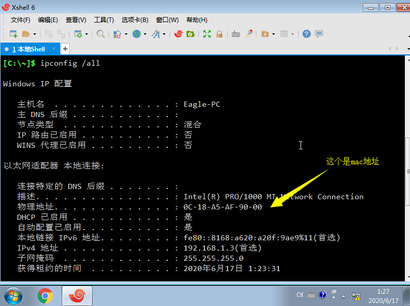
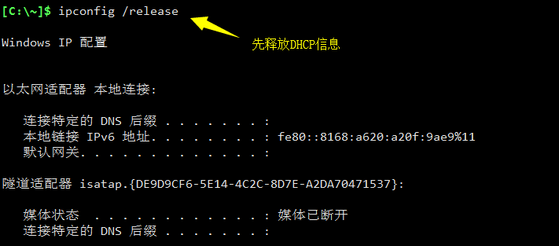
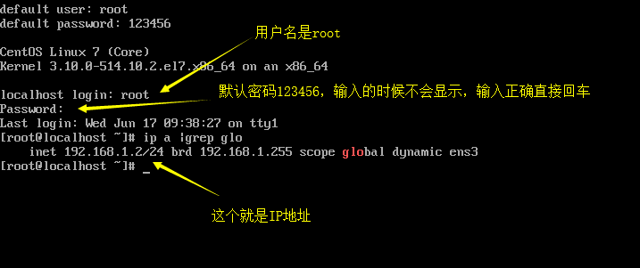

**DHCP地址绑定**

- 通过上面的学习，我们知道设备必须提供自己的身份信息才能在dhcp服务端获取地址信息

- 那么想要给设备绑定固定的IP地址，就必须知道设备的身份信息

**拓扑**



- 我们分别测试 windows 、 linux 、 Router 在DHCP中使用什么身份信息

# 1、路由配置

```
R1#conf t
R1(config)#int e0/0
R1(config-if)#ip add 192.168.1.1 255.255.255.0
R1(config-if)#no sh
R1(config-if)#ip dhcp pool cisco
R1(dhcp-config)#netw 192.168.1.0 /24
R1(dhcp-config)#def 192.168.1.1
R1(dhcp-config)#dns 114.114.114.114 114.114.115.115
R1(dhcp-config)#exit
R1(config)#ip dhcp ex 192.168.1.1
```

# 2、windows绑定DHCP

## 1）查看windows获取到的IP地址



## 3)去路由器上查看分配这个地址的对应身份信息

```
R1#sh ip dhcp binding
Bindings from all pools not associated with VRF:
IP address     Client-ID/  Lease expiration    Type
 Hardware address/
 User name
192.168.1.3     010c.18a5.af90.00    Jun 18 2020 01:23 AM  Automatic
```

可以看到windows使用的是 010c.18a5.af90.00 这个信息获得的这个IP地址，而这个信息并不是MAC

地址，这台windows的mac地址我们可以通过 ipconfig /all 查看



所以windows会在mac地址前加上 01 组成 Client-ID 向DHCP服务端发起请求，我们下面绑定这个

Client-ID 到一个地址池，这个地址池中只放一个IP地址，这样windows的地址就被绑定了

```
R1(config)#ip dhcp pool windows
R1(dhcp-config)#host 192.168.1.100
R1(dhcp-config)#client-identifier 010c.18a5.af90.00
% A binding for this client already exists.
```

如果绑定的时候出现 % A binding for this client already exists. ，说明你要绑定的这个身份

信息在dhcp地址池中已经被占用，先去清理一下

```
R1#clear ip dhcp binding * 
```

清理完成后，再次绑定，就可以成功了，查看地址池，可以看到windows地址池只有一个IP地址

```
R1#sh ip dhcp pool
Pool cisco :
Utilization mark (high/low)  : 100 / 0
Subnet size (first/next)    : 0 / 0
Total addresses        : 254
Leased addresses        : 0
Pending event         : none
1 subnet is currently in the pool :
Current index    IP address range          Leased addresses
192.168.1.4      192.168.1.1    - 192.168.1.254   0
Pool windows :
Utilization mark (high/low)  : 100 / 0
Subnet size (first/next)    : 0 / 0
Total addresses        : 1
Leased addresses        : 1
Pending event         : none
0 subnet is currently in the pool :
Current index    IP address range          Leased addresses
192.168.1.100     192.168.1.100   - 192.168.1.100   1
```

让windows重新获取IP地址




# 3、Linux绑定DHCP

- 步骤和windows一样，不过要注意linux是使用mac地址作为身份信息来获取DHCP的

- 查看Linux获得的IP地址



- 在路由器上查看dhcp地址池，可以看到linux就是用mac地址来获得的DHCP信息

```
R1#show ip dhcp bin
Bindings from all pools not associated with VRF:
IP address     Client-ID/  Lease expiration    Type
 Hardware address/
 User name
192.168.1.2     0c18.a52c.fa00     Jun 18 2020 01:38 AM  Automatic
```

- 绑定

```
R1#clear ip dhcp bin * # 别忘了先清空地址池
R1#conf t
R1(config)#ip dhcp pool linux
R1(dhcp-config)#host 192.168.1.101
R1(dhcp-config)#hardware-address 0c18.a52c.fa00 # 这次绑定的是硬件地址，也就是
mac地址
```

- linux需要重新获得一下dhcp信息


# 4、路由器等其他网络设备绑定DHCP

- cisco设备是使用的 Client-ID 来获取DHCP信息的

- 首先要让想获取DHCP信息的设备随意获得一下DHCP信息

```
R2#conf t
R2(config)#int e0/0
R2(config-if)#ip add dhcp
R2(config-if)#no sh
```

- 在DHCP服务端上查看DHCP地址池绑定情况

```
R1#sh ip dhcp binding
Bindings from all pools not associated with VRF:
IP address     Client-ID/  Lease expiration    Type
 Hardware address/
 User name
192.168.1.5     0063.6973.636f.2d61.  Jun 18 2020 01:51 AM  Automatic
          6162.622e.6363.3030.
         2e30.3330.302d.4574.
         302f.30
```

- cisco设备提供的 Client-ID 太长了，在复制的时候需要稍微处理一下，变成一行

```
0063.6973.636f.2d61.6162.622e.6363.3030.2e30.3330.302d.4574.302f.30 
```

- 开始绑定

```
R1#clea ip dhcp bin *
R1#conf t
R1(config)#ip dhcp pool Router
R1(dhcp-config)#host 192.168.1.102
R1(dhcp-config)#client-identifier
0063.6973.636f.2d61.6162.622e.6363.3030.2e30.3330.302d.4574.302f.30
```

- DHCP客户端重新获得IP地址

```
R2(config)#int e0/0
R2(config-if)#sh
R2(config-if)#no sh
R2(config-if)#do sh ip int br
Interface         IP-Address   OK? Method Status       
Protocol
Ethernet0/0         192.168.1.102  YES DHCP  up         
up 
```