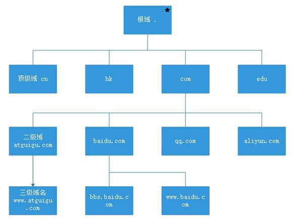
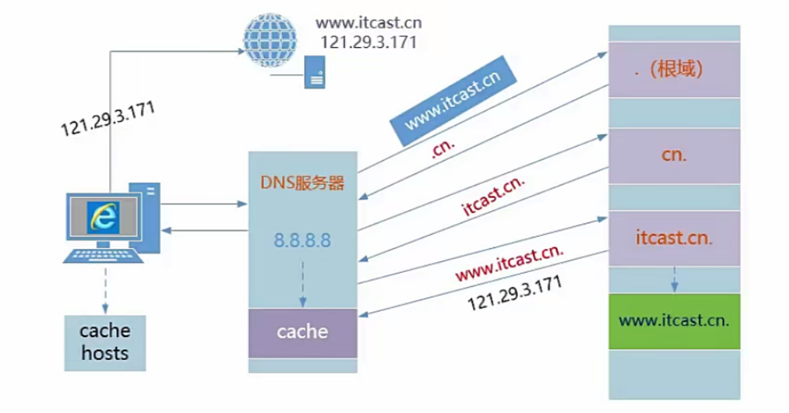
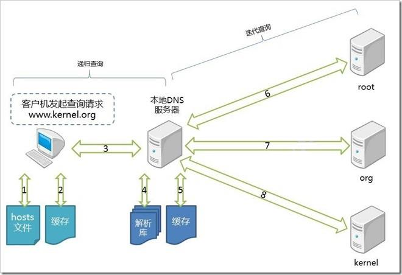
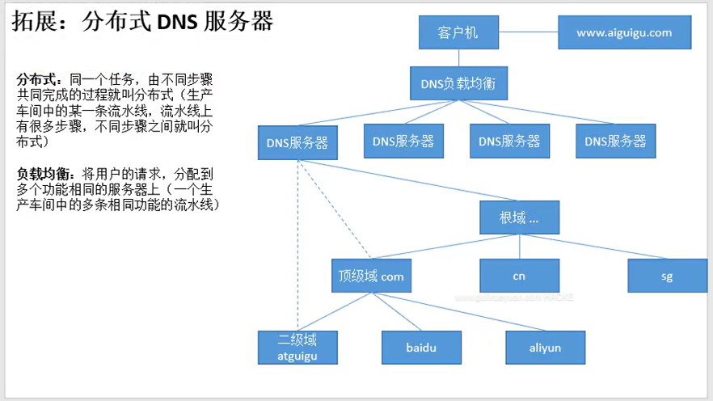
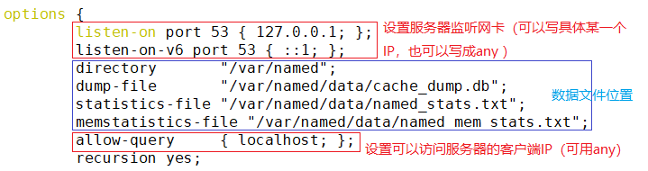
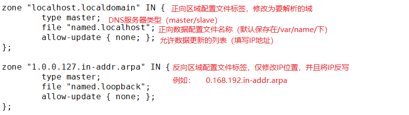
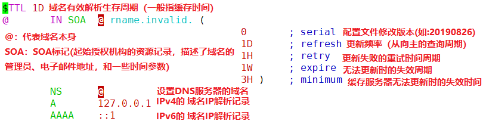
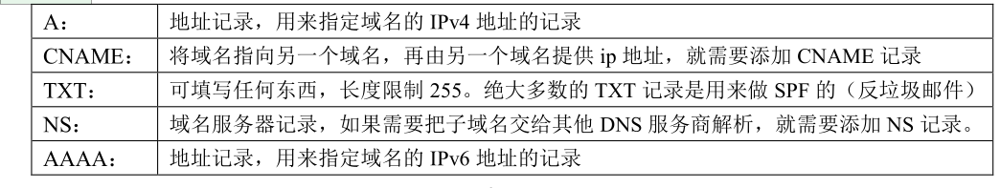
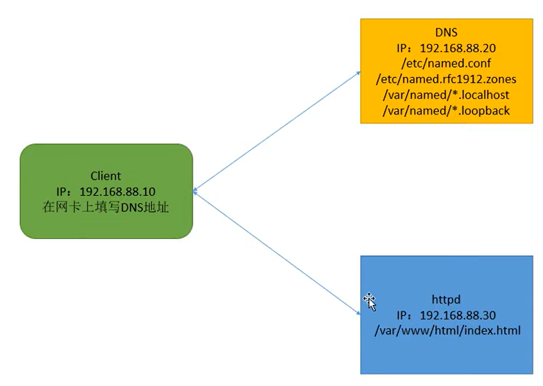

# **1、什么是域名？
**

域名（Domain Name），简称域名、网域，是由一串用点分隔的名字组成的 Internet 上某一台计算机
或计算机组的名称，用于在数据传输时标识计算机的电子方位。具有独一无二，不可重复的特性。

# **2、 是 什么是 DNS ？
**

域名系统（Domain Name System，缩写：DNS）是互联网的一项服务。域名解析是把域名指向网站空
间 IP，让人们通过注册的域名可以方便地访问到网站的一种服务。IP 地址是网络上标识站点的数字地
址，为了方便记忆，采用域名来代替 IP 地址标识站点地址。域名解析就是域名到 IP 地址的转换过程。

域名的解析工作由 DNS 服务器完成。可以理解为 DNS 就是翻译官。

**正向解析：域名 --> IP 地址
**

**反向解析：IP 地址 --> 域名**

# **3、 域名的 组 成 和 分类
**

**常见格式**

**完整格式：	www.atguigu.com**

**. ：			**

**com ：**

- **分类**：

- **国家地区域名**：cn（中国）、hk（香港）、sg（新加坡）等

- **通用顶级域名**：com（商业机构）、org（非营利组织）、edu（教育机构）等

- **新通用顶级域名**：red（红色、热情）、top（顶级、高端）等

**atguigu ： 		**

**www ：**

**主机名：**

**拓展：com.cn 属于“二级域名”，是 cn 顶级域的子域**



# **2、域名解析过程**



- 如果询问一次得到结果 递归查询 C-S   

- 耗时

- 如果询问多次得到结果 迭代查询 S-S



```javascript
1. 客户机首先查看查找本地 hosts 文件，如果有则返回，否则进行下一步
2. 客户机查看本地缓存，是否存在本条目的缓存，如果有则直接返回，否则进行下一步。
3. 将请求转发给指向的 DNS 服务器。
4. 查看域名是否本地解析，是则本地解析返回，否则进行下一步。
5. 本地 DNS 服务器首先在缓存中查找，有则返回，无则进行下一步。
6. 向全球 13 个根域服务器发起 DNS 请求，根域返回 org 域的地址列表。
7. 使用某一个 org 域的 IP 地址，发起 DNS 请求，org 域返回 kernel 域服务器地址列表。
8. 使用某一个 kernel 域 IP 地址，发起 DNS 请求，kernel 域返回 www.kernel.org 主机的 IP 地址，本
地 DNS 服务收到后，返回给客户机，并在本地 DNS 服务器保存一份。
```

## **1）扩展：分布式DNS服务器**



# **3、DNS软件信息**

**软件 名称： **

bind

**服务 名 称： **

named

**软件 端口： **

UDP 53 数据通信（域名解析）

TCP 53 数据同步（主从同步）

**
**

**主配置文件：**



**区域 配置 文件：**



**数 据 配置 文件： **



**记录类型：**






# DNS 正向解析

- 域名的 正向解析

- 将主机域名转换为对应的IP地址，以便网络程序能够通过主机域名访问到对应的服务器主机

- 域名-->IP	A记录

# DNS的反向解析

- 域名的反向解析

- 将主机的IP地址转换为对应的域名，以便网络（服务）程序能够通过ip地址查询到主机的域名。

- IP-->域名		PTR记录


## **根域(.)**

- 在整个DNS 系统的最上方一定是.(小数点) 这个DNS服务器(称为root),也叫”根域“。

- 根域（13台全世界只有13台。1个为主根服务器，放置在美国。其余12个均为辅根服务器，其中9个放置在美国，欧洲2个，位于英国和瑞典，亚洲1个，位于日本。）

## ☆ 一级域名<顶级域|国家域>

com net edu gov org cc iol cn uk us ru ja ko

.com : 商业公司

.net :互联网公司

.edu :教育（中小学、高中、大学..）

.gov : 政府

.io : 存储设备，redis

## ☆ 二级域名(自己购买管理)

qq.com. baidu.com. google.com.