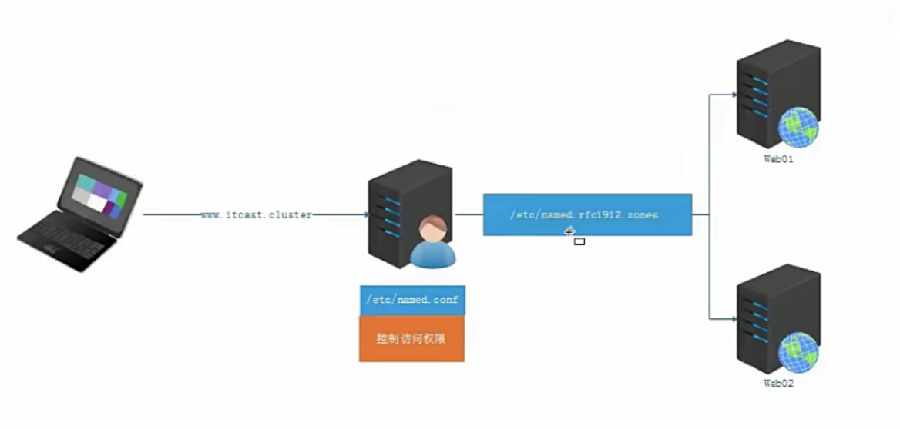



# **1、DNS服务端软件**

- DNS的域名解析都是 **udp/53 **.主从之间的数据传输 默认使用** tcp/53**

- DNS软件 :

- Bind 是一款开放源码的DNS服务器软件，Bind由美国加州大学Berkeley（伯克利）分校开发和维护的，全名为Berkeley Intermet Name Domain它是目前世界上使用最为广泛的DNS服务器软件，支持各种unix平台和windows平台。BIND现在由互联网系统协会( Internet Systems Consortium ) 负责开发与维护。

# 2、DNS基本部署使用

**需求：**[http://www.hackw.cn](http://www.hackwu.cn)时可以看到web服务的首页。

| ip | hostnam | type  | 
| -- | -- | -- |
| 192.168.23.42 | dns-server | DNS服务 域名解析 | 
| 192.168.23.12 | web-server | web服务 | 
| 192.168.23.13 | client | 测试web服务 | 




**服务 名 称： **

named

**软件 端口： **

UDP 53 数据通信（域名解析）

TCP 53 数据同步（主从同步）

**
**

**主配置文件：**

**区域 配置 文件：**

**数 据 配置 文件： **



# **1、DNS 服务 搭建
**

**先关闭服务器和客户机上的防火墙和 SELinux**

## **1.）软件安装
**

```javascript
yum -y install bind
```

## **2.）配置主配置文件（/etc/named.conf）**

- /etc/named.conf	#控制访问权限,主要配置，哪些主机可以访问DNS服务器

```javascript
ptions {
        listen-on port 53 { any; };             #改成any，表示监听，任意IP的53端口
        listen-on-v6 port 53 { any; };          #改成any
        directory       "/var/named";
        dump-file       "/var/named/data/cache_dump.db";
        statistics-file "/var/named/data/named_stats.txt";
        memstatistics-file "/var/named/data/named_mem_stats.txt";
        allow-query     { any; };               #改成any，表示任意主机的53端口，都可以请求本机
        recursion yes;
。。。。。。。。。
include "/etc/named.rfc1912.zones";             # include "文件1" 调用 文件1
include "/etc/named.root.key";
```

## **
**

## **3. ）配置区域文件（/etc/named.rfc1912.zones）**

- /etc/named.rfc1912.zones 	#定义域名如何解析（正向解析），解析为哪个IP地址

**注：先对区域文件进行备份，删除多余的模板，只留下一个正向和一个反向（反向修改时，网络
**

**位的反写格式，如 192.168.100.2-->100.168.192.）**

```javascript
zone "atguigu.com" IN {			#更改为域名（二级.顶级）
        type master;
        file "atguigu.localhost";           #更改
        allow-update { none; };
};
#正向解析
 #反向解析
zone "22.168.192.in-addr.arpa" IN {       #更改
        type master;
        file "atguigu.loopback";           #更改
        allow-update { none; };
};
 
```

## **4. ）配置数据文件/var/named/
**

```javascript
A． 先复制生成正向解析文件和反向解析文件
B． 编辑正向解析文件（ 注意域名结尾的 “. ”）
C． 编辑反向解析文件（ 注意域名结尾的 “. ”）
```

- 查看

```javascript
[root@localhost ~]# ls /var/named/
data  dynamic  named.ca  named.empty  
named.localhost        #正向解析模板
named.loopback         #反向解析模板
 
 slaves
```

- 生成正向和反向解析文件

```javascript
[root@localhost named]# cp -a named.localhost  atguigu.localhost    #保留文件原来的属性
[root@localhost named]# cp -a named.loopback   atguigu.loopback     #
[root@localhost named]# ls
atguigu.localhost  atguigu.loopback  data  dynamic  named.ca  named.empty  named.localhost  named.loopback  slaves
```

- 修改正向配置文件

```javascript
[root@localhost named]# vi atguigu.localhost 

$TTL 1D
@       IN SOA  atguigu.com.  rname.invalid. (                   #要解析的域名（二级+顶级）
                                        0       ; serial
                                        1D      ; refresh
                                        1H      ; retry
                                        1W      ; expire
                                        3H )    ; minimum
        NS      dns.atguigu.com.    #设置DNS服务器的域名
dns     A       192.168.22.128	     #DNS域名的地址，A表示ipv4,AAAA表示ipv6
www     A       192.168.22.129	     #要解域名的地址
```

- 检查文件 

```
root@server1 /v/named# named-checkconf /etc/named.conf
root@server1 /v/named# named-checkconf /etc/named.rfc1912.zones
root@server1 /v/named# named-checkzone hackwu.cn.zone hackwu.cn.zone 
zone hackwu.cn.zone/IN: loaded serial 0
OK
```

- zone文件详解

```
# vim itcast.cluster .zone
# $TTL 缓存的生存周期
# @ = zonename = itcast.com 当前域
# IN    互联网
# SOA   开始授权
# NS    dns服务端    nameserver
# A     ipv4 正向
# AAAA  IPV6
# CNAME 别名
# MX    邮件交互记录 5  数字代表优先级 数字越小优先级越高
# 0     ; serial     更新序列号
# 1D    ;  refres    更新间隔（从服务器下载数据）
# 1H    ; retry      失败重试
# 1W    ; expire     区域文件的过期时间
# 3H )  ; minimum    缓存的最小生存周期
# D Day、H Hour、W week
```

- **修改反向配置文件**

```javascript
[root@localhost named]# vi atguigu.loopback 

$TTL 1D
@       IN SOA  atguigu.com. rname.invalid. (
                                        0       ; serial
                                        1D      ; refresh
                                        1H      ; retry
                                        1W      ; expire
                                        3H )    ; minimum
        NS      dns.atguigu.com.
128     PTR     dns.atguigu.com.        #128 ：DNS服务器IP地址的第四位
129     PTR     www.atguigu.com.	#129 ：要解析域名ip的第四位
```

## **5.）重启 DNS 服务
**

```javascript
service named restart
```

- 获取网页源码

```javascript
[root@localhost ~]# curl www.atguigu.com
<html>
<body>
	<h1> DNS.net </h1>
</body>
</html>

```

## **6. ）客户端测试**

- 临时配置DNS服务地址

```
echo "nameserver 192.168.22.128" >> /etc/reslove.conf 
```

- nslookup测试，dns服务是否配置正常

```javascript
在网卡配置文件中添加 DNS 服务器的地址，然后用 nslookup 测试。
正向解析：
[root@localhost ~]# nslookup www.atguigu.com
Server:		192.168.22.128
Address:	192.168.22.128#53

Name:	www.atguigu.com
Address: 192.168.22.129
```

```javascript
反向解析
[root@localhost ~]# nslookup 192.168.22.129
Server:		192.168.22.128
Address:	192.168.22.128#53

129.22.168.192.in-addr.arpa	name = www.atguigu.com.
```