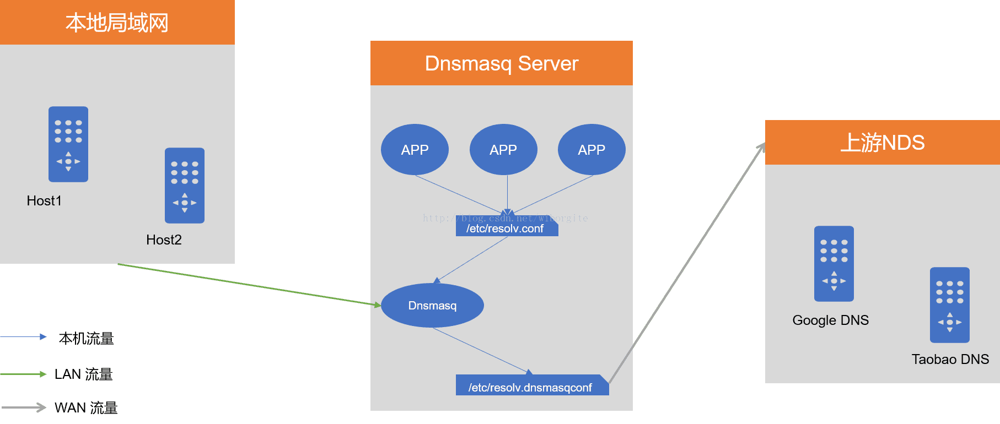

Dnsmasq为小型网络提供网络基础设施：DNS，DHCP，路由器通告和网络引导。它被设计为轻量级且占用空间小，适用于资源受限的路由器和防火墙。它还被广泛用于智能手机和便携式热点的共享，并支持虚拟化框架中的虚拟网络。支持的平台包括Linux（带有glibc和uclibc），Android，* BSD和Mac OS X. Dnsmasq包含在大多数Linux发行版以及FreeBSD，OpenBSD和NetBSD的端口系统中。Dnsmasq提供完整的IPv6支持。



Dnsmasq原理：

•本机APP访问主机的/etc/resolv.conf获取DNSServer，该文件指向的DNSServer为Dnsmasq。

•本地局域网中的主机可以直接访问Dnsmasq，即在这些主机中/etc/resolv.conf指向了Dnsmasq。

•Dnsmasq需要通过上游DNS来进行域名解析，上游DNS可以配置在/etc/resolv.dnsmasq.conf中，该文件需要在Dnsmasq的配置文件/etc/dnsmasq.conf中指定。

**先关闭服务器和客户机上的防火墙和 和 SELinux**

**实验 作用：**

加快解析速度，提高工作效率

**实验 软件：**

dnsmasq  

**配 置文件：**

```javascript
/etc/dnsmasq.conf
domain=域名 #需要解析的域名      #domain=atguigu.com
server=ip #主 DNS 服务器 IP      #server=192.168.22.128
cache-size=15000 #声明缓存条数
```

**重启服务：**

service dnsmasq restart

**测试 效果： **

在测试机上填写 DNS 缓存服务器的 ip 地址