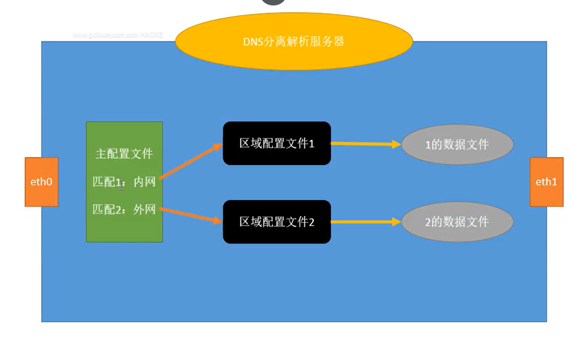
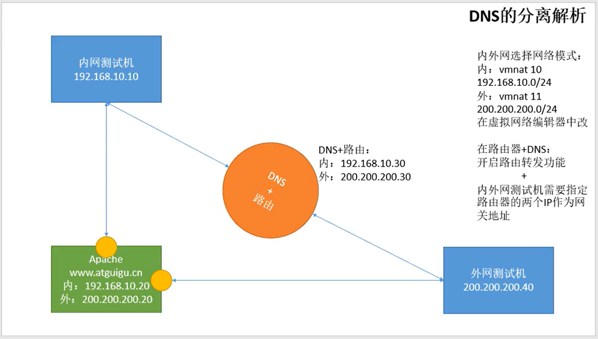

# 1、实验原理 ：

DNS 分离解析即将相同域名解析为不同的 IP 地址。现实网络中一些网站为了让用户有更好


的体验效果解析速度更快，就把来自不同运营商的用户解析到相对应的服务器这样就大大提升了访问


速度





---

# 2、实验环境 ：先关闭服务器和客户机上的防火墙和 SELinux


一台内网测试机（单网卡）

```javascript
IPADDR=192.168.23.10
GATEWAY=192.168.23.20
DNS1=192.168.23.20
```

一台外网测试机（单网卡）

```javascript
IPADDR=100.100.100.10
GATEWAY=100.100.100.20
DNS1=100.100.100.10
```

一台网关+DNS（双网卡）

```javascript
eth0:
    IPADDR=192.168.23.20
eth1:    
    IPADDR=100.100.100.20 		           
```


一台 web 服务器（双网卡）

```javascript
eth0:
    IPADDR=192.168.23.11
eth1:
    IPADDR=100.100.100.10 
```





# 3、实验步骤：


1. 安装 bind 软件


2. 内核配置文件开启路由转发，修改/etc/sysctl.conf


3. 修改主配置文件/etc/named.conf


```javascript
[root@localhost ~]# vi /etc/named.conf 


options {
        listen-on port 53 { any; };                    #改成any(因为有两张网卡，两张网卡都要监听)
        listen-on-v6 port 53 { any; };
        directory       "/var/named";
        dump-file       "/var/named/data/cache_dump.db";
        statistics-file "/var/named/data/named_stats.txt";
        memstatistics-file "/var/named/data/named_mem_stats.txt";
        allow-query     { any; };			#改成any
        recursion yes;
}
//zone "." IN {			#注释掉
//      type hint;
//      file "named.ca";
//};

                
      
view lan {                                    #匹配内网
        match-clients { 192.168.23.0/24; };    #内网的网段
        zone "." IN {
                type hint;
                file "named.ca";
    	};
        include "/etc/lan.zones";		   #内网的域名文件

};


view wan {					#匹配网
        match-clients { any; };		#改成any，不是内外，剩下就默认为外网；
        zone "." IN {
                type hint;
                file "named.ca";
        };
        include "/etc/wan.zones";		#外网的域名文件
}

#include "/etc/named.rfc1912.zones";	#注释掉
#include "/etc/named.root.key";		#注释掉
    
```

注意：不同的解析放在了各自的区域配置文件（便于区分和维护更新）


# 4. 生成 生成 自己定 义的区域文件 （ 反向解析 省略掉了 ）


```javascript
cp –a named.rfc1912.zones lan.zones
cp –a named.rfc1912.zones wan.zones
```

- 修改 lan.zones :

```javascript
[root@localhost named]# vi /etc/lan.zones 


zone "atguigu.com" IN {
        type master;
        file "lan.localhost";
        allow-update { none; };
};

```

- 修改 wan.zones:

```javascript
[root@localhost named]# vi /etc/wan.zones var

zone "atguigu.com" IN {
        type master;
        file "wan.localhost";
        allow-update { none; };
};
```

# 5. 配置数据文件 配置数据文件


配置内网的正向解析文件:

```javascript
[root@localhost named]# vi lan.localhost 

$TTL 1D
@       IN SOA atguigu.com.  rname.invalid. (
                                        0       ; serial
                                        1D      ; refresh
                                        1H      ; retry
                                        1W      ; expire
                                        3H )    ; minimum
        NS      dns.atguigu.com.
www     A       192.168.23.11
dns     A       192.168.23.20

```

配置外网的正向解析文件:

```javascript
[root@localhost named]# vi  wan.localhost 

$TTL 1D
@       IN SOA atguigu.com.  rname.invalid. (
                                        0       ; serial
                                        1D      ; refresh
                                        1H      ; retry
                                        1W      ; expire
                                        3H )    ; minimum
        NS      dns.atguigu.com.
www     A       100.100.100.11
dns     A       100.100.100.20
```

# 6. 重启服务 重启服务


```javascript
service named restart
```

# 7. 效果 效果 测试（crul/nslookup/elinks)


内网客户端网卡配置


将 dns 和网关都指为网关服务器的内网口地址


外网客户端网卡配置


将 dns 和网关都指为网关服务器的外网口地址


