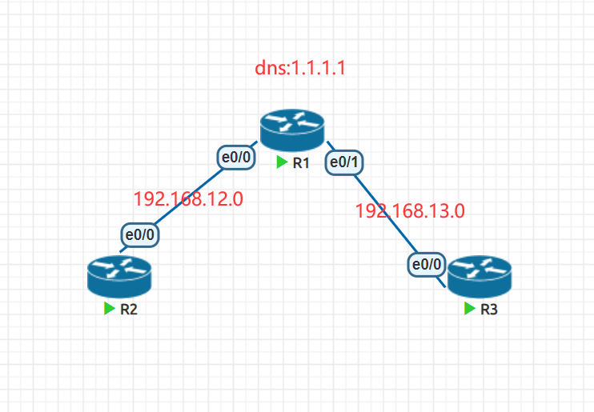

**cisco路由器配置DNS**

```
ip dns server  # 开启DNS服务器
ip host domain.com 192.168.1.1
```

# 1、dns部署



- 需求

- R1提供dns服务端功能，添加一条解析记录，将www.r3.com解析成192.168.13.3

- 将R2的dns服务器地址指向1.1.1.1

- 最终实现在R2上ping www.r3.com能够ping通

## 1）代码步骤

```
# 第一步，配置ip地址，R1上记得配置一个环回接口地址1.1.1.1，略
# 第二步，在R1上配置dns并开启dns解析功能
R1(config)#ip dns server
R1(config)#ip host www.r3.com 192.168.13.3
R1(config)#ip name-server 1.1.1.1
R1(config)#ip domain lookup
# 第三步，在R2上指定dns服务器地址为1.1.1.1
R2(config)#ip name-server 1.1.1.1
R2(config)#ip domain lookup
# 第四步，在R2，R3上添加默认路由指向R1
R2(config)#ip route 0.0.0.0 0.0.0.0 192.168.12.1
R3(config)#ip route 0.0.0.0 0.0.0.0 192.168.13.1
# 第五步，验证
R2#ping www.r3.com
Translating "www.r3.com"...domain server (1.1.1.1) [OK]
Type escape sequence to abort.
Sending 5, 100-byte ICMP Echos to 192.168.13.3, timeout is 2 seconds:
!!!!!
Success rate is 100 percent (5/5), round-trip min/avg/max = 1/1/1 ms
```


- windows的DNS设置为 1.1.1.1 ，当windows访问 linux.com 的时候，由centos回应

# 2、配置

## 1）R1

```
R1(config)#int e0/0
R1(config-if)#ip add 192.168.1.1 255.255.255.0
R1(config-if)#no sh
R1(config-if)#int e0/1
R1(config-if)#ip add 192.168.2.1 255.255.255.0
R1(config-if)#no sh
R1(config-if)#int lo0
R1(config-if)#ip add 1.1.1.1 255.255.255.0
R1(config-if)#ip dns server
R1(config)#ip host linux.com 192.168.2.2
```

## 2)windows


### 3)linux 


# 3、检测DNS是否正常工作


# 4、抓包分析

## 1）找到解析的数据包


## 2）查看请求数据


## 3）查看回复的数据

