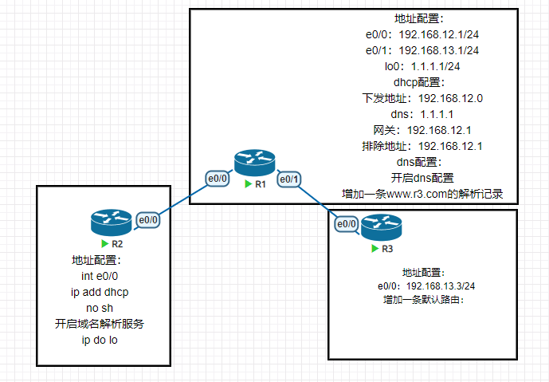

**实验**



# 1、配置地址

```
R1(config)#int e0/0
R1(config-if)#ip add 192.168.12.1 255.255.255.0
R1(config-if)#no sh
R1(config-if)#int e0/1
R1(config-if)#ip add 192
*Feb 1 07:28:01.664: %LINK-3-UPDOWN: Interface Ethernet0/0, changed state
to up
*Feb 1 07:28:02.670: %LINEPROTO-5-UPDOWN: Line protocol on Interface
Ethernet0/0, changed state to up.
R1(config-if)#ip add 192.168.13.1 255.255.255.0
R1(config-if)#no sh
R1(config-if)#int lo0
R1(config-if)#ip add
*Feb 1 07:28:12.133: %LINK-3-UPDOWN: Interface Ethernet0/1, changed state
to up
R1(config-if)#ip add 1.1.1.1
*Feb 1 07:28:13.082: %LINEPROTO-5-UPDOWN: Line protocol on Interface
Loopback0, changed state to up
*Feb 1 07:28:13.139: %LINEPROTO-5-UPDOWN: Line protocol on Interface
Ethernet0/1, changed state to up
R1(config-if)#ip add 1.1.1.1 255.255.255.0
R2(config)#int e0/0
R2(config-if)#ip add dhcp
R2(config-if)#no sh
R3(config)#int e0/0
R3(config-if)#ip add 192.168.13.3 255.255.255.0
R3(config-if)#no sh
```

# 2、配置dns服务端

```
R1(config)#ip dns server
R1(config)#ip host www.r3.com 192.168.13.3
R1(config)#ip name-server 1.1.1.1
R1(config)#ip domain lookup
R1(config)#do ping www.r3.com
Type escape sequence to abort.
Sending 5, 100-byte ICMP Echos to 192.168.13.3, timeout is 2 seconds:
.!!!!
Success rate is 80 percent (4/5), round-trip min/avg/max = 1/4/6 ms
R1(config)#
```

# 3、配置dhcp

```
R1(config)#ip dhcp pool cisco
R1(dhcp-config)#network 192.168.12.0 /24
R1(dhcp-config)#default-router 192.168.12.1
R1(dhcp-config)#dns-server 1.1.1.1
R1(config)#ip dhcp exclude 192.168.12.1
```

# 4、在R3上添加一条默认路由

```
R3(config)#ip route 0.0.0.0 0.0.0.0 192.168.13.1 
```

# 5、在R2上开启dns解析功能，并验证

```
R2(config)#ip domain lookup
R2(config)#do ping www.r3.com
Translating "www.r3.com"...domain server (1.1.1.1) [OK]
Type escape sequence to abort.
Sending 5, 100-byte ICMP Echos to 192.168.13.3, timeout is 2 seconds:
!!!!!
Success rate is 100 percent (5/5), round-trip min/avg/max = 1/1/1 ms
```