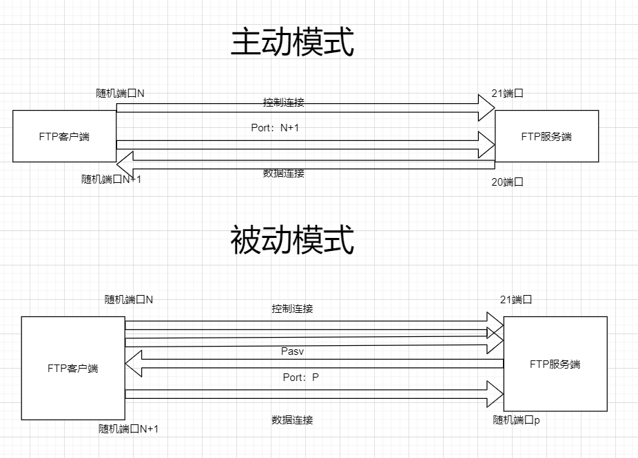
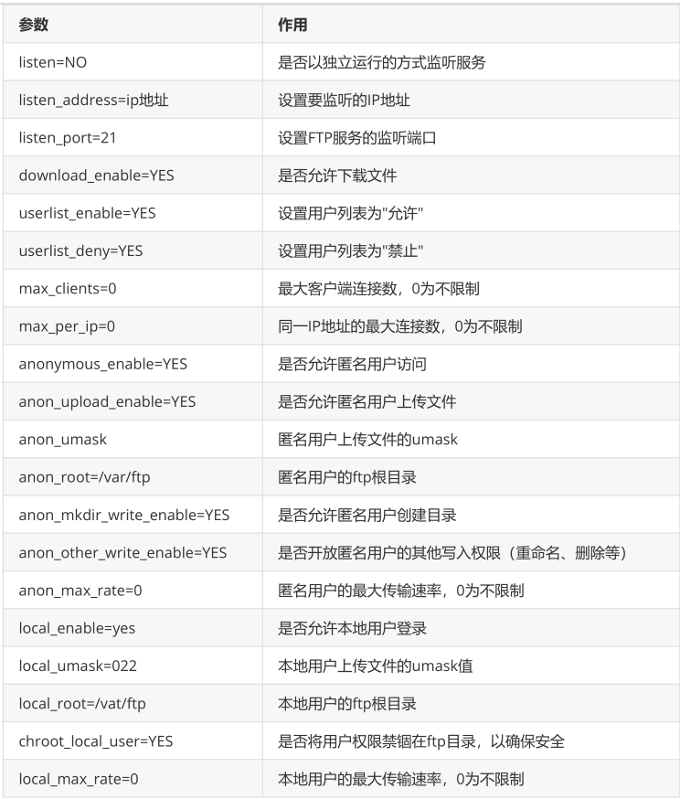

**FTP（文件传输协议）**

# **一、简介**

- **FTP协议：文件传输协议（File Transfer Protocol）**

- 协议定义了一个在远程计算机系统和本地计算机系统之间传输文件的一个标准

- FTP运行在OSI模型的应用层，并利用传输协议TCP在不同的主机之间提供可靠的数据传输

- FTP 在文件传输中还支持断点续传功能，可以大幅度减少CPU网络带宽的开销

- **FTP模型**

- 用户接口：提供一个用户接口并使用客户端协议解释器的服务

- 客户端协议解释器：向远程服务器发送命令 并建立客户数据传输过程

- 服务端协议解释器：响应客户协议机发出的命令并驱动服务端数据传输过程

- 客户端数据传输协议：负责完成和服务器数据传输过程及客户端本地文件系统的通信

- 服务端数据传输协议：负责完成和客户数据过程及服务器端文件系统的通信

- **控制连接（端口号21）**

- 主要用来传送在实际通信过程中需要执行的FTP命令以及命令的响应

- 只需要很小的网络带宽

- FTP服务端监听21端口号来等待控制连接建立

- 建立控制连接后，还需要验证客户身份，决定是否建立数据连接

- 当需要目录列表，传输文件时，才建立数据连接，并且每次客户端都是用不同的端口号来建立

数据连接。数据 传输完毕，就中断这条临时的数据连接

- 在FTP连接期间，控制连接始终保持通常的连接状态。在数据连接存在期间，控制连接必须存

在；一旦控制连 接断开，数据连接会自动关闭。

- **数据连接（端口号20）**

- FTP服务端监听20端口来等待数据连接

- 数据连接依赖于控制连接

- 建立方式

- 参考博客：

- 主动模式

- 通过三次握手，建立控制连接；客户端的源端口是高位随机端口，目标端口是21端口

- 控制连接建立后，客户端进行份验证，协商数据连接采用主动模式；随后客户端会

向FTP服务器发送Port报 文，表明自己监听的IP+端口，并等待FTP服务器（20端口）

向自己监听的IP+端口发起数据连接请求。

- 服务端发起数据连接请求，建立数据连接

- 被动模式

- 通过三次握手，建立控制连接；客户端的源端口是高位随机端口，目标端口是21端口；

- 控制连接建立后，客户端进行身份验证，协商数据连接采用被动模式；随后客户端

会向服务器发送PASV报 文，表示我们用被动模式

- 服务端收到PASV报文，于是向客户端发送Port报文，表明自己监听的IP+端口

- 客户端发起数据连接请求，建立数据连接

FTP协议有两种工作方式：PORT方式和PASV方式，中文意思为主动式和被动式。

在主动模式下，FTP客户端随机开启一个大于1024的端口N向服务器的21号端口发起连接，然后开放

N+1号端口进行监听，并向服务器发出PORT N+1命令。服务器接收到命令后，会用其本地的FTP数据端

口（通常是20）来连接客户端指定的端口N+1，进行数据传输。

在被动模式下，FTP库户端随机开启一个大于1024的端口N向服务器的21号端口发起连接，同时会开

启N+1号端口。然后向服务器发送PASV命令，通知服务器自己处于被动模式。服务器收到命令后，会开

放一个大于1024的端口P进行监听，然后用PORT P命令通知客户端，自己的数据端口是P。客户端收到

命令后，会通过N+1号端口连接服务器的端口P，然后在两个端口之间进行数据传输。

- **主动模式被动模式的区别**

总的来说，主动模式的FTP是指服务器主动连接客户端的数据端口，被动模式的FTP是指服务器被动地等

待客户端连接自己的数据端口。

被动模式的FTP通常用在处于防火墙之后的FTP客户访问外界FTp服务器的情况，因为在这种情况下，防

火墙通常配置为不允许外界访问防火墙之后主机，而只允许由防火墙之后的主机发起的连接请求通过。

因此，在这种情况下不能使用主动模式的FTP传输，而被动模式的FTP可以良好的工作



- 软件包

- vsftpd

- tftp（了解）

# 二、VSFTPD服务介绍

- 服务包：vsftpd

- 服务类型：由Systemd启动的守护进程

- 配置单元： /usr/lib/systemd/system/vsftpd.service

- 守护进程： /usr/sbin/vsftpd

- 端口： 21(ftp) , 20(ftp-data)

- 主配置文件： /etc/vsftpd/vsftpd.conf

- 用户访问控制配置文件： /etc/vsftpd/ftpusers /etc/vsftpd/user_list

- 日志文件： /etc/logrotate.d/vsftpd

- 配置文件参数



# 三、基础配置

- 安装vsftp:[root@localhost ~]#yum -y install vsftpd

- 准备分发文件：[root@localhost ~]#touch /var/ftp/abc.txt

- 启动服务：

- [root@localhost ~]#systemctl start vsftpd

- [root@localhost ~]#systemctl enable vsftpd

- 关闭防火墙：

- [root@localhost ~]#systemctl stop firewalld

- [root@localhost ~]#setenforce 0

# 四、客户端工具

## 1）linux中

### 第一种：

```
[root@localhost ~]#yum install ftp -y
[root@localhost ~]#ftp <IP地址>
username:.......
password:.......
```

### 第二种：

```
[root@localhost ~]#yum install lftp -y
[root@localhost ~]#lftp <IP地址>
```

## 2）Windows中

- **第一种：**

- 可以在浏览器、运行窗口或者资源管理器中输入 

置，如果需要访问相关

- 目录可以输入 

- **第二种**

- 在DOS窗口中，输入命令 ftp <IP地址> 即可访问

# 五、案列

## 1）匿名用户访问（默认开启）

```
[root@localhost ~]# vi /etc/vsftpd/vsftpd.conf
anonymous_enable=YES
anon_umask=022
anon_upload_enable=Yes
anon_mkdir_write_enable=Ye
anon_other_write_enable=Yes
local_enable=YES
write_enable=YES
local_umask=022
dirmessage_enable=YES
xferlog_enable=YES
connect_from_port_20=YES
xferlog_std_format=YES
listen=NO
listen_ipv6=YES
pam_service_name=vsftpd
userlist_enable=YES
tcp_wrappers=YES
[root@localhost ~]# systemctl restart vsftpd
```

## 2）本地用户访问

使用本地用户登录成功时位置在家目录的位置

```
[root@localhost ~]# vi /etc/vsftpd/vsftpd.conf
anonymous_enable=NO
local_enable=YES
write_enable=YES
local_umask=022
dirmessage_enable=YES
xferlog_enable=YES
connect_from_port_20=YES
xferlog_std_format=YES
listen=NO
listen_ipv6=YES
pam_service_name=vsftpd
userlist_enable=YES
tcp_wrappers=YES
[root@localhost ~]# systemctl restart vsftpd
[root@localhost ~]# systemctl enable vsftpd
注意：出现在/etc/vsftpd/ftpuser /etc/vsftpd/user_list这两个文件
中的内容将会被定义为黑名单
```

## 3）虚拟用户访问

1、创建用于进行FTP认证的用户数据库文件，其中奇数行为账户名，偶数行为密码。

```
[root@localhost ~]# cd /etc/vsftpd/
[root@localhost vsftpd]# vi vuser.list
eagle
centos
cisco
centos
huawei
centos
```

2、使用db_load命令用哈希（hash）算法将原始的明文信息文件转换成数据库文件

3、降低数据库文件的权限（避免其他人看到数据库文件的内容）

4、把原始的明文信息文件删除。

```
[root@localhost vsftpd]# db_load -T -t hash -f vuser.list vuser.db
[root@localhost vsftpd]# file vuser.db
vuser.db: Berkeley DB (Hash, version 9, native byte-order)
[root@localhost vsftpd]# chmod 600 vuser.db
[root@localhost vsftpd]# rm -f vuser.list
```

5、创建一个本地用户，用来做虚拟用户在本地的代理，为了安全起见，禁止这个本 地用户登录

```
[root@localhost vsftpd]# useradd -d /var/ftproot -s /sbin/nologin virtual
[root@localhost vsftpd]# ls -ld /var/ftproot/
drwx------. 2 virtual virtual 59 8月 10 23:04 /var/ftproot/
[root@localhost vsftpd]# chmod -Rf 755 /var/ftproot/
```

6、

```
[root@localhost vsftpd]# vi /etc/pam.d/vsftpd.vu
auth required pam_userdb.so db=/etc/vsftpd/vuser
account required pam_userdb.so db=/etc/vsftpd/vuser
```

7、

```
[root@localhost vsftpd]# cat /etc/vsftpd/vsftpd.conf
anonymous_enable=NO
local_enable=YES
guest_enable=YES
guest_username=virtual
allow_writeable_chroot=YES
write_enable=YES
local_umask=022
dirmessage_enable=YES
xferlog_enable=YES
connect_from_port_20=YES
xferlog_std_format=YES
listen=NO
listen_ipv6=YES
pam_service_name=vsftpd.vu
userlist_enable=YES
tcp_wrappers=YES
[root@localhost vsftpd]#
```

8、

```
[root@localhost vsftpd]# mkdir /etc/vsftpd/vusers_dir/
[root@localhost vsftpd]# cd /etc/vsftpd/vusers_dir/
[root@localhost vusers_dir]# touch huawei
[root@localhost vusers_dir]# vi eagle
anon_upload_enable=YES
anon_mkdir_write_enable=YES
anon_other_write_enable=YES
[root@localhost vusers_dir]#
[root@localhost vusers_dir]# vi /etc/vsftpd/vsftpd.conf
anonymous_enable=NO
local_enable=YES
guest_enable=YES
guest_username=virtual
allow_writeable_chroot=YES
write_enable=YES
local_umask=022
dirmessage_enable=YES
xferlog_enable=YES
connect_from_port_20=YES
xferlog_std_format=YES
listen=NO
listen_ipv6=YES
pam_service_name=vsftpd.vu
userlist_enable=YES
tcp_wrappers=YES
user_config_dir=/etc/vsftpd/vusers_dir
[root@localhost vusers_dir]# systemctl restart vsftpd
```