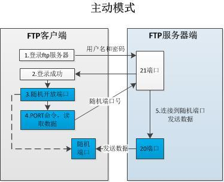
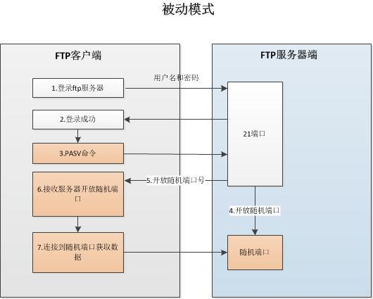

# **1、 VSFTP 概述
**

  FTP 是 File Transfer Protocol（文件传输协议）的英文简称，用于 Internet 上的文件的双向


传输。使用 FTP 来传输时，是具有一定程度的危险性， 因为数据在因特网上面是完全没有受到保护
的

  VSFTP是一个基于GPL发布的类Unix系统上使用的FTP服务器软件，它的全称是Very Secure FTP，
从名称定义上基本可以看出，这是为了解决 ftp 传输安全性问题的。


## **1） 安全特性
**

```javascript
1. vsftp 程序的运行者一般是普通用户，降低了相对应进程的权限，提高了安全性
2. 任何需要执行较高权限的指令都需要上层程序许可
3. ftp 所需要使用的绝大多数命令都被整合到了 vsftp 中，基本不需要系统额外提供命令
4. 拥有 chroot 功能，可以改变用户的根目录，限制用户只能在自己的家目录
```

# **2、VSFTP 连接类型
**

```javascript
控制连接（持续连接） → TCP 21（命令信道） → 用户收发FTP命令
数据连接（按需连接） → TCP 20（数据信道） → 用于上传下载数据
```

# **3、VSFTP工作模式**

# **
**

**1、Port 模式**




  FTP 客户端首先和服务器的 TCP 21 端口建立连接，用来发送命令，客户端需要接收数据的时候在这个通道上发送 PORT 命令。PORT 命令包含了客户端用什么端口接收数据。在传送数据的时候，服务器端通过自己的 TCP 20 端口连接至客户端的指定端口发送数据。FTP server 必须和客户端建立一个

**主动模式：建立数据信道时，server的21端口去主动连接client的端口。**

**2、Passive 模式**




  FTP 客户端首先和服务器的 TCP 21 端口建立连接，用来建立控制通道发送命令，但建立连接后客户端发送 Pasv命令。服务器收到 Pasv 命令后，打开一个临时端口（端口大于 1023小于 65535）并且通知客户端在这个端口上传送数据的请求，客户端连接 FTP 服务器的临时端口，然后 FTP 服务器将通过这个端口传输数据

**被动模式：建立数据信道，server事先开启若干个tcp端口，等待client进行连接，但是并不知道client会连接哪一个，这就是被动连接**

**注意：由于VSFTP的被动模式是随机端口进行数据传输，所以在设置防火墙时需要刻意放行。**

# **4、VSFTP 传输模式
**

**Binary 模式 **

**ASCII 模式 **

Linux的红帽发行版中VSFTP默认采用的是Binary模式，这样能保证绝大多数文件传输后能正常使用


**切换方式 **

# **5、 VSFTP 软件息
**

**服务端 软件名 ：**

**客户端 软件名 **

**服务名**

**端口号：**

**配置文件**

# 6、FTP服务的客户端工具

- Linux:ftp、tp(客户端程序)

- Windows:FileZilla、IE、Chrome、Firefox

- Iftp和tp工具区别：

- lftp：默认是以匿名用户访问

- 可以批量并且下载目录

- ftp：默认是以用户名/密码方式访问