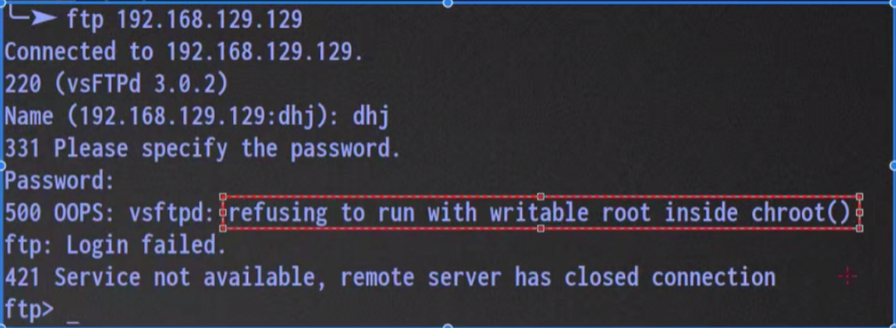

**FTP任务解决方案**

# 1、任务背景

简单来说：根据我们所学的内容（FTP）搭建一个客户服务系统（主要涉及客服资料上传与下载）

- 1．客服人员必须使用用户名密码（kefu/123)的方式登录服务器来下载相应文档

- 2．不允许匿名用户访问

- 3．客服部门的相关文档保存在指定的目录里/data/kefu	local_root=/data/kefu

- 4．客服用户使用用户kefu/123登录后就只能在默认的==/data/kefu目录里活动==

# 2、创建客服账号（server）

```
useradd kefu 
echo 123 | passwd --stdin kefu
```

# 3、vsftpd.conf配置

```
anonymous_enable=NO                #不允许匿名用户访问
local_enable=YES                   #允许linux本地用户登录，默认情况下，自动进入用户家目录
local_root=/data/kefu              #指定，账访登录成功时，默认进入的目录。
chroot_local_user=yes              #禁锢用户，改变根目录为本地用户，登录时，默认进入的目录。
```

# 4、权限设置

```
seracl -m u:kefu:rwx /data/kefu/
#给kefu这个linux用户，赋予777的权限，以让他可以在此目录中上传和修改文件。
```

## 可能会出现的问题

- 500 OOPS



以上问题主要出现在FTP2.5.3以后的版本中。

解决方案：

1. 去除写权限（治标不治本）

```
chmod a-w /home/kefu
```

1. 核心解决方案，添加一个选项

```
allow_writeable_chroot=YES
```

# 5、禁锢目录补充

```
chroot_local_user=YES
```

- 需求：我们能不能给一小部分用户开通非禁锢权限。

```
chroot_list_enable=YES                      开启用户列表文件
chroot_list_file=/etc/vsftpd/chroot_list    指定用户列表文件
echo hack >> /ect/vsftpd/chroot_list
```