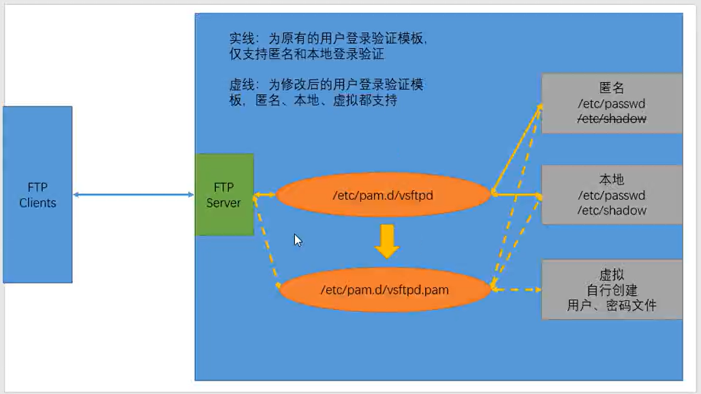

# **1、建立 FTP的虚拟用户的用户数据库文件（ 在 /etc/ vsftpd ）**

- 

# **
**

```javascript
cd /etc/vsftpd/
vim vsftpd.user
```

**注：该文件名可以随便定义，文件内容格式：奇数行用户，偶数行密码**

```javascript
[root@localhost vsftpd]# vi vsftpd.user

a1 			#用户名
123456			#密码
a2
123456
a3
123456
```

- 

```javascript
db_load -T -t hash -f vsftpd.user vsftpd.db
```



**#将用户密码的存放文本转化为数据库类型，并使用 hash 加密**

```javascript
[root@localhost vsftpd]# db_load -T -t hash -f vsftpd.user  vsftpd.db
[root@localhost vsftpd]# ls -l
-rw-r--r--. 1 root root 12288 8月  22 19:30 vsftpd.db            #生成了数据库文件
-rw-r--r--. 1 root root    32 8月  22 19:28 vsftpd.user
```

- 

```javascript
chmod 600 vsftpd.db
```

**#修改文件权限为 600，保证其安全性**

# **2、创建 创建 FTP 虚拟用户 的映射用户， 并制定其用户家目录****(不需要设置密码，因为他的作用仅仅只是提供一个家目录）****
**

```javascript
useradd -d /var/ftproot -s /sbin/nologin virtual
```

**#创建 virtual 用户作为 ftp 的虚拟用户的映射用户**

# **3、 建立支持虚拟用户的 建立支持虚拟用户的 PAM 认证文件，添加虚拟用户支持
**

```javascript
cd  /etc/pam.d/
cp –a /etc/pam.d/vsftpd /etc/pam.d/vsftpd.pam
```

**#使用模板生成自己的认证配置文件，方便一会调用**

**编辑新生成的文件 vsftpd .pam **

```javascript
auth required pam_userdb.so db=/etc/vsftpd/vsftpd
account required pam_userdb.so db=/etc/vsftpd/vsftpd
```

**在 vsftpd.conf 文件中添加支持配置**

修改：

```javascript
pam_service_name=vsftpd      #修改为  pam_service_name=vsftpd.pam
```

添加：

```javascript
guest_enable=YES                #开启虚拟用户登录
guest_username=virtual          #虚拟用户映射的本地用户名称
user_config_dir=/etc/vsftpd/dir
```

# **4、为 虚拟用户建立独立的配置文件，启动服务并测试****（mkdir  /etc/vsftpd/dir)****
**

**注：做虚拟用户配置文件设置时，将主配置文件中 **

- 
**a1用户可以上传: **

```javascript
cd /etc/vsftpd/dir
anon_upload_enable=YES 		#允许上传文件
```

```javascript
[root@localhost dir]# vi a1

anon_upload_enable=YSE
```

- **a2用户可以创建目录或文件: **

```javascript
cd  /etc/vsftpd/dir
anon_mkdir_write_enable=YES	 #允许创建目录
```

```javascript
[root@localhost dir]# vi a2

anon_mkdir_write_enable=YES
```

- **a3用户可以修改文件名: **

```javascript
cd  /etc/vsftpd/dir
anon_upload_enable=YES 		#允许上传文件（为了覆盖开启的）
anon_other_write_enable=YES 	#允许重名和删除文件、覆盖
```

```javascript
[root@localhost dir]# vi a3

anon_upload_enable=YES
anon_other_write_enable=YES
```

注：给映射用户的家目录 设置 o+r 让虚拟用户有读权chmod

```javascript
chmod o+r /var/ftproot/
```

