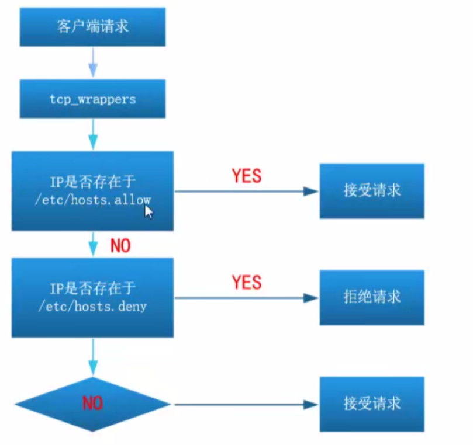

# 1、FTP对象访问控制（黑名单）

- ftpusers	黑名单

- user_list	默认是黑名单（可以成为白名单）

**默认情况下root是不能登录ftp的，因为两个黑名单中都存有root账户，已经被明文禁止了。**

**如果想让root账户能够登录，需要将ftpusers和yuser_list中的root都删除才可以。**

## ftpusers和user_list效果的不同点。

- ftpusers 被禁用	:可以输入密码，但是会返回530。

- user_list 被禁用	：直接报没有权限，更加严格。

## user_list 变为白名单

```
user_list_deny=NO    #这样user_list文件，就变成白名单了
```

# 2、FTP网络访问控制 （限速+限制IP）

## 2.1限制IP

- FTP必须支持tcp_wrappers

```
tcp_wrappers=YES    
```

```
/etc/hosts.allow	允许
/etc/hosts.deny	        拒绝
```



- **案例：如何禁止某个IP或IP网段**

```
vim /etc/hosts.deny
服务程序：主机
vsfqpd :all                             全部拒绝
vsftpd:all EXCEPT 192.168.0.2           拒绝所有除了 192.168.0.2
vsftpd:192.168.0.254                    拒绝单个IP地址
vsftpd:192.168.0.254:allow
//以上是允许192.168.0.254访问，类似/etc/hosts.allow里增加vsftpd:192.168.0.254
vsftpd:192.168.0.0/255.255.255.0        拒绝某个网段
vsftpd:192.168.0.0/255.255.255.0 EXCEPT 192.168.0.254    拒绝某个网段，但是除了
某个ip地址
注意：子网掩码不支持192.168.0.0/24这种写法
vim /etc/hosts.deny
vsftpd,sshd:10.1.1.1
```

### 案例：如何判断某个服务是否支持tcp_wrappers

- 1）./configure --enable-libwrap 表示支持tcp_wrappers访问控制

- 2）rpm安装（也包括yum 安装）

```
ldd命令+二进制程序，查询某个软件包含哪些模块
```

- 案例：查询vsftpd与sshd是否支持tcp_wrappers

```
ldd /usr/sbin/vsftpd |grep libwrap*
libwrap.so.o => /lib64/libwrap.so.0 (0x00007f2956480000）
ldd /usr/sbin/sshd |grep libwrap*
libwrap.so.e => /lib64/libwrap.so.e (ex00007f015ff29000）
```

## 限制FTP流量

```
单位为字节，默认为0，表示不限数
anon_max_rate=0   B/s       #匿名账号        
local_max_rate=0  B/s      #本地账号
```