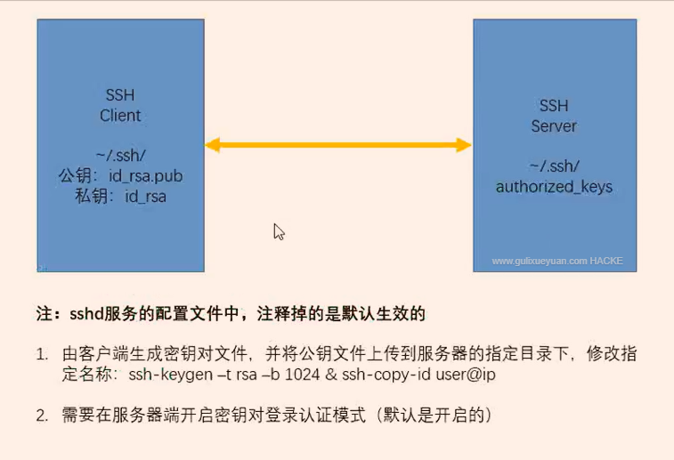
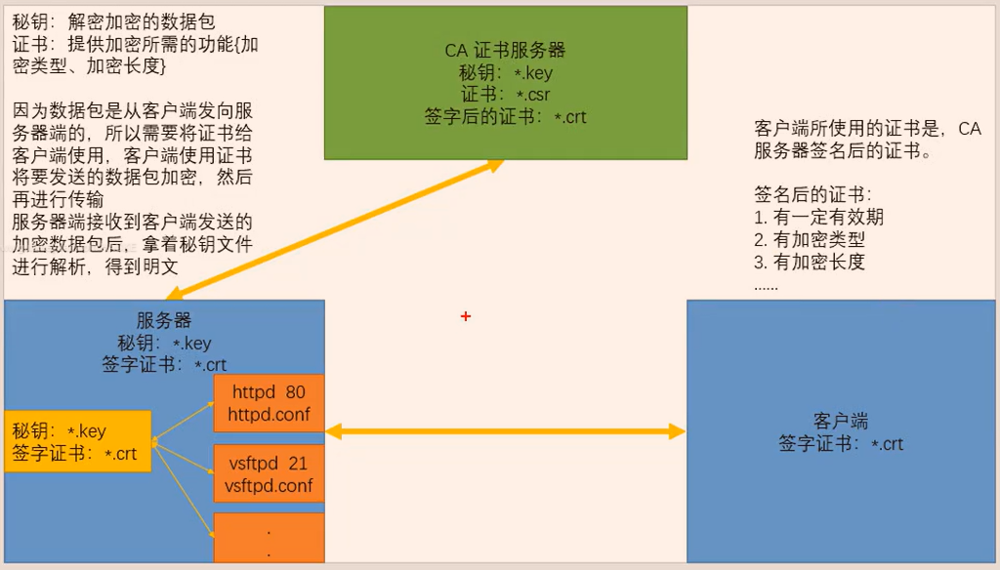

**openssl+vsftpd 加密验证方式**

**(ssl,Secure-Socket-Layer:安全套接字协议）**

**openssl是一个开源软件。**

拓展 ： 使用 tcpdump 工具进行指定端口抓包 ， 抓取 ftp 登录过程中的数据包

```
[root@server1 ~]# tcpdump -i eth0 -nn -X -vv tcp port 21 and ip host 来源ip
-i #interface：指定tcpdump需要监听的接口
-n #对地址以数字方式显式，否则显式为主机名
-nn #除了-n的作用外，还把端口显示为数值，否则显示端口服务名
-X #输出包的头部数据，会以16进制和ASCII两种方式同时输出
-vv #产生更详细的输出
```

- 1. 1. 查看是否安装了 openssl ：
rpm -q openssl

- 2. 2. 查看 查看 vsftpd 是否支持 openssl
：ldd /usr/sbin/vsftpd | grep libssl

- 3. 3. 生成加密信息 生成加密信息 的秘钥和证书文件
：

- **(genrsa,Generate-RSA:生成秘钥使用rsa算法）**

```
[root@server1 ~]# cd /etc/ssl/certs/
[root@server1 ~]# openssl genrsa -out vsftpd.key 1024    
    #建立服务器私钥，生成 RSA 密钥

[root@server1 ~]# openssl req -new -key vsftpd.key -out vsftpd.csr
    #需要依次输入国家，地区，城市，组织，组织单位，Email 等信息。最重要的是有一个 common name，
    可以写你的名字或者域名。如果为了 https 申请，这个必须和域名吻合，否则会引发浏览器警报。
    生成的 csr 文件交给 CA 签名后形成服务端自己的证书
[root@server1 ~]# openssl x509 -req -days 365 -sha256 -in vsftpd.csr -signkey vsftpd.key -out
 vsftpd.crt
    #使用 CA 服务器签发证书，设置证书的有效期等信息
```

**注意 1 1 ： 生成完秘 钥和证书文件 后，将本目录{ /etc/ssl/certs/} 的权限修改为 500.
**

**注意 2 2 ：在实验环境中可以用命令生成测试，在生产环境中必须要在 https 证书厂商注册（否则浏览器不识别）**

- 4. 4. 修改主配置文件 修改主配置文件 /etc/vsftpd/vsftp d.conf

```
ssl_enable=YES
#启用 ssl 认证
ssl_tlsv1=YES
ssl_sslv2=YES
ssl_sslv3=YES
#开启 tlsv1、sslv2、sslv3 都支持
allow_anon_ssl=YES
#允许匿名用户{虚拟用户}
force_anon_logins_ssl=YES
force_anon_data_ssl=YES
#匿名登录和传输时强制使用 ssl
force_local_logins_ssl=YES
force_local_data_ssl=YES
#本地登录和传输时强制使用 ssl
rsa_cert_file=/etc/ssl/certs/vsftpd.crt
#rsa格式的证书
rsa_private_key_file=/etc/ssl/certs/vsftpd.key
#rsa格式的密钥
```

**注 ： 密 钥文件要在配置文件 中单独声明 （写入配置 文件时，注释要单独一行，否则会报 错）**

- 5. 5. 重启 服务

service vsftpd restart

- 6. 6. 测试(  使用第三方客户端连接)



FileZilla-FTP（第三方客户端工具）

连接测试时选择：

服务器类型：显式 TLS/SSL

登录类型： 一般或匿名



