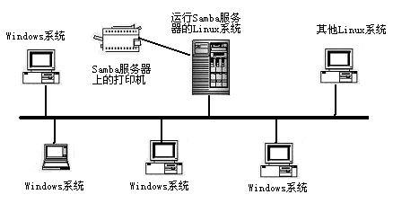

# **. 1. Samba概述
**

  SMB（Server Messages Block，信息服务块）是一种在局域网上共享文件和打印机的



# **2、为什么要讲 SAMBA ？
**

**ftp 的 优缺点 ：**

优点：文件传输、应用层协议、可跨平台

缺点：只能实现文件传输，无法实现文件系统挂载；无法直接修改服务器端文件

**Samba 的特性 ：**

使用 smb/cifs 协议、可跨平台、可实现文件系统挂载、可实现服务器端修改文件

- SMB(Server Message Block ) 协议实现文件共享，也称为CIFS( common Internet File System )

- 是Windows和类Unix系统之间共享文件的一种协议

- 客户端主要是Windows ; 支持多节点同时挂载以及并发写入

- 主要用于windows和Linux下的文件共享、打印共享

- 实现 匿名与本地用户 文件共享



# **3、smb 协议和 cifs 之间的关系
**

  随着 Internet 的流行，Microsoft 希望将这个协议扩展到 Internet 上去，成为 Internet 上计算机之间相互共享
数据的一种标准。因此它 将原有的几乎没有多少技术文档的 SMB 协议进行整理，重新命名为CIFS （ Common Internet File
 System ） ， 它使程序可以访问远程  Internet 计算机上的文件并要求此计算机提供服务。客户程序请求远在服务器上的
服务器程序为它提供服务。服务器获得请求并返回响应。CIFS 是公共的或开放的 SMB 协议版本，并由 Microsoft 使用。

SMB 协议在局域网上用于服务器文件访问和打印的协议。




