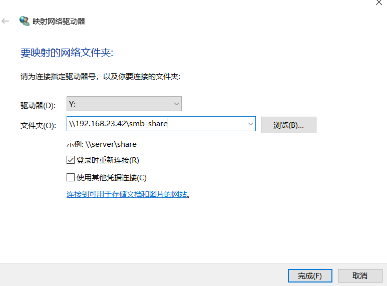



# **1、Linux 端:****（yum install -y samba-client)**

# **
**

```javascript
smbclient -U 用户名 -L //服务器 IP 		#查看服务器共享
smbclient -U 用户名 //服务器 ip/共享名 	#登录服务器共享
```

# **1）安装客户端软件：**

```javascript
[root@localhost ~]# which smbclien         #查看命令所在路径
/usr/bin/smbclient 

[root@localhost ~]# rpm -qf /usr/bin/smbclient     #查看命令属于哪个软件包
samba-client-3.6.23-53.el6_10.x86_64

[root@localhost ~]# yum install -y samba-client     #安装软件
```

## **2）查看：smbclient  -U  zhangsan   //192.168.1.105**

```javascript
[root@localhost ~]# smbclient -U zhangsan  -L //192.168.1.105
Enter zhangsan's password: 
Domain=[MYGROUP] OS=[Unix] Server=[Samba 3.6.23-33.el6]

	Sharename       Type      Comment
	---------       ----      -------
	IPC$            IPC       IPC Service (Samba Server Version 3.6.23-33.el6)
	zhangsan        Disk      Home Directories


Domain=[MYGROUP] OS=[Unix] Server=[Samba 3.6.23-33.el6]

	Server               Comment
	---------            -------

	Workgroup            Master
	---------            -------
[root@localhost ~]#
```

## **3）登录：smbclient   -U  lisi //192.168.1.105/lisi**

```javascript
[root@localhost ~]# smbclient -U lisi  //192.168.1.105/lisi
Enter lisi's password: 
Domain=[MYGROUP] OS=[Unix] Server=[Samba 3.6.23-33.el6]
smb: \> 
smb: \> ls
  .                                   D        0  Mon Aug 23 23:31:39 2021
  ..                                  D        0  Mon Aug 23 23:31:39 2021
  .gnome2                            DH        0  Fri Nov 12 09:04:19 2010
  .bash_logout                        H       18  Wed May 11 07:21:42 2016
  .bash_profile                       H      176  Wed May 11 07:21:42 2016
  .bashrc                             H      124  Wed May 11 07:21:42 2016

		61970 blocks of size 32768. 58674 blocks available
smb: \> 
```

4）把Samba挂载到linux系统（类似NFS）

- 下载cifs-ults工具

```
yum install -y cifs-utils
```

- 挂载

```
mount.cifs -o user=user01,pass=123 //192.168.23.42/smb_share /u01
```

# **2、Window 端**

- 首先Windows需要支持samba协议

- 控制面板-->程序和功能-->启用或关闭Windows功能


- 重启

- 然后打开文件管理器，选择计算机，选择映射网络驱动器


- 文件夹输入框中，输入samba服务器地以及共享的文件别名（注意是别名，不是路径）



- **回车：**


- 输入账号密码之后，就可以进入共享目录了。

- 此时计算机那，就会多显示一个磁盘

