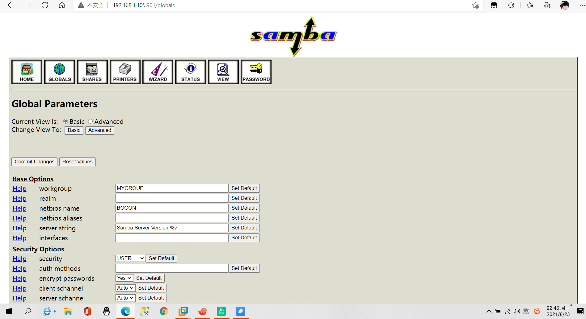

**注：先关闭服务器和客户机上的防火墙和 SELinux**

# **1、部署流程：****
**

## **1. 服务器端安装 samba
**

```javascript
yum -y install samba
```

## **2. 确认客户端和相关命令软件包是否安装（默认是安装的）
**

```javascript
rpm -q samba-client
rpm -q samba-common
```

## **3. 创建共享区域
**

```javascript
备份主配置文件
创建独立的共享区间（仿照模板编写）
```

## **4. 启动 smb 服务并查看默认共享区域
**

```javascript
a、service smb start
b、smbclient -U 用户名 -L //smbserverIP
```



# **2、本地验证（登录、上传、下载）（****需要重启）****
**

## **a、 修改配置文件（添加自定义共享）：vi  /etc/samba/smb.conf
**

```javascript
[atguigu]  			#共享名
comment = the share is atguigu   	#说明
path = /atguigu			#共享位置，记得创建相应的目录
public = yes			#是否可以匿名访问
browseable = yes			#是否可以被查看
writable = yes			#是否可写
```

## **b、 创建共享目录并给定相应权限
**

```javascript
mkdir  /atguigu
chmod 777 /atguigu (chmod o+w  /atguigu)	#最好使用 ACL 权限
```

## **c、 测试配置文件并重启服务
**

```javascript
testparm
service smb restart
```

## **d、 首先，创建 Linux 用户
**

```javascript
useradd -s /sbin/nologin zhangsan
passwd zhangsan #不需要创建系统密码
```

## **e、 转换为 samba 用户
**

```javascript
pdbedit -a zhangsan
```

## **f、 客户端查看共享文件夹并登录测试
**

```javascript
smbcient -U zhangsan –L IP 地址
smbclient –U zhangsan //IP 地址/共享名
```

**注：由于未设置上传文件的默认权限，指定用户上传的文件只有自己能修改和覆盖。**

# **3、访问控制 - 通过配置限制****
**

valid users 仅允许部分用户访问共享区域

注：前提条件是指定目录权限给到最大，通过修改配置文件来实现实验结果

## **1）部分用户登录 samba 服务器
**

```javascript
修改/etc/samba/smb.conf 中自定义的共享区域
添加：设置合法用户列表
valid users = 用户,@组（多个逗号分隔）
```

- **更改配置文件，设置只允许zhangsan可登录共享区域**

```javascript
[root@bogon atguigu]# vi /etc/samba/smb.conf
[atguigu]
        comment = Public Stuff
        path = /atguigu
        public = yes
        writable = yes
        browseable=yes
        valid  users=zhangsan				#添加此处
```

- **登录测试：**

```javascript
[root@localhost ~]# smbclient -U zhangsan   //192.168.1.105/atguigu
Enter zhangsan's password: 
Domain=[MYGROUP] OS=[Unix] Server=[Samba 3.6.23-33.el6]
smb: \> 
**#登录成功**
[root@localhost ~]# smbclient -U lisi   //192.168.1.105/atguigu
Enter lisi's password: 
Domain=[MYGROUP] OS=[Unix] Server=[Samba 3.6.23-33.el6]
tree connect failed: NT_STATUS_ACCESS_DENIED
#登录失败
```

## **2）部分用户对共享区域有写权限
**

```javascript
修改/etc/samba/smb.conf 中自定义的共享区域
添加：开启只读，设置可写列表
read only = yes
write list = lisi
```

## **3）设置上传文件的默认权限
**

```javascript
create mask 文件的默认权限
directory mask 目录的默认权限
修改配置文件自定义的共享区域
添加：
create mask = 666
directory mask = 777
```

# **4、用户别名 （ 虚拟用户） ）****
**

## **1） 添加别名（/etc/samba/smbusers）
**

```javascript
添加：
zhangsan = zs
```

## **2） 启用别名（修改主配置文件）
**

```javascript
vim /etc/samba/smb.conf
添加：
username map = /etc/samba/smbusers    #添加在[global]下
```

```javascript
[root@bogon atguigu]# vi /etc/samba/smb.conf
[global]
# ----------------------- Network Related Options -------------------------
#
# workgroup = NT-Domain-Name or Workgroup-Name, eg: MIDEARTH
#
# server string is the equivalent of the NT Description field
#
# netbios name can be used to specify a server name not tied to the hostname
#
# Interfaces lets you configure Samba to use multiple interfaces
# If you have multiple network interfaces then you can list the ones
# you want to listen on (never omit localhost)
#
# Hosts Allow/Hosts Deny lets you restrict who can connect, and you can
# specifiy it as a per share option as well
#
        workgroup = MYGROUP
        server string = Samba Server Version %v
        username map = /etc/samba/smbusers                    #添加在此处

```

## **3）测试
**

```javascript
smbclient -U 别名 //服务器 ip/共享名
[root@localhost ~]# smbclient -U zs   //192.168.1.105/atguigu
Enter zs's password: 
Domain=[MYGROUP] OS=[Unix] Server=[Samba 3.6.23-33.el6]
smb: \> 

```

# **5、映射网络驱动器 （ 挂载） ****
**

**Linux 下:**

```javascript
临时挂载：
mount -t cifs -o username=xxx,password=xxx //服务器 ip/服务器共享 /本地挂载目录
永久挂载：vi  /etc/fstab
//服务器 ip/服务器共享 /本地挂载目录 cifs defaults,username=xxx,password=xxx 0 0
```

- 永久挂载：

```javascript
[root@localhost etc]# vi fstab 

# /etc/fstab
# Created by anaconda on Thu Aug 12 06:44:15 2021
#
# Accessible filesystems, by reference, are maintained under '/dev/disk'
# See man pages fstab(5), findfs(8), mount(8) and/or blkid(8) for more info
#
UUID=b2b5c7eb-0aa1-489e-aa3c-10a9aabfab35 /                       ext4    defaults        1 1
UUID=2653a86d-232e-47d4-a523-01996b9642d6 /boot                   ext4    defaults        1 2
UUID=4ed49586-cbb5-418a-8519-cf4c343a0be5 /home                   ext4    defaults        1 2
UUID=a933df42-b3b5-45fa-9606-300a0be389a8 swap                    swap    defaults        0 0
tmpfs                   /dev/shm                tmpfs   defaults        0 0
devpts                  /dev/pts                devpts  gid=5,mode=620  0 0
sysfs                   /sys                    sysfs   defaults        0 0
proc                    /proc                   proc    defaults        0 0

//192.168.1.105/atguigu /atguigu                cifs    defaults,username=zhangsan,password=123456 0 0   #修改此处
```

**Window 下：**

```javascript
我的电脑、计算机、此电脑、这台电脑等右键映射网络驱动器【注意是反斜杠 \ 】
```

# **6、化 图形化 web 管理 界面
**

## **1. 安装（导入安装包）
**

```javascript
使用 yum -y install samba-swat
```

## **2. 修改/etc/xinetd.d/swat
**

```javascript
添加：
only_from = 登录来源 IP
disable = no
```

## **3. 重启 xinetd 服务
**

```javascript
service xinetd restart
```

## **4. 测试
**

```javascript
浏览器：IP：901 #登录时注意端口号
```

