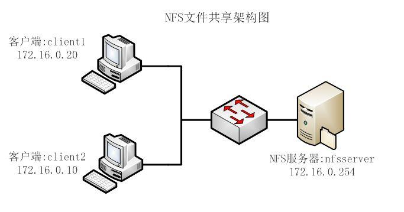
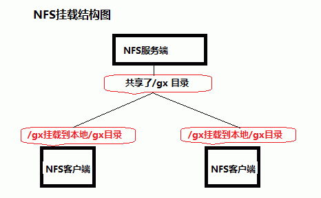
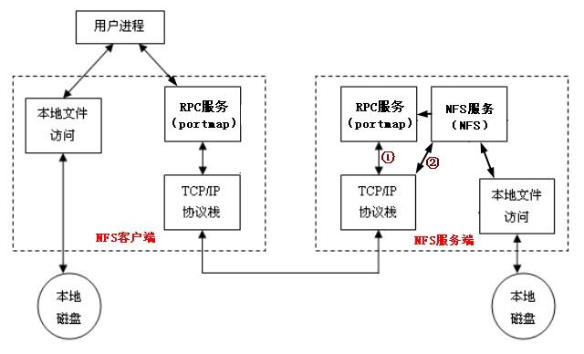

# **1. 什么是NFS ？
**

 NFS 是 Network File System 的缩写，即网络文件系统。一种使用于分散式文件系统的协定，由 Sun 公司开发，
于 1984 年向外公布。功能是通过网络让不同的机器、不同的操作系统能够彼此分享个别的数据，让应用程序在客户端
通过网络访问位于服务器磁盘中的数据，是在类 Unix 系统间实现磁盘文件共享的一种方法





  它的主要功能是通过网络让不同的机器系统之间可以彼此共享文件和目录。NFS 服务器可以允许 NFS 客户端将远
端 NFS 服务器端的共享目录挂载到本地的 NFS 客户端中。在本地的 NFS 客户端的机器看来，NFS 服务器端共享的目录
就好像自己的磁盘分区和目录一样。一般客户端挂载到本地目录的名字可以随便，但为方便管理，我们要和服务器端
一样比较好。

**NFS 一般用来存储共享视频，图片等静态数据。**





# **2、NFS 挂载原理
**

  NFS 是通过网络来进行服务端和客户端之间的数据传输。两者之间要传输数据就要有想对应的网络端口来进行传
 
输。NFS 服务器到底使用什么网络端口来传输数据的，NFS 服务器端其实是

  也就是 RPC 管理服务端的 NFS 端口分配，客户端要传数据，那客户端的 RPC 会先跟服务端的 RPC 去要服务器的端

口，要到端口后再建立连接，然后传输数据。



## **1）那 RPC 和 NFS 之间又是如何之间相互通讯的？****
**

  首先当 NFS 启动后，就会随机的使用一些端口，然后 NFS 就会向 RPC 去注册这些端口。RPC 就会记录下这些端口。并

且 RPC 会开启 111 端口，等待客户端 RPC 的请求，如果客户端有请求，那服务端的 RPC 就会将记录的 NFS 端口信息告
知客户端。

## **2）RPC 和 NFS 的启动顺序是怎样的？****
**

  在启动 NFS SERVER 之前，首先要启动 RPC 服务（即 portmap 服务，下同）否则 NFS SERVER 就无法向 RPC 服务区注册，
另外，如果 RPC 服务重新启动，原来已经注册好的 NFS 端口数据就会全部丢失。因此此时 RPC 服务管理的 NFS 程序也
要重新启动以重新向 RPC 注册。

**特别注意：一般修改 NFS 配置文档后，是不需要重启 NFS 的，直接在命令执行
**

**/etc/init.d/nfs reload**

## **3）总结：客户端 NFS 和服务端 NFS 通讯过程****
**

1）首先服务器端启动 RPC 服务，并开启 111 端口

2）启动 NFS 服务，并向 RPC 注册端口信息

3）客户端启动 RPC（portmap 服务），向服务端的 RPC(portmap)服务请求服务端的 NFS 端口（使用的是111端口）

4）服务端的 RPC(portmap)服务反馈 NFS 端口信息给客户端。

5）客户端通过获取的 NFS 端口来建立和服务端的 NFS 连接并进行数据的传输。



# **3、NFS 相关协议及软件 安装管理
**

**协议：**

RPC（Remote Procedure Call Protocol）——远程过程调用协议

**软件：**

nfs-utils-* ：包括 NFS 命令与监控程序

rpcbind-* ：支持安全 NFS RPC 服务的连接

**注：通常情况下，是作为系统的默认包安装的
**

**Cent OS6.*之前 rpcbind 叫 portmap**

# **4、. NFS系统守护进程
**

**nfs：**

**rpcbind**

会将所管理的与服务对应的端口提供给客户端，从而使客户可以通过该端口向服务器请求服务。

# **2、nfs相关命令
**

**exportfs 命令**

  如果我们在启动了NFS之后又修改了/etc/exports，是不是还要重新启动nfs呢？这个时候我们就可以用exportfs

命令来使改动立刻生效，该命令格式如下：

```javascript
格式：exportfs [-aruv]
-a 全部挂载或卸载 /etc/exports中的内容
-r 重新读取/etc/exports 中的信息 ，并同步更新/etc/exports、/var/lib/nfs/xtab
-u 卸载单一目录（和-a一起使用为卸载所有/etc/exports文件中的目录）
-v 在export的时候，将详细的信息输出到屏幕上。
```

**具体例子：**

```javascript
# exportfs -au 卸载所有共享目录
# exportfs -ra 重新共享所有目录并输出详细信息
```

**rpcinfo 命令**

利用

其中