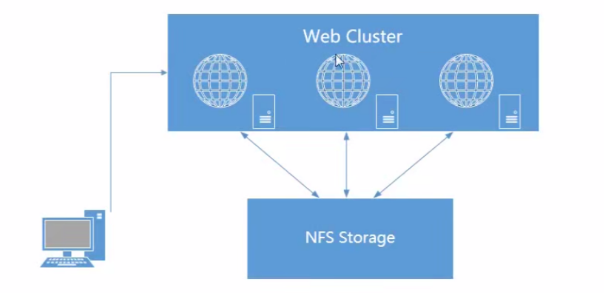
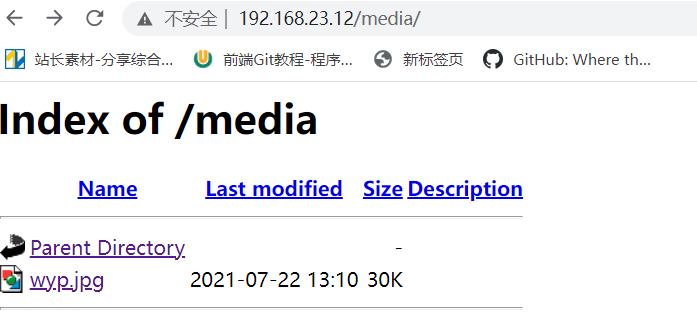

# 1、任务背景

①搭建NFS服务器（用于静态资源的存储如图片、视频、附件）

②使用mount指定对NFS服务器进行挂载，挂载到Web服务器中

③对NFS服务器中的静态资源进行实时备份( inotify + rsync )

# 2、环境准备

- 配置主机

| 编号 | 主机(FQDN) | ip地址 | 作用 | 
| -- | -- | -- | -- |
| 1 | web.itcast.cn | 192.168.23.12 | web服务器 | 
| 2 | nfs.itcast.cn | 192.168.23.48 | NFS服务器 | 
| 3 | backup.itcast.cn | 192.168.23.13 | Backup服务器 | 


- 三台主机都关闭防火墙和SELINUX

```
systemctl stop firewalld
setenforce 0
```

# **任务背景**

由于业务驱动，为了提高用户的访问效率，现需要将原有web服务器上的静态资源文件分离出来，单独保存到一台文件服务器上。



# **任务解决方案**

## **1、搭建NFS服务器****(NFS服务器中)**

- 第一步：安装软件

```
yum install -y rpcbind nfs-utils 
```

- 第二步：创建共享目录，如/share

```
mkdir /share
```

- 第三步：编写NFS主配置文件

```
vim /etc/exports
# 共享目录        共享选项
/share        192.168.23.0/24(rw,sync)    #将/share目录共享给192.168.23.0这个网段的主机。(IO操作，使用sync)
```

- 第四步：启动相关的NFS服务

```
systemctl    start   rpcbind
systemctl    start   nfs-server
netstate -anltp |grep 111        #查看端口号是否开启
```

# 2、搭建web服务器（web服务器中）

```
yum insatll -y httpd
systemctl start   httpd
echo "NFS服务" > /var/www/html/index.html
```

# 3、在web服务器中挂载NFS（web服务器中）

```
mkdir /var/www/html/media
yum install -y nfs-utils    #挂载nfs，需要下载nfs-utils服务
showmount  -e 192.168.23.42    #查看192.168.23.42主机上可挂载的目录
    >> Export list for 192.168.23.42:
    >> /share/nfs 192.168.23.0/24
mount -t nsf 192.168.23.42:/share/nfs   /var/www/html/media    #将nfs挂载到/var/www/html/media目录上
```

# 4、在NFS服务器的共享目录中，上传某个图片文件

```
ll /share/nfs/
    >> wyp.jpg
```

# 5、然后使用浏览器，访问web服务



**如上访问成功！！！**