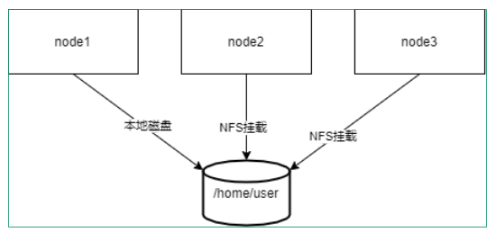

**NFS(网络文件系统)**

# 一、简介

- Linux/Unix系统之间共享文件系统的一种协议，通过网络让不同的主机之间共享文件或目录

- NFS的客户端主要为Linux

- 支持多节点同时挂载以及并发写入

- 提供文件共享服务

- 为集群中的web server配置后端存储

## **1）NFS协议模型**


## **2）RPC远程过程调度**

- NFS协议本身并没有网络传输功能，而是基于远程过程调用协议实现的

- 提供一个面向过程的远程服务的接口

- 可以通过网络从远程主机程序上请求服务，而不需要了解底层网络技术的协议

- 工作在OSI模型的会话层，它可以为遵从RPC协议应用层协议提供端口注册功能

- 事实上，有很多服务（NFS和NIS等）都可以向RPC注册端口

- RPC使用网络端口111来监听客户端的请求

## 3）RPC协议模型

1、基于rpc的服务（此处是指nfs服务，在别处有可能是代表其他服务）在启动时向portmapper注册端口

2. 基于rpc的客户端练习服务端portmapper询问服务的端口号

3. portmapper告知客户端某基于rpc服务使用的端口号

4. 基于rpc的客户端访问被告知单某基于rpc服务的端口

5. 基于rpc的服务响应客户端的请求


## 4）工作过程


## 5）案例，基于NFS搭建web后端NAS存储

用户访问负载均衡器节点（负载均衡的知识暂时不用关心），负载均衡器会将请求负载均衡得分发给web服务器，比如请求index.html界面，每一台服务器都会去NAS存储服务器上寻找想要被读取的数据。这可以大大降低服务器成本、运维成本（修改数据会牵一发而动全身）


### 1、关闭防火墙和selinux，每台机器操作一样

```
[root@server1 ~]# systemctl stop firewalld
[root@server1 ~]# setenforce 0
```

### 2、准备web

```
[root@server1 ~]# yum install httpd -y
[root@server1 ~]# systemctl start httpd
[root@server2 ~]# yum install httpd -y
[root@server2 ~]# systemctl start httpd
```

### 3、准备nas端

```
# 安装nfs服务
[root@server3 ~]# yum install -y nfs-utils
# 准备共享目录
[root@server3 ~]# mkdir /webdata
# 准备共享文件
[root@server3 ~]# echo "<h1>today i study but you sleep i good you bad</h1>"
> /webdata/index.html
# 配置nfs服务
[root@server3 webdata]# cat /etc/exports
/webdata 192.168.80.0/24(rw)
[root@server3 ~]# systemctl start nfs-server.service
[root@server3 ~]# systemctl enable nfs-server.service
```

### 4、查看共享

```
[root@server1 ~]# yum install -y nfs-utils
[root@server1 ~]# showmount -e 192.168.80.153
```

### 5、挂载后端nas存储

```
[root@server1 ~]# mount -t nfs 192.168.80.153:/webdata /var/www/html/
[root@server1 ~]# df
文件系统          1K-块  已用   可用 已用% 挂载点
/dev/mapper/centos-root 17811456 1153376 16658080  7% /
devtmpfs         922468    0  922468  0% /dev
tmpfs           933524    0  933524  0% /dev/shm
tmpfs           933524  8804  924720  1% /run
tmpfs           933524    0  933524  0% /sys/fs/cgroup
/dev/sda1        1038336 145756  892580  15% /boot
tmpfs           186708    0  186708  0% /run/user/0
192.168.80.153:/webdata 17811456 1082880 16728576  7% /var/www/html
[root@server2 ~]# mount -t nfs 192.168.80.153:/webdata /var/www/html/
[root@server2 ~]# df
文件系统          1K-块  已用   可用 已用% 挂载点
/dev/mapper/centos-root 17811456 1127392 16684064  7% /
devtmpfs         922468    0  922468  0% /dev
tmpfs           933524    0  933524  0% /dev/shm
tmpfs           933524  8836  924688  1% /run
tmpfs           933524    0  933524  0% /sys/fs/cgroup
/dev/sda1        1038336 145756  892580  15% /boot
tmpfs           186708    0  186708  0% /run/user/0
192.168.80.153:/webdata 17811456 1082880 16728576  7% /var/www/html
```

### 6、最后在浏览器测试访问即可

```
nas存储端 133
web客户端 132
测试网站访问
关闭防火墙和selinux
配置nas
 安装nfs服务器
 yum install -y nfs-utils
  mkdir /webdata
  echo "nfs test..." > /webdata/index.html  准备测试页面
配置nfs服务器
  vim /etc/exports
     /webdata   192.168..0/24(rw)
启动nfs服务器
 systemctl start nfs-server
 systemctl enable nfs-server
 exportfs -v                              
检查是否输出正常
配置web客户端
 安装nfs客户端
 yum install -y nfs-utils httpd
 systemctl enable httpd
 systemctl start httpd
```

## 6)NFS配置参数


## 7）自动挂载

可使用autofs服务按需要挂载外围设备，NFS共享等，并在空闲5分钟后后自动卸载

### 1）相关包和文件

- 软件包: autofs

- 服务文件: /usr/lib/systemd/system/autofs.service

- 配置文件: /etc/auto.master

### 2）配置文件格式

参看帮助: man 5 autofs

所有导出到网络中的NFS启用特殊匹配-host至"browse"

范例: /net目录可以自动挂载NFS共享

```
cat /etc/auto.master
/net   -hosts
cd /net/192.168.175.147
```

- 自动挂载资源有两种格式

- 相对路径法:将mount point路径分成dirname和basename分别配置，可能会影响现有的目录结构

- 绝对路径法:直接匹配全部绝对路径名称,不会影响本地目录结构

### 3）相对路径法

- /etc/auto.master 格式 ：挂载点的dirname  指定目录的配置文件路径

- 指定目录的配置文件格式 ：挂载点的basename  挂载选项  选项设备

案例

相对路劲：

```
vim /etc/auto.master
/misc  /etc/auto.misc
vim /etc/auto.misc
cd    -fstype=iso9660,ro,nosuid,nodev  :/dev/cdrom
```

- 相对路径法为支持通配符

```
vim /etc/auto.master
/misc  /etc/auto.misc
vim /etc/auto.misc
# 表示/misc下面的子目录和nfs共享/export目录的子目录同名
*   server:/export/&
```

### 4）绝对路劲法

- /etc/auto.master格式 ：/-   指定配置文件路径

- 指定配置文件格式 ：绝对路径   挂载选项   选项设备

案列：

- 绝对路径法

```
vim /etc/auto.master
/-   /etc/auto.direct
vim /etc/auto.direct
/nfsdir    -fstype=nfs  server1:/export/nfsdir
```

## 8）实战案例

将NFS的共享目录，通过autofs 发布出来，做为远程主机用户的家目录



### 1、环境准备

将node1中的用户家目录共享出来，node2在登陆这个用户的到时候，看到家目录下的文件是一致的

## 2、步骤

- NFS服务器创建用户和相应的目录，将用户user的家目录共享

```
[root@NFSserver ~]# mkdir /data
[root@NFSserver ~]# useradd -d /data/user user
[root@NFSserver ~]# id user
uid=1000(user) gid=1000(user) 组=1000(user)
[root@NFSserver ~]# vim /etc/exports.d/test.exports
/data/user  *(rw,anonuid=1000,anongid=1000,all_squash)
```

- 在nfs客户端上实现autofs

```
[root@NFSclient ~]# vim /etc/auto.master
/data  /etc/auto.home
[root@NFSclient ~]# vim /etc/auto.home
*  -fstype=nfs,vers=3  192.168.175.144:/data/user&
```

- 在nfs客户端上创建用户user

```
[root@NFSclient ~]# mkdir /data
[root@NFSclient ~]# useradd -d /data/user -u 1000 user
```

- 测试是否完成目标

```
[root@NFSserver ~]# su - user
[user@NFSserver ~]$ touch file
# 在NSF服务器上登录user用户，创建文件在家目录中
[root@NFSclient /]# su - user
[user@NFSclient ~]$ ll
总用量 0
-rw-rw-r--. 1 user user 0 4月 30 10:13 file
# 在NSF客户机上登录user用户，发现文件已经被共享了
```