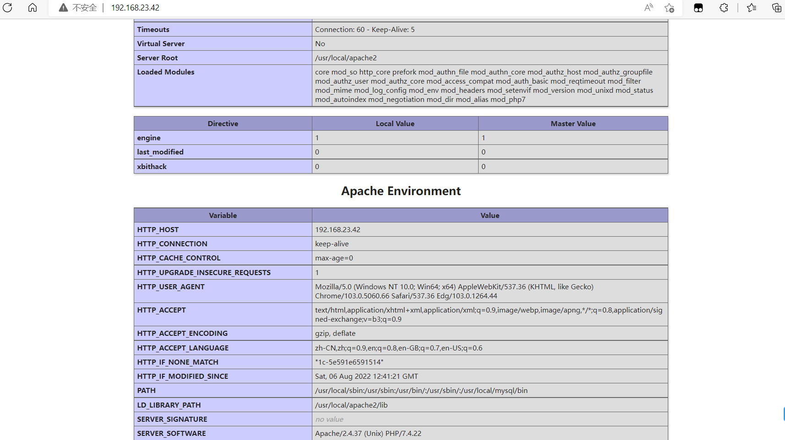

**LAMP 源码构建**

# **1、项目背景**

初创公司，随着业务不断增长，用户基数越来越大，为更好满足用户体验，开发人员提一个工单过来，需要运维人员给开发人员部署一套预发布环境（和生产环境保持一致），能够保证开发人员高效的进行预发布测试等工作。

为企业内部的开发人员，部署一套“预发布系统”，要求其环境与线上环境一模一样。由于项目是基于PHP+MySQL进行开发设计的，所以我们需要选配环境。


# 2、环境准备

系统环境：CentoS7.6

软件环境：AMP(Apache、.MySQLI以及PHP)

```
Apache->2.4.37
MySQL-->5.6.31
PHP-->7.2.17
```

# 3、依赖软件安装

```
yum install  -y  gcc gcc-c++  cmake pcre-devel ncurses-devel openssl-devel libcurl-devel autoconf
```

# 4、LAMP 安装注意事项

编译安装顺序：

```
Linux+Apache(2.4)+MySQL(5.6.31)+PHP(7.2.17)
Apache-->MySQL->PHP   或者   MySQL-->Apache-->PHP
```

# 5、编译安装mysql.5.6.31

- 解压源码包

```
tar -zxvf mysql-5.6.35.tar.gz
```

- 使cmake配置MySQL的安装向导

```
vim cmake.sh
cmake . \
-DCMAKE_INSTALL_PREFIX=/usr/local/mysql/ \
-DMYSQL_DATADIR=/usr/local/mysql/data \
-DENABLED_LOCAL_INFILE=1    \
-DWITH_INNOBASE_STORAGE_ENGINE=1 \
-DMYSQL_TCP_PORT=3306 \
-DDEFAULT_CHARSET=utf8mb4 \
-DDEFAULT_COLLATION=utf8mb4_general_ci \
-DWITH_EXTRA_CHARSETS=all \
-DMYSQL_USER=mysql 
```

- 编译安装

```
make && make install 
```

- 更改权限

```
chown -R mysql.mysql /usr/local/mysql/
```

- 初始化数据库

```
[root@server1 mysql]# rm -f /etc/my.cnf    #删除my.cnf文件
[root@server1 mysql]# ./scripts/mysql_install_db --user=mysql  #使用mysql的身份初始化数据库
[root@server1 mysql]# ll data/
总用量 110600
-rw-rw---- 1 mysql mysql 12582912 8月   6 18:00 ibdata1
-rw-rw---- 1 mysql mysql 50331648 8月   6 18:00 ib_logfile0
-rw-rw---- 1 mysql mysql 50331648 8月   6 18:00 ib_logfile1
drwx------ 2 mysql mysql     4096 8月   6 18:00 mysql
drwx------ 2 mysql mysql     4096 8月   6 18:00 performance_schema
drwxr-xr-x 2 mysql mysql       20 8月   6 17:11 test
#如显示以上信息，证明初始化成功
```

- 第六步：把mysq的启动脚本copy到/etc/init.d目录下，起一个名称叫做mysql，

```
[root@server1 mysql]# cp support-files/mysql.server  /etc/init.d/mysql
```

- 启动mysql

```
[root@server1 mysql]# service mysql start         #启动mysql服务
Starting MySQL. SUCCESS!         #启动成功
```

- 设置密码与环境变量

```
cd /usr/local/mysql
bin/mysqladmin -u root password '123'
```

- 把/usr/ocal/mysql/bin目录添加到环境变量

```
echo 'export PATH=$PATH:/usr/local/mysql/bin' >> /etc/profile
source /etc/profile    #环境变量立即生效
```

# 6、编译安装Apache

-  安装依赖软件

```
#安装apr软件：
tar xf apr-1.5.2.tar.bz2
cd apr-1.5.2
./configure
make && make  install
#安装apr-uti1软件：
tar xf apr-util-1.5.4.tar.bz2
cd apr-ut11-1.5.4/
./configure --with-apr=/usr/local/apr/bin/apr-1-config    #指定软件apr的路径
make &&make install
```

- 编写apache.sh

```
yum install -y apr-util-devel-1.5.2-6.el7.x86_64
  apr-devel-1.4.8-7.el7.x86_64
vim apache.sh
./configure \
--prefix=/usr/local/apache2 \
--enable-modules=all \
--enable-mods-shared=all \
--enable-so \
--enable-rewrite \
--with-pcre \
--enable-ssl \
--with-mpm=prefork \
--with-apr=/usr/bin/apr-1-config \
--with-apr-util=/usr/bin/apu-1-config
```

- 执行脚本

```
bash apache.sh
```

- 编译安装

```
make && make install
```

- 运行apache软件

```
cd  /usr/local/apache2/
bin/apachectl     #启动服务
```

- 用浏览器访问


## 配置参数说明

```
yum install -y apr-util-devel-1.5.2-6.el7.x86_64
  apr-devel-1.4.8-7.el7.x86_64
#./configure
--enable-modules=all        加载所有支持模块
--enable-mods-shared=all    共享方式加载大部分常用的模块
--enable-so                  启动动态模块加载功能
--enable-rewrite             启用ur1地址重写功能
--enable-ssl                编译ss1模块，支持https
--with-pcre                    支持正则表达式
--with-apr=/usr/bin/apr-1-config         指定依赖软件apr路径
--with-apr-util=/usr/bin/apu-1-config    
--with-mpm=prefork                插入式并行处理模块，称为多路处理模块，Prefork是类UNIX平台上默认的MPM
(1)prefork    多进程模型，每个进程响应一个请求
(2)worker    多进程多线程模型，每个线程处理一个用户请求
(3)event(最优)    事件驱动模型，多进程模型，每个进程响应多个请求
```

# 7、源码安装PHP

- 安装依赖软件

```
yum install -y libxml2-devel  libjpeg-devel  libpng-devel  freetype-devel sqlite-devel  oniguruma-devel
```

- 解压

```
tar xf php-7.4.22.tar.gz
```

- 编辑php.sh脚本

```
[root@lamp php-7.2.17]#vim php.sh
./configure  \
--with-apxs2=/usr/local/apache2/bin/apxs \
--with-mysqli=/usr/local/mysql/bin/mysql_config \
--with-pdo-mysql=/usr/local/mysql \
--with-zlib --with-curl --enable-zip \
--with-gd --with-freetype-dir --with-jpeg-dir \
--with-png-dit --enable-sockets --with-xmlrpc \
--enable-soap --enable-opcache --enable-mbstring --enable-mbregex \
--enable-pcntl --enable-shmop --enable-sysvmsg \
--enable-sysvsem --enable-sysvshm --enable-calendar \
--enable-bcmath --enable-fpm  --with-fpm-user=www --with-fpm-group=www 
```

- 执行

```
bash php.sh
```

- 编译安装

```
make && make install 
```

- 查php有没有安装成功

```
ls  /usr/local/apache2/modules/libphp7.so
```

# 8、配置Apache与PHP

## 8.1编辑apache的配置文件

```
vim /usr/local/apache2/conf/httpd.conf
ServerName localhost:80
```

- 配置Apachei语言支持（支持中文）

```
LoadModule negotiation_module modules/mod_negotiation.so    取消注释，159行
Include conf/extra/httpd-languages.conf        取消注释，483行
```

- 开启对PHP的支持

```
LoadModule php7_module modules/libphp7.so  #166行添加
AddHandler php7-script php  #408行添加
AddType text/html .php
```

- 添加index.php默认首页

```
<IfModule dir_module>            #266行
    DirectoryIndex  index.php  index.html
 </IfModule>
```

- 让Apache优先支持中文

```
vim/usr/local/apache2/conf/extra/httpd-languages.conf
DefaultLanguage zh-CN    取消注释，并修改，默认语言集改为中文 19行
LanguagePriority zh-CN enn ca cs da de el eo es et fr he hr it ja ko ltz nl nn no pl pt pt-BR ru sv tr zh-TW
    #语言集优先集，把zh-CN写到前面
```

- 重启apache

```
/usr/local/apache2/bin/apachectl -k restart
```

- 启动脚本

```
#!/usr/bin/bash
. /etc/init.d/functions

EXEC=/usr/local/apache2/bin/apachectl
case $1 in
start)  bash $EXEC    $1  ;;
stop)  bash $EXEC -k   $1  ;;
restart)  bash $EXEC  -k   $1  ;;
status) systemctl status httpd ;;
* )
    echo 'please enter start|stop|restart|status' ;;
esac
```

- 编写PHP测试脚本

```
cd /usr/local/apache2/htdocs    # htdocs就是apachel的默认项目目录
rm -f index.html
vim index.php
    <?php
        phpinfo();
    ?>
```

**如果不显示以下页面：**

- 如果还不行，直接pkill httpd,然后再重启一次

