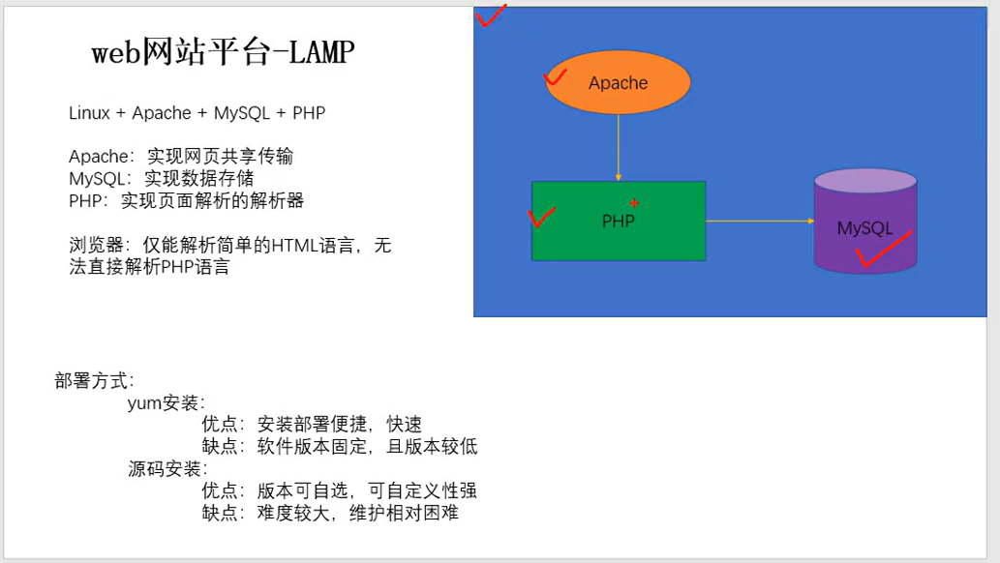

# **
**

**环境要求： **

- 系统环境：CentOS 6.X 64 位

- 关闭 SELinux 和 iptables 防火墙

# **1、安装编译工具 gcc 、 gcc- - c++ 等
**

**注意解决依赖关系，推荐使用 yum 安装，若不能联网可使用安装光盘做为 yum 源**

## **a、编辑yum 配置文件 ，启用本地光盘源 （ 双光盘 ）
**

```javascript
# mount /dev/sr0 /mnt
# mount /dev/sr1 /media
# vim /etc/yum.repos.d/CentOS-Media.repo
[c6-media]
name=CentOS-$releasever - Media
baseurl=file:///mnt
file:///media
gpgcheck=0
enabled=1
```

## **b、调整yum源配置文件引导优先级
**

```javascript
# mv /etc/yum.repos.d/CentOS-Base.repo /backup
```

## **c 、安装 gcc 、 gcc- - c++ 、e make 等编译工具
**

```javascript
# yum -y install gcc gcc-c++ make
```

# **2、关闭系统 M RPM 安装包的 Apac he 、 My SQL L 等 服务
**

**为了防止 rpm 安装的软件和接下来安装的源码软件包冲突**

```javascript
# service httpd stop
# service mysqld stop
# ……
```

确定 rpm 包安装的 httpd 和 mysqld 不能开机自启动

```javascript
# chkconfig httpd off
# chkconfig mysqld off
# ……
```

# **3 、关闭 x SELinux 和 和 iptables
**

**防止软件安装和调试过程被 iptables 和 SELinux 所限制，无法实现效果**

## **a. 关闭 SELi nux （**** 需重启 ）****
**

```javascript
# vim /etc/selinux/config
SELINUX=disabled
# reboot
```

## **b 、关闭 iptables
**

```javascript
# iptables -F
# chkconfig iptables off
```

# **4、拷贝源码包，解包解压缩
**

建议将 LAMP 环境安装源码包统一存放在一个目录下，如/lamp，可以使用解压脚本解压缩

```javascript
# vim tar.sh
cd /lamp
/bin/ls *.tar.gz > ls.list
for TAR in `cat ls.list`
do
/bin/tar -xf $TAR
done
/bin/rm ls.list
```

# **5、查看 安装 软件的磁盘空间是否充足
**

保证软件能正常安装，空间不足时会导致软件安装失败

```javascript
# df -h
```

# **6 、源码软件包安装报错 确认与 解决方案
**

```javascript
echo $?   		#安装软件过程中由于频繁刷屏，建议在每个步骤结束后执行此命令
./configure	#此步骤报错多是依赖关系没解决或是编译工具未安装（注意关键词提示）
make 		#此步骤多是编译时选项参数书写错误、不存在、漏写等问题
    		#一般需要检查上一个步骤：./configure --help
```

注意 ：若遇到报错，最简答的办法是，找到问题解决后重新解压软件，重新安装，步骤最简洁