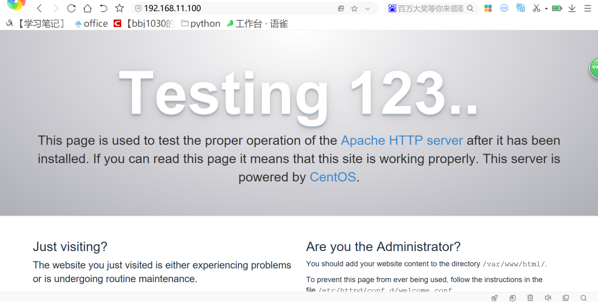
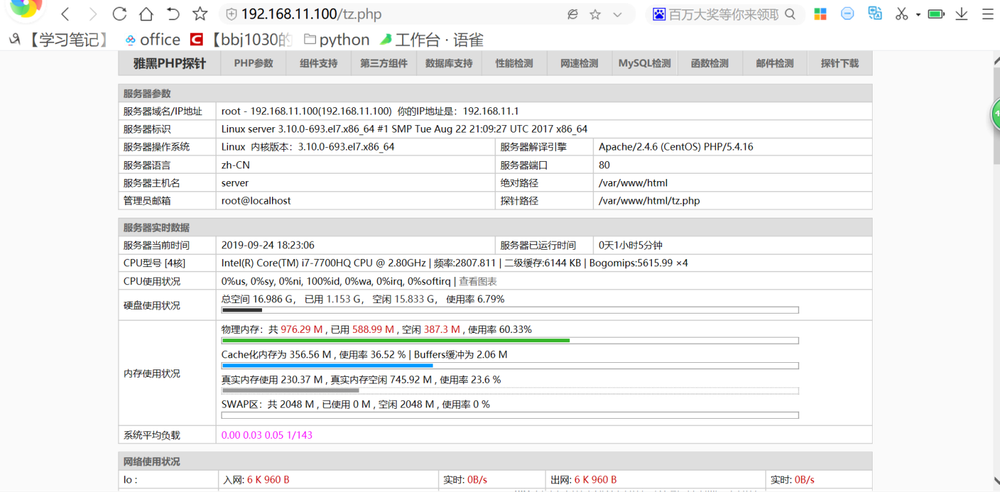
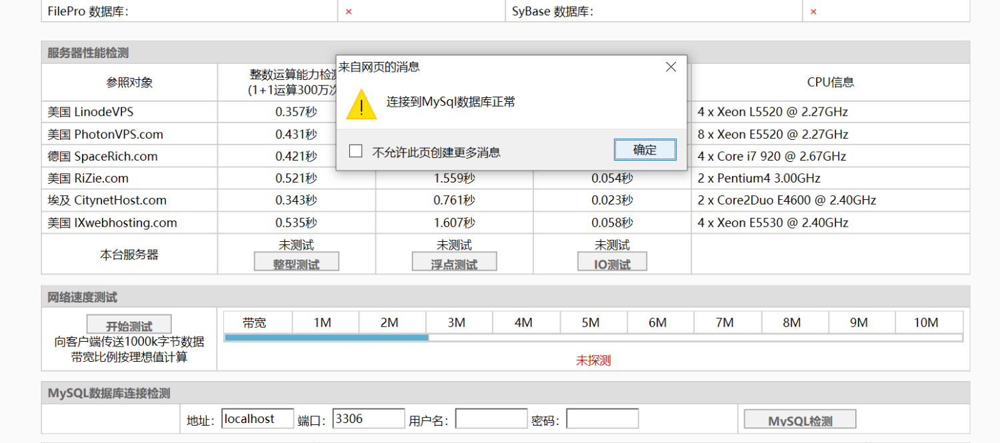

使⽤LAMP搭建博客


# 1、APACHE安装和防⽕墙放⾏


```javascript
yum -y install httpd wget unzip
systemctl start httpd
systemctl enable httpd
firewall-cmd --add-port=80/tcp --permanent
firewall-cmd --reload
```




安装PHP


```javascript
yum -y install php-* --skip-broken php-mysqlnd
cd /var/www/html
wget http://mirrors.eagleslab.com:8889/tz.php
systemctl restart httpd
```




安装mariadb


```javascript
wget http://repo.mysql.com/mysql-community-release-el7-5.noarch.rpm
 rpm -ivh mysql-community-release-el7-5.noarch.rpm
 
 
yum -y install mariadb mariadb-server
systemctl start mariadb
systemctl enable mariadb
mysql_secure_installation
```




