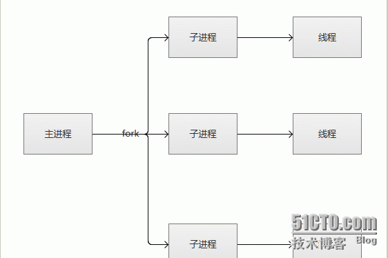
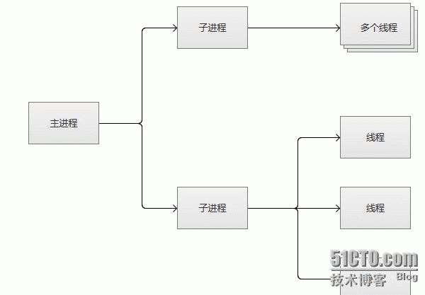
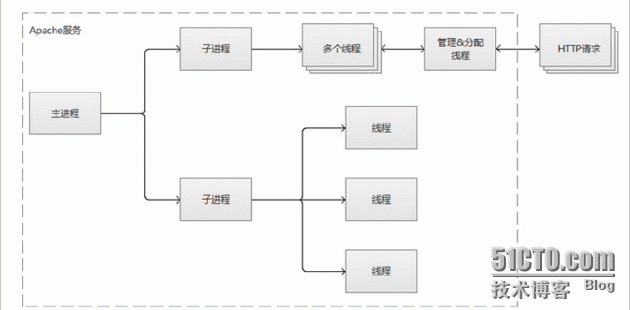
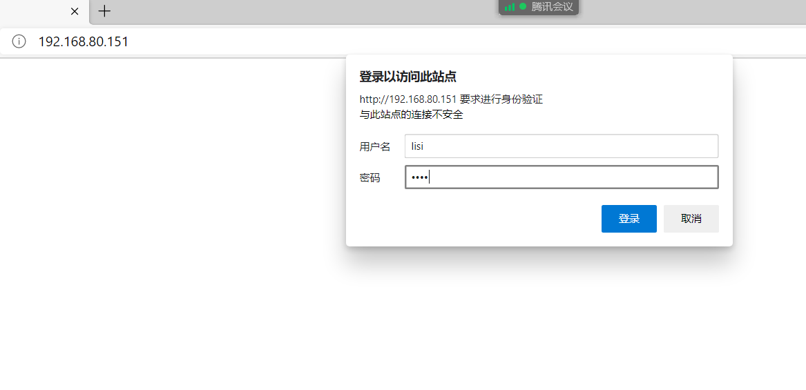
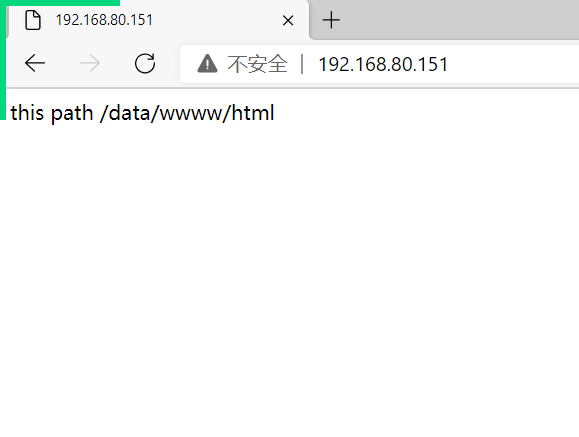
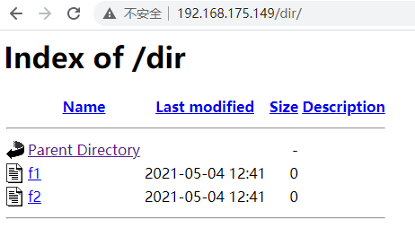
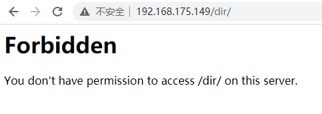
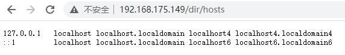
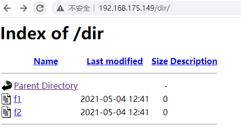

**Apache网站服务**

# 1、访问网站的基本流程

我们每天都会使用web客户端上网浏览网页，最常见的web客户端就是web浏览器，如通用的微软IE，

以及技术人员偏爱的火狐浏览器、谷歌浏览器等。当我们在web浏览器输入网站地址时（例如www.baidu.com ），

很快就会看到网站的内容。这一切似乎看起来很神奇，那么在其背后到底时怎样的实现流程呢？也许普通的上网者

无需关注，但作为一个IT技术人员，特别时合格的Linux运维人员，就需要清晰的掌握了。

# 2、Apache服务

## 1）Apache介绍

- Apache是什么

- Apache HTTP Server简称为Apache，是Apache软件基金会的一个高性能、功能强大、见状

可靠、又灵活的开放源代码的web服务软件，它可以运行在广泛的计算机平台上如Linux、

Windows。因其平台型和很好的安全性而被广泛使用，是互联网最流行的web服务软件之一

- 特点

- 功能强大

- 高度模块化

- 采用MPM多路处理模块

- 配置简单

- 速度快

- 应用广泛

- 性能稳定可靠

- 可做代理服务器或负载均衡来使用

- 双向认证

- 支持第三方模块

- 应用场合

- 使用Apache运行静态HTML网页、图片

- 使用Apache结合PHP、Linux、MySQL可以组成LAMP经典架构

- 使用Apache作代理、负载均衡等

- MPM工作模式

- prefork：多进程I/O模型，一个主进程，管理多个子进程，一个子进程处理一个请求。

- worker：复用的多进程I/O模型，多进程多线程，一个主进程，管理多个子进程，一个子进程

管理多个线程，每个 线程处理一个请求。

- event：事件驱动模型，一个主进程，管理多个子进程，一个进程处理多个请求。

## 2）http命令

**httpd 为apache http server服务提供的工具**

```
-c：在读取配置⽂件前，先执⾏选项中的指令。
-C：在读取配置⽂件后，再执⾏选项中的指令。
-d<服务器根⽬录>：指定服务器的根⽬录。
-D<设定⽂件参数>：指定要传⼊配置⽂件的参数。
-f<设定⽂件>：指定配置⽂件。
-h：显示帮助。
-l：显示服务器编译时所包含的模块。
-L：显示httpd指令的说明。
-S：显示配置⽂件中的设定。
-t：测试配置⽂件的语法是否正确。
-v：显示版本信息。
-V：显示版本信息以及建⽴环境。
-X：以单⼀程序的⽅式来启动服务器。
```

## 3）安装并设置第一个站点

```
[root@localhost ~]#yum install -y httpd
[root@localhost ~]#echo '<h1>It works!</h1>' > /var/www/html/index.html
[root@localhost ~]#systemctl start httpd
```

### 1、检查防火墙和selinux是否关闭

```
[root@localhost ~]#systemctl stop firewalld
[root@localhost ~]#systemctl status firewalld
[root@localhost ~]#setenforce 0
[root@localhost ~]#getenforce
```

### 2、检查端口是否存在

```
[root@localhost ~]#ss -tanl | grep 80 
```

### 3、查看进程是否存在

```
[root@localhost ~]#ps -ef | grep http 
```

### 4、在服务器本地进行测试

```
[root@localhost ~]#wget <http://IP地址>
[root@localhost ~]#curl <IP地址>
```

- 文件说明

```
/etc/httpd/：主配置文件目录
/etc/httpd/conf/httpd.conf：服务配置文件
/etc/httpd/conf.d/：服务配置目录（模块化）
/etc/httpd/conf.modules.d/：模块配置目录
/etc/sysconfig/httpd：守护进程配置文件
/usr/lib64/httpd/modules/：可用模块
/usr/sbin/：相关命令目录
/var/log/httpd/：日志目录
/var/www/：站点目录
```

- 主配置文件

```
##主配置说明##
[root@node3 ~]# grep "^[^ #]" /etc/httpd/conf/httpd.conf
ServerRoot "/etc/httpd" # 服务器的根（配置文件）
Listen 80 # 监听的端口
Include conf.modules.d/*.conf # 包含模块
User apache # 用户
Group apache # 属组
ServerAdmin root@localhost # 服务器管理员
DocumentRoot "/var/www/html"    #网站的根目录
ErrorLog "logs/error_log" # 错误日志
LogLevel warn # 日志等级
EnableSendfile on # 开启
IncludeOptional conf.d/*.conf # 虚拟服务器配置文件
说明：<></>此类称之为容器，针对某个容器做配置
```

## apache功能模块

- httpd 有静态功能模块和动态功能模块组成，分别使用 httpd -l 和 httpd -M 查看

- Dynamic Shared Object，加载动态模块配置，不需重启即生效

- 动态模块所在路径： /usr/lib64/httpd/modules/

- 主配置 /etc/httpd/conf/httpd.conf 文件中指定加载模块配置文件

- apache模块功能介绍

- 

- 加载模块示例

```
[root@localhost ~]# vim /etc/httpd/conf/httpd.conf
Include conf.modules.d/*.conf
```

- 配置指定实现模块加载格式

```
[root@localhost ~]# vim /etc/httpd/conf/httpd.conf
LoadModule <mod_name> <mod_path>
```

模块文件路径可使用相对路径：相对于ServerRoot（默认/etc/httpd）

范例：查看模块加载的配置文件

```
[root@localhost ~]# ls /etc/httpd/conf.modules.d/
00-base.conf 00-dav.conf 00-lua.conf 00-mpm.conf 00-proxy.conf 00-
systemd.conf 01-cgi.conf
[root@localhost ~]# cat /etc/httpd/conf.modules.d/00-base.conf
# 可以看到加载的模块
```

## 4）持久连接

持久连接，每个资源获取完成后不会断开连接，而是继续等待其它的请求完成

- **默认参数**

```
KeepAlive on 默认是on，默认的超时时间是5秒。
KeepAliveTimeout  30# 连接超时，30秒超时
MaxKeepAliveRequests 100 # 最大保持连接请求
```

- **测试持久连接**

```
[root@server ~]# yum install telnet -y
[root@server ~]# echo 'this is test!' > /var/www/html/index.html
[root@server ~]# telnet 127.0.0.1 80
Trying 127.0.0.1...
Connected to 127.0.0.1.
Escape character is '^]'.
>GET / HTTP/1.1
>Host:127.0.0.1
HTTP/1.1 200 OK
Date: Wed, 14 Jul 2021 14:17:29 GMT
Server: Apache/2.4.6 (CentOS)
Last-Modified: Wed, 14 Jul 2021 14:16:40 GMT
ETag: "e-5c71600ca9dad"
Accept-Ranges: bytes
Content-Length: 14
Content-Type: text/html; charset=UTF-8
this is test!
Connection closed by foreign host.
```

- **修改持久连接的参数，重启httpd，再次测试**

```
[root@server ~]# cat /etc/httpd/conf.d/keeplive.conf
KeepAlive on
KeepAliveTimeout 30
MaxKeepAliveRequests 100
[root@server ~]# systemctl restart httpd.service
[root@server ~]# telnet 127.0.0.1 80
Trying 127.0.0.1...
Connected to 127.0.0.1.
Escape character is '^]'.
GET / HTTP/1.1        #手动输入
Host:127.0.0.1        #手动输入
HTTP/1.1 200 OK
Date: Wed, 14 Jul 2021 14:20:58 GMT
Server: Apache/2.4.6 (CentOS)
Last-Modified: Wed, 14 Jul 2021 14:16:40 GMT
ETag: "e-5c71600ca9dad"
Accept-Ranges: bytes
Content-Length: 14
Content-Type: text/html; charset=UTF-8
this is test!
Connection closed by foreign host.
```

# 3、多路处理模块

**MPM工作模式**

- prefork：多进程I/O模型，一个主进程，管理多个子进程，一个子进程处理一个请求。

- worker：复用的多进程I/O模型，多进程多线程，一个主进程，管理多个子进程，一个子进程管理多个线程，

每个 线程处理一个请求。

- event：事件驱动模型，一个主进程，管理多个子进程，一个进程处理多个请求。

## 1）prefork模式



- 

- **查看默认选择处理模块为prefork**

```
[root@server ~]# httpd -V
AH00558: httpd: Could not reliably determine the server's fully qualified
domain name, using fe80::eaf3:dc40:2bf:6da2. Set the 'ServerName' directive
globally to suppress this message
Server version: Apache/2.4.6 (CentOS)
Server built:  Nov 16 2020 16:18:20
Server's Module Magic Number: 20120211:24
Server loaded: APR 1.4.8, APR-UTIL 1.5.2
Compiled using: APR 1.4.8, APR-UTIL 1.5.2
Architecture:  64-bit
Server MPM:   prefork
threaded:   no
 forked:   yes (variable process count)
```

- **切换apache的mpm工作模式**

```
[root@server ~]# cat /etc/httpd/conf.modules.d/00-mpm.conf | grep -Ev
"^#|^$"
LoadModule mpm_prefork_module modules/mod_mpm_prefork.so
[root@server ~]# ps aux | grep httpd
root 12886 0.4 0.2 221928 4956 ? Ss 11:03 0:00 /usr/sbin/httpd -
DFOREGROUND
apache 12887 0.0 0.1 221928 2992 ? S 11:03 0:00 /usr/sbin/httpd -
DFOREGROUND
apache 12888 0.0 0.1 221928 2992 ? S 11:03 0:00 /usr/sbin/httpd -
DFOREGROUND
apache 12889 0.0 0.1 221928 2992 ? S 11:03 0:00 /usr/sbin/httpd -
DFOREGROUND
apache 12890 0.0 0.1 221928 2992 ? S 11:03 0:00 /usr/sbin/httpd -
DFOREGROUND
apache 12891 0.0 0.1 221928 2992 ? S 11:03 0:00 /usr/sbin/httpd -
DFOREGROUND
若要使用worker和event工作模型，只需要在/etc/httpd/conf.modules.d/00-mpm.conf中取消
对应注释即可
```

- **修改prefork参数**

```
默认参数：
StartServers 5 # 服务启动时的进程数
MaxSpareServers 10 # 最大空闲服务进程数
MinSpareServers 5 # 最小空闲进程数
MaxRequestWorkers 256 # 单个进程最多接受的进程数
[root@server ~]# vim /etc/httpd/conf.d/mpm.conf
StartServers 10
MaxSpareServers 15
MinSpareServers 10
MaxRequestWorkers 256
MaxRequestsPerChild 4000
[root@localhost ~]# systemctl restart httpd
[root@server ~]# ps -ef | grep httpd
```

- **压测工具**

```
[root@localhost ~]# ab -n 1000000 -c 1000 http://127.0.0.1/
# -n 即requests，用于指定压力测试总共的执行次数
# -c 即concurrency，用于指定的并发数
```

## 2）work模式



- **相关参数**

```
StartServers
#服务器启动时建立的子进程数量,在workers模式下默认是3.
ServerLimit
#系统配置的最大进程数量
MinSpareThreads
#空闲子进程的最小数量，默认75
MaxSpareThreads
#空闲子进程的最大数量，默认250
ThreadsPerChild 
#每个子进程产生的线程数量，默认是64
MaxRequestWorkers /MaxClients
#限定服务器同一时间内客户端最大接入的请求数量.
MaxConnectionsPerChild
#每个子进程在其生命周期内允许最大的请求数量，如果请求总数已经达到这个数值，子进程将会结束，
如果设置为0，子进程将永远不会结束。在Apache2.3.9之前称之为MaxRequestsPerChild。
```

## 3）event模式



参数可以参考work模式中的参数

# 4、访问控制机制

## 1）基于IP地址访问控制

### 更改站点根目录案例

- **重新定义根目录**

```
# 定义服务器的文档的页面路径：
[root@server1 conf]# vim httpd.conf
......
DocumentRoot "/data/www/html"
......
# 准备页面
[root@server1 ~]# echo "this path /data/wwww/html" >
/data/www/html/index.html
# 重启服务
[root@server1 ~]# systemctl restart httpd
```

- **测试访问，发现状态码为403没有权限**

```
[root@server1 conf]# curl 192.168.80.151 -I
HTTP/1.1 403 Forbidden
Date: Mon, 22 Feb 2021 06:19:54 GMT
Server: Apache/2.4.6 (CentOS)
Last-Modified: Thu, 16 Oct 2014 13:20:58 GMT
ETag: "1321-5058a1e728280"
Accept-Ranges: bytes
Content-Length: 4897
Content-Type: text/html; charset=UTF-8
```

- **访问控制机制中开放相应目录权限**

```
[root@server1 conf]# vim httpd.conf
<Directory "/data/www/html">
Require all granted
</Directory>
[root@server1 ~]# systemctl restart httpd
```

- **再次测试访问发现可以成功访问**

```
[root@server1 conf]# curl 192.168.80.151 -I
HTTP/1.1 200 OK
Date: Mon, 22 Feb 2021 06:21:15 GMT
Server: Apache/2.4.6 (CentOS)
Last-Modified: Mon, 22 Feb 2021 06:18:57 GMT
ETag: "1a-5bbe6c6eb43fa"
Accept-Ranges: bytes
Content-Length: 26
Content-Type: text/html; charset=UTF-8
[root@server1 conf]# curl 192.168.80.151
this path /data/wwww/html
```

- **更加详细的访问控制配置的参数**

```
Require常见配置参数：
Require all granted # 全部放行
Require all denied # 全部拒绝
Require ip IPAd # 放行某ip地址
Require not ip IP # 拒绝某ip地址
Require user user1 # 放行某用户
Require group group1 # 放行某组
PS：34参数需要在…中才可以。
<RequireAll>
 Require all granted
 Require not ip 10.252.46.165
</RequireAll>
```

- **黑名单方式**

```
<RequireAll>
Require all granted
Require not ip 172.16.1.1 #拒绝特定IP
</RequireAll>
```

- **白名单方式**

```
<RequireAny>
Require all denied
require ip 172.16.1.1 #允许特定IP
</RequireAny>
```

- **只允许特定网段访问**

```
<requireany>
require all denied
Require ip 192.168.39.0/24
</requireany>
```

- **只允许特定主机访问**

```
<Requireany>
Require all denied
Require ip 192.168.32.7 #只允许特定的主机访问
</Requireany>
```

## URI匹配规则

- apache支持针对文件系统和URI的资源进行访问匹配

```
#基于目录
<Directory “/path">
...
</Directory>
#基于文件
<File “/path/file”>
...
</File>
#基于文件通配符
<File “/path/*file*”>
...
</File>
#基于正则表达式
<FileMatch “regex”>
...
</FileMatch>
```

- 案例

```
<FilesMatch ".+\.(gif|jpe?g|png)$">
# ...
</FilesMatch>
<FilesMatch "\.(gif|jpe?g|png)$">
<Files “?at.*”> 通配符
<Files ".ht*">     #禁止直接打开.ht* eg：.htaccess文件
Require all denied
</Files>
```

- apache对URL的匹配

```
<Location "URL">
...
</Location>
<LocationMatch "regex">
...
</LocationMatch>
```

### URL匹配规则

```
#/private1, /private1/，/private1/file.txt 匹配 
#/private1other 不匹配
<Location "/private1">
# ...                   #注意斜线
</Location>
#/private2/，/private2/file.txt 匹配
#/private2，/private2other 不匹配
<Location "/private2/">
# ...
</Location>
```

## 2）用户访问控制

认证方式有basic和digest两种

- **创建用户认证文件，为用户认证做准备**

```
[root@server1 ~]# htpasswd -c -m /etc/httpd/conf.d/.htpassword lisi
New password:
Re-type new password:
Adding password for user lisi
[root@server1 ~]# htpasswd -b -m /etc/httpd/conf.d/.htpassword zhangsan
zhangsan
Adding password for user zhangsan
```

- **修改配置文件，启用用户认证**

```
[root@server1 ~]# vim /etc/httpd/conf/httpd.conf
<Directory "/data/www/html">
AuthType Basic
AuthName "Restricted Resource"
AuthBasicProvider file
AuthUserFile /etc/httpd/conf.d/.htpassword
Require user lisi
</Directory>
[root@server1 ~]# systemctl restart httpd.service
```

- **测试访问，发现lisi可以成功访问，zhangsan不能访问**





- **扩展，认证组文件**

```
通过认证组文件：
<Directory "/data/www/html">
AuthType Basic
AuthName "Restricted Resource"
AuthBasicProvider file
AuthUserFile /etc/httpd/conf.d/.htpassword
AuthGroupFile /etc/httpd/conf.d/.htgroup
Require group group1
</Directory>
使用浏览器访问测试即可!
```

## Options指令

- 后跟1个或多个以空白字符分隔的选项列表， 在选项前的+，- 表示增加或删除指定选项

- 常见选项（默认是全部禁用）：

- Indexes：指明的URL路径下不存在与定义的主页面资源相符的资源文件时，返回索引列表给用户

- FollowSymLinks：允许访问符号链接文件所指向的源文件

- None：全部禁用

- All： 全部允许

- 在html目录下产生如下目录和文件，然后通过浏览器访问这个目录

```
[root@localhost ~]# cd /data/html/dir
[root@localhost dir]# touch f1 f2
```



- 这样是不安全的。因为如果没有index.html文件就会把其他的目录显示出来。所以要修改配置

```
```



- 创建一个软连接，把/etc的软连接放到 html/dir 中，同时关闭上述的options -Indexes

```
[root@localhost dir]# ln -s /etc/hosts hosts
```



- 可以访问软连接指定文件中的内容。这样也会导致很大的安全风险。

- 关闭FollowSymLinks选项后再次查看，发现软链接文件已经不显示了

```
[root@localhost ~]# vim /etc/httpd/conf/httpd.conf
<Directory "/data/html">
 Options -FollowSymLinks
[root@localhost html]# systemctl restart httpd
```



## AllowOverride指令

AllowOverride指令与访问控制相关的哪些指令可以放在指定目录下的.htaccess（由AccessFileName 指

令指定,AccessFileName .htaccess 为默认值）文件中，覆盖之前的配置指令，只对语句有效，直接在对

应的文件目录中新建一个.htaccess的文件

- 常见用法：

- AllowOverride All:.htaccess中所有指令都有效

- AllowOverride None：.htaccess 文件无效，此为httpd 2.3.9以后版的默认值

- AllowOverride AuthConfig：.htaccess 文件中，除了AuthConfig 其它指令都无法生效，指定精确指令

### 案例

- 在主配置文件中禁止 Indexes 和 FollowSymLinks ，但是在 .htaccess 中打开

```
[root@localhost ~]# vim /etc/httpd/conf/httpd.conf
<Directory "/data/html">
  Options -Indexes -FollowSymLinks
  AllowOverride options=FollowSymLinks,Indexes
[root@localhost ~]# systemctl reload httpd
```

- 创建 .htaccess 文件，然后发现主配置文件中的设置被修改了

```
[root@localhost ~]# echo "Options FollowSymLinks Indexes" >
/data/html/dir/.htaccess
[root@localhost ~]# systemctl reload httpd
```

- 因为有主配置文件中设置了 .htaccess 对应的文件拒绝全部访问，所以相对是安全的

```
[root@localhost ~]# vim /etc/httpd/conf/httpd.conf
<Files ".ht*">
  Require all denied
</Files>
```

## 3）日志设定

```
ErrorLog "logs/error_log"
LogLevel warn
<IfModule log_config_module>
LogFormat "%h %l %u %t \"%r\" %>s %b \"%{Referer}i\" \"%{User-Agent}i\""
combined
LogFormat "%h %l %u %t \"%r\" %>s %b" common
<IfModule logio_module>
LogFormat "%h %l %u %t \"%r\" %>s %b \"%{Referer}i\" \"%{User-Agent}i\" %I
%O"
combinedio
</IfModule>
CustomLog "logs/access_log" combined
</IfModule>
```

- **日志参数**

```
参数：
%h Remote hostname
%l Remote logname
%u Remote user
%t Time the request was received, in the format [18/Sep/2011:19:18:28 -0400]
%r First line of request
%s Status
%b Size of response in bytes, excluding HTTP headers
Referer 有利于分析用户是通过哪个网站转发的如通过baidu转发的，也可以监控网站盗链的发生。
User-Agent 记录浏览器的类型。防止爬虫一定程度上，爬虫可以伪造浏览器类型。curl -A "evan"
http://I(伪造名字叫evan的浏览器)
```

# 5、虚拟主机

## 1）基于IP地址虚拟主机

```
root@node3 data]# cat /etc/httpd/conf.d/site.conf
<Directory "/data/">
Require all granted
</Directory>
<VirtualHost 192.168.0.140:80>
Servername www.site1.com
DocumentRoot "/data/site1/"
</VirtualHost>
<VirtualHost 192.168.0.145:80>
Servername www.site2.com
DocumentRoot "/data/site2/"
</VirtualHost>
[root@node1 ~]# curl 192.168.0.142
<h1>This is site1</h1>
[root@node1 ~]# curl 192.168.0.145
<h1>This is site2</h1>
```

## 2）基于端口虚拟主机

```
[root@server1 ~]# cat /etc/httpd/conf.d/site.conf
Listen 8080
Listen 9090
<Directory "/data/">
Require all granted
</Directory>
<VirtualHost *:8080>
DocumentRoot "/data/site3/"
</VirtualHost>
<VirtualHost *:9090>
DocumentRoot "/data/site4/"
</VirtualHost>
[root@server1 ~]# curl 192.168.80.100:8080
<h1>This is site3</h1>
[root@server1 ~]# curl 192.168.80.100:9090
<h1>This is site4</h1>
```

## 3）基于FQDN虚拟主机

```
[root@server1 ~]# cat /etc/httpd/conf.d/site.conf
Listen 10101
<Directory "/data/">
Require all granted
</Directory>
<VirtualHost 192.168.80.100:10101>
Servername www.site5.com
DocumentRoot "/data/site5/"
</VirtualHost>
<VirtualHost 192.168.80.100:10101>
Servername www.site6.com
DocumentRoot "/data/site6/"
</VirtualHost>
~       
[root@server1 ~]# cat /etc/hosts
192.168.0.142 www.site5.com
192.168.0.142 www.site6.com
[root@server1 ~]# curl www.site5.com:10101
<h1>This is site5</h1>
[root@server1 ~]# curl www.site6.com:10101
<h1>This is site6</h1>
```

## 4）三种不同方式的虚拟主机验证汇总

```
[root@server1 ~]# curl 192.168.80.100
<h1>This is site1</h1>
[root@server1 ~]# curl 192.168.80.200
<h1>This is site2</h1>
[root@server1 ~]# curl 192.168.80.100:8080
<h1>This is site3</h1>
[root@server1 ~]# curl 192.168.80.100:9090
<h1>This is site4</h1>
[root@server1 ~]# curl www.site5.com:10101
<h1>This is site5</h1>
[root@server1 ~]# curl www.site6.com:10101
<h1>This is site6</h1>
```

# 6、SSL配置

- 安装mod_ssl和openssl

```
[root@node1 ~]# yum install mod_ssl openssl -y 
```

- 生成2048位的加密私钥server.key

```
[root@node1 ~]# openssl genrsa -out server.key 2048 
```

- 生成证书签名请求server.csr

```
[root@node1 ~]# openssl req -new -key server.key -out server.csr 
```

- 生成类型为X509的自签名证书。有效期设置3650天，即有效期为10年server.crt

```
[root@node1 ~]# openssl x509 -req -days 3650 -in server.csr -signkey
server.key -out
server.crt
```

- 复制文件到相应位置

```
[root@node1 ~]# cp server.crt /etc/pki/tls/certs/
[root@node1 ~]# cp server.key /etc/pki/tls/private/
[root@node1 ~]# cp server.csr /etc/pki/tls/private/
```

- 修改配置文件

```
Servername 192.168.0.140:443
SSLCertificateFile /etc/pki/tls/certs/server.crt
SSLCertificateKeyFile /etc/pki/tls/private/server.key
```

- 防火墙放行

```
[root@node1 ~]# firewall-cmd --add-port=443/tcp --per
```

# 7、LAMP架构

- LAMP动态网站部署架构是由一套 Linux+Apache+MySQL+PHP 组成的动态网站系统解决方案。

- LNMP动态网站部署架构是由一套 Linux+Nginx+MySQL+PHP 组成的动态网站系统解决方案。

```
1.安装相关软件包
[root@node1 ~]# yum install httpd php php-mysql mariadb-server -y
[root@node1 ~]# cat /etc/httpd/conf.d/php.conf | grep -Ev "^#|^$"
<FilesMatch \.php$>
SetHandler application/x-httpd-php # 定义了以.php结尾的文件触发x-httpd-php
AddType text/html .php
DirectoryIndex index.php # 定义默认主页面
php_value session.save_handler "files" # 定义保持handler为文件
php_value session.save_path "/var/lib/php/session" # 定义会话保持路径
<FilesMatch>
2.启动httpd服务
[root@node1 ~]# systemctl start httpd
[root@node1 ~]# firewall-cmd --add-port=80/tcp --per
3.编写测试页面
[root@node1 ~]# cat /var/www/html/index.php
<html>
<head>
<title>PHP 测试</title>
</head>
<body>
<?php echo '<p>Hello World</p>'; ?>
</body>
</html>
打开浏览器访问：http://192.168.0.140/index.php
4.启动数据库，并编写测试页面
[root@node1 ~]# cat /var/www/html/test.php
<?php
$link=mysql_connect("127.0.0.1","root","");
if(!$link)
echo "FAILD!连接错误，用户名密码不对";
else
echo "OK!可以连接";
?>
打开浏览器访问：http://192.168.0.140/test.php
```