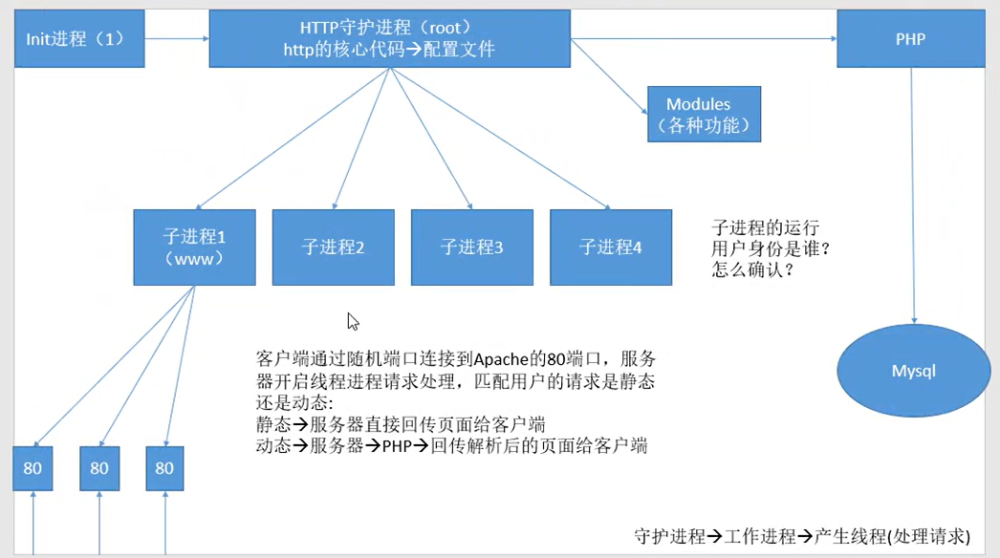
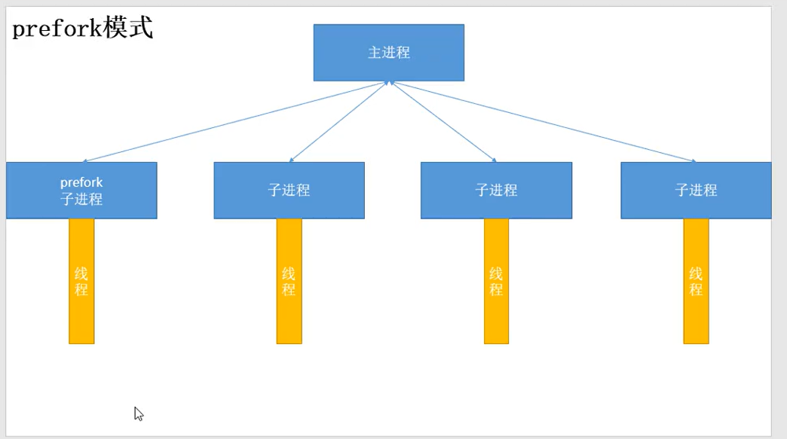
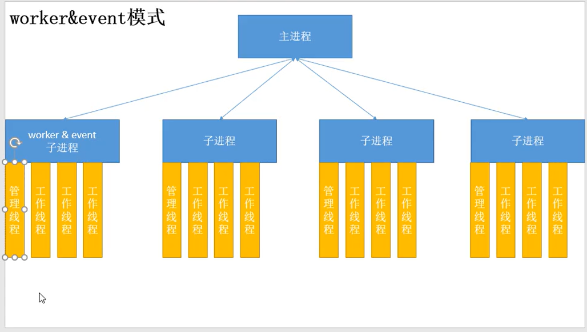
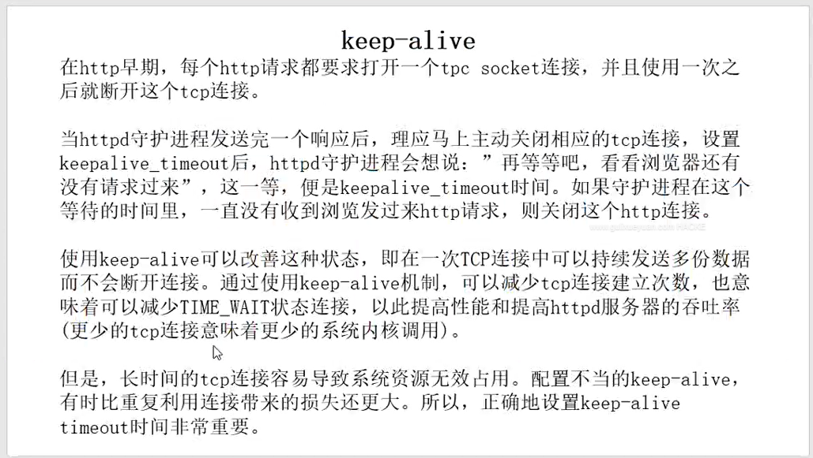
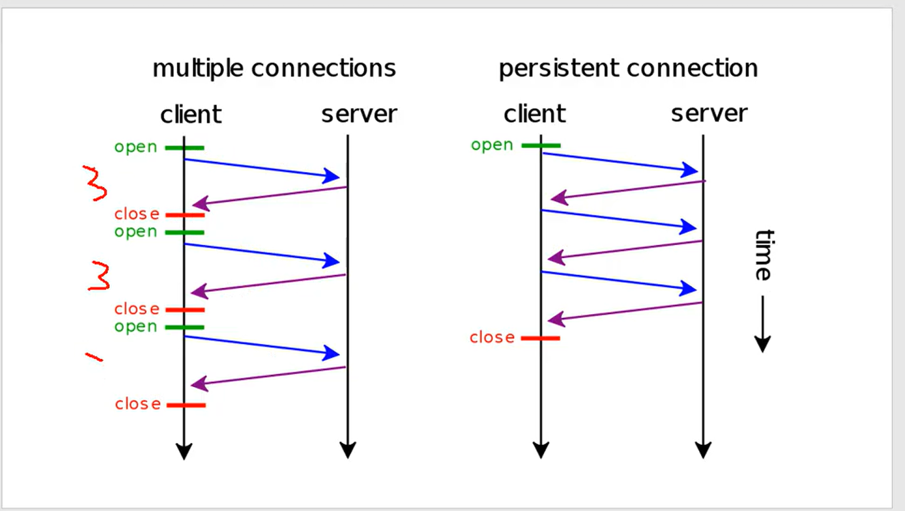

# **1. 概述
**

  Apache是世界使用排名第一的Web服务器软件。它可以运行在几乎所有广泛使用的计算机平台上，

由于其跨平台和安全性被广泛使用，是最流行的Web服务器端软件之一

 Apache有多种产品，可以支持SSL技术，支持多个虚拟主机。Apache是以进程为基础的结构，进

程要比线程消耗更多的系统开支，不太适合于多处理器环境，因此，在一个Apache Web站点扩容时，

通常是增加服务器或扩充群集节点而不是增加处理器。到目前为止Apache仍然是世界上用的最多的

Web服务器，市场占有率达60%左右。

# **2、工作模式**

Apache一共有3种稳定的MPM模式





## **prefork 工作模式
**



Apache在启动之初，就预先fork一些子进程，然后等待请求进来。之所以这样做，是为了减少频繁创

建和销毁进程的开销。每个子进程只有一个线程，在一个时间点内，只能处理一个请求。

**优点**

**缺点：**



## **worker 工作模式
**

使用了多进程和多线程的混合模式。它也预先fork了几个子进程(数量比较少)，然后每个子进程创建

一些线程，同时包括一个监听线程。每个请求过来，会被分配到1个线程来服务。线程比起进程会更

轻量，因为线程通常会共享父进程的内存空间，因此，内存的占用会减少一些。在高并发的场景下，

因为比起prefork有更多的可用线程，表现会更优秀一些。

**优点**

**缺点**



## **event 工作模式
**

它和worker模式很像，最大的区别在于，它解决了keep-alive场景下，长期被占用的线程的资源浪费

问题。event MPM中，会有一个专门的线程来管理这些keep-alive类型的线程，当有真实请求过来的

时候，将请求传递给服务线程，执行完毕后，又允许它释放。这样增强了高并发场景下的请求处理能

力。

HTTP采用keepalive方式减少TCP连接数量，但是由于需要与服务器线程或进程进行绑定，导致一个繁

忙的服务器会消耗完所有的线程。Event MPM是解决这个问题的一种新模型，它把服务进程从连接中

分离出来。在服务器处理速度很快，同时具有非常高的点击率时，可用的线程数量就是关键的资源限

制，此时Event MPM方式是最有效的，但不能在HTTPS访问下工作。

**查看方式 **

```javascript
# httpd -V | grep -i "server mpm"
```

**指定方式 ：**

在编译时，在选项中指定，--with-mpm=xxx





