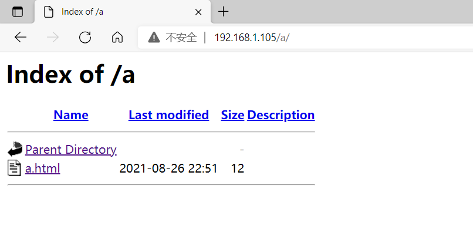

**Apache 的目录别名（**

当 apache 接受请求时，在默认情况下会将 DocumentRoot 目录中的文件送到客户端，如果想将某一不
在 DocumentRoot 目录中的文件共享到网站上，并希望将它们留在本来位置而不需要进行移动的话，

处理这种情况可以通过建立别名的方式将 URL 指向特定的目录



# **1、编辑主配置文件
**

```javascript
# vim /usr/local/apache2/conf/httpd.conf
Include etc/extra/httpd-autoindex.conf 	#去掉注释，开启调用子配置文件
```

# **Centos 7: 如果在Centos 7中，通过yum进行的安装，不需要 include ，直接就会调用conf.d/下的配置文件。**

# **2 、编辑子配置文件
**

```javascript
# vim /usr/local/apache2/etc/extra/httpd-autoindex.conf
alias /icons/ "/usr/local/apache2/icons/"
#结构：别名 "真实目录" #真实目录的结尾要有/，否则报错

<Directory "/usr/local/apache2/icons">
    Options Indexes FollowSymLinks
    AllowOverride None
    Require all granted
</Directory>
#可以根据模板编写一个自己需要的目录别名
```

**例子：**

- **  定义别名/a/**

```javascript
[root@bogon apache2]# vi /usr/local/apache2/etc--with-included-apr/extra/httpd-autoindex.conf 
Alias /a/ "/a/b/c/"      	 #给/a/b/c/下的目录定义一个别名/a/;	

<Directory "/a/b/c">	#设定原目录的配置
    Options Indexes MultiViews
    AllowOverride None
    Require all granted
</Directory>
```

- **在原目录下添加文件：**

```javascript
[root@bogon apache2]# vi /a/b/c/a.html 

www.a.b.com
```

- **打开浏览器查看：192.168.1.105/a/**

