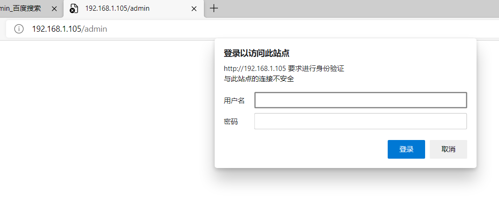

**Apache 的用户认证**

有时候，我们需要给一些特殊的访问设置一个用户认证机制，增加安全。比如我们的个人网站，一般

都是有一个管理后台的，虽然管理后台本身就有密码，但我们为了更加安全，可以再设置一层用户身

份认证。



# **1 、编辑配置文件
**

```javascript
# vim /usr/local/apache2/etc/httpd.conf
```

在需要进行登录认证的目录标签中加入如下配置：

```javascript
<Directory "/usr/local/apache2/htdocs/admin"> #声明被保护目录
    Options Indexes FollowSymLinks
    AllowOverride All			 #开启权限认证文件.htaccess
    Require all granted
</Directory>
```

# **2 、 在指定目录下创建权限文件
**



切换到/usr/local/apache2/htdocs/admin，创建 .htaccess（HTML——ACCESS） 文件，并添加下面的内容

```javascript
# vi .htaccess
AuthName "Welcome to atguigu"
#提示信息（auth，验证）
AuthType basic
#加密类型
AuthUserFile /usr/local/apache2/htdocs/admin/apache.passwd
#密码文件，文件名自定义。（使用绝对路径）
require valid-user
#允许密码文件中所有用户访问
```

# **3 、 建立密码文件，加入允许 访问的用户。****（此用户和系统用户无关）****
**

```javascript
# /usr/local/apache/bin/htpasswd -c /usr/local/apache2/htdocs/admin/apache.passwd user1
-c 建立密码文件，只有添加第一个用户时，才能-c
# htpasswd -m /usr/local/apache2/htdocs/admin/apache.passwd user2
-m 再添加更多用户时，使用-m 参数
```

**注意： htpasswd 该命令是 httpd 的命令，需要绝对路径**

# **4 、 重 启 apache 服 务
**

```javascript
/usr/local/apache2/bin/apachectl -t              #检查配置文件
/usr/local/apache2/bin/apachectl stop
/usr/local/apache2/bin/apachectl start
```

先检查配置是否正确，然后通过浏览器输入要访问的资源时就会提示输入密码了。

# **5、检验**

