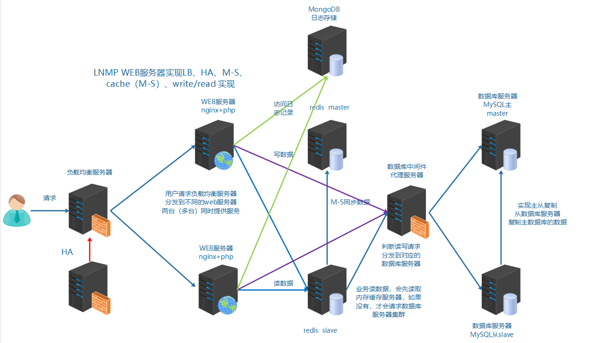

# 1、项目开发流程

公司老板和产品经理根据市场调查，决定开发的一整套互联网产品

互动社交+电商+用户论坛（BBS）

项目从开始策划，实施，上线，维护，一直到结束。称之为 项目的生命周期 。

**作为运维人员来说，不仅仅是在上线流程中参与。**

需要在策划，实施之初，就进行准备工作。学习对应架构和方案的知识点等。

比如:

①项目代码使用Inmp架构 那么就需要对Inmp架构熟悉

②开发人员需要多人协作开发，合并代码，就需要服务器上搭建代码版本控制器

③测试人员需要用到的测试环境等等

# 2、企业架构分布式集群解决方案

- 集群：多台服务器在一起作同样的事。

- 分布式：多台服务器在一起作不同的事。

最终的架构图示：

实现负载均衡LB、高可用HA、数据库主从复制M-S、读写分离R-W、缓存中间件[memcached、Redis

 

# 3、业务背景

- 年份：	2008-2010

- 发布产品类型：	互联网动态站点 社区论坛 商城 社交类站点

- 用户数量: 	100-500

- PV：	1000-3000 (24小时访问次数总和 8小时) 页面访问数量 点击量 Page View 

- **QPS**:	 5-10（每秒访问查询次数）并发量 吞吐量 TPS RPS

- DAU：	10-50（每日活跃用户数） 日活数 根据用户登录等方式

- QPS两种方法:

- ①计算 pv/时间 = qps

- ②压测 使用ab等并发测试软件 在规定时间发送一定的请求数量