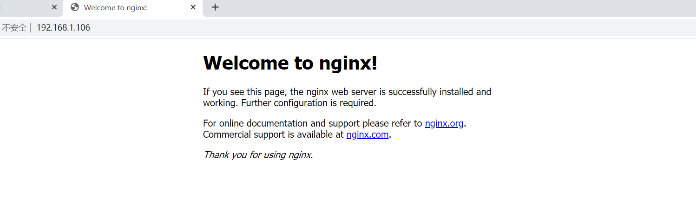
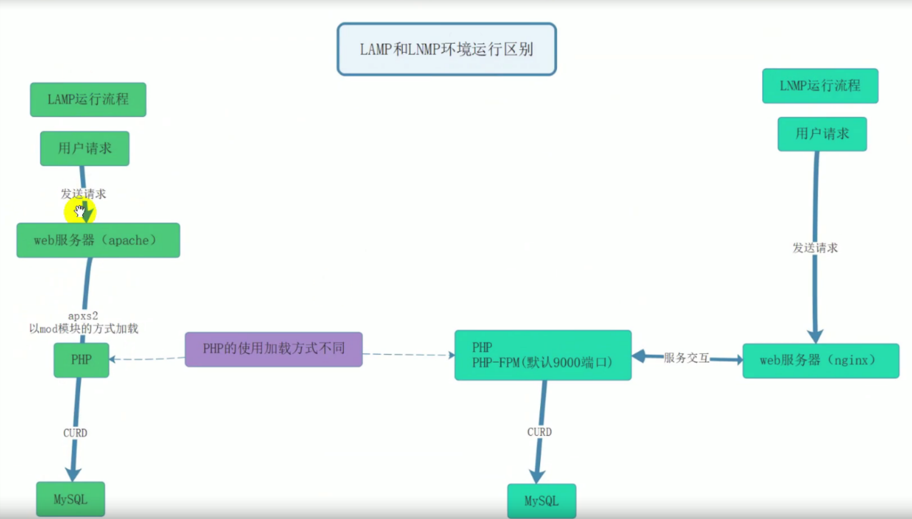
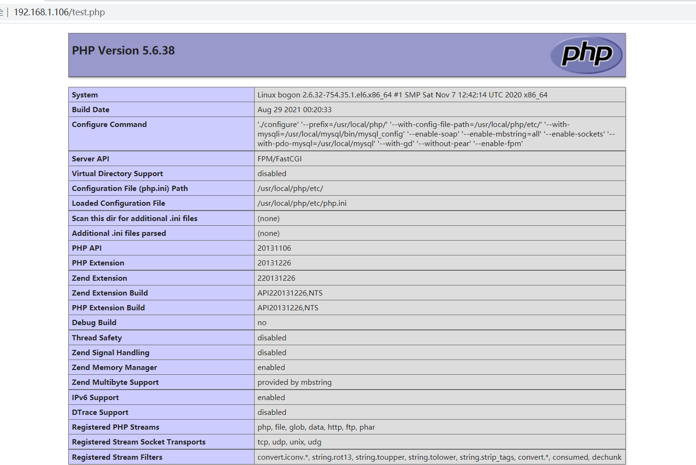

# **一 、 准备工作
**

## **1. 环境要求：
**

操作系统：CentOS 6.X 64 位

关闭 SELinux 和 iptables 防火墙

此次试验环境使用网络 yum 源，保证系统能正常连接互联网



## **2. 网络 yum 源更新****（如果centos6的yum源已经无法使用）****  ：**

### **1)首先把fastestmirrors关了**

```javascript
#编辑vi /etc/yum/pluginconf.d/fastestmirror.conf
#修改enable=0
#或者执行以下命令
sed -i "s|enabled=1|enabled=0|g" /etc/yum/pluginconf.d/fastestmirror.conf
```

### **2)先把之前的repo挪到备份：**

```javascript
mv /etc/yum.repos.d/CentOS-Base.repo /etc/yum.repos.d/CentOS-Base.repo.bak
```

-  

### **3)替换为官方Vault源(海外服务器用)**

```javascript
curl -o /etc/yum.repos.d/CentOS-Base.repo https://www.xmpan.com/Centos-6-Vault-Official.repo
```

- 或者替换为阿里云Vault镜像(国内服务器用)

```javascript
curl -o /etc/yum.repos.d/CentOS-Base.repo https://www.xmpan.com
```

## **
**





**下载完成后，需要使用命令清除掉原有的 yum 缓存，使用新的配置文件建立缓存**

```javascript
# yum clean all #清除掉原有缓存列表
# yum makecache #建立新的缓存列表
# yum update #将所有能更新的软件更新（非必选）
```

## **3.安装编译工具和依赖软件包： ：
**

```javascript
# yum -y install gcc* pcre-devel openssl openssl-devel zlib-devel ncurses-devel cmake bison
libxml2-devel libpng-devel
```

## **4. Nginx 、MySQL 、PHP 三大软件的源码包 下载地址： ：
**

Nginx：		[http://nginx.org/en/download.html](http://nginx.org/en/download.html)

MySQL：		[https://dev.mysql.com/downloads/mysql/](https://dev.mysql.com/downloads/mysql/)

PHP：		[http://www.php.net/](http://www.php.net/)

**版本选用：**

Nginx： 1.12.*	 #选用软件的稳定版即可

Mysql： 5.5.*	 #5.5 以上版本需要 1G 以上的内存，否则无法安装

PHP： 5.6.*	 #LAMP 中我们使用的是 php7，此次使用 php5

**注意 ：装 每次安装 LNMP 时，软件包的 小版本 都不 一样，官方会对其大版本下的 小版本 进行覆盖式更
**

**新， 本文内部分 链接 会 失效 ，切记 **

# **二 、源码软件包安装
**

## **1 .Nginx
**

Nginx是一款轻量级的Web 服务器/反向代理服务器及电子邮件（IMAP/POP3）代理服务器，在BSD-like

协议下发行。其特点是占有内存少，并发能力强。

## **2 、下载 Nginx 源码包
 
**

```javascript
# wget http://nginx.org/download/nginx-1.12.2.tar.gz
```

### **3、 创建用于运行 Nginx 的用户
**

```javascript
# useradd -r -s /sbin/nologin nginx
```

### **4、安装依赖**

```javascript
yum -y install pcre-devel zlib-devel openssl-devel gcc gcc-c++
```

### **5、 解压缩 Nginx 并安装
**

```javascript
./configure --prefix=/usr/local/nginx --user=www --group=www --with-http_stub_status_module --with-http_ssl_module
#编译参数说明
    参数					作用
    --prefix				编译安装到的软件目录
    --USer					worker进程运行用户
    --group				worker进程运行用户组
    --with-http_ssl_module			支持https 需要 pcel-devel 依赖
    --with-http_stub_status_module	        基本状态信息显示 查看请求数、连接数等
    --with-http_realip_module		定义客户端地址和端口为header头信息 常用于反向代理后的真实IP获取
make -j4
make install
```

### **6.  nginx命令选项**

```javascript
nginx version: nginx/1.14.2
Usage: nginx [-?hvVtTq] [-s signal] [-c filename] [-p prefix] [-g directives]
Options:
-？,-h	:this htlp			#查看帮助
-v		: show version and exit		#查看版本并退出
-V		: show version and configure options then exit	#查看版本和配置选项并退出
-t		: test configuration and exit			#检测配置文件语法并退出
-T		: test configuration, dump it and exit		#检测配置文件语法打印它并退出
-q	: suppress non-error messages during configuration testing	#在配置测试期间禁止显示非错误信息
-s signal	: send signal to a master process: stop, quit, reopen, reload
    	#发送信号给主进程 stop强制退出quit优雅的退出reopen重开日志 reload重载配置
-p prefix	: set prefix path (default:/usr/local/nginx/)			#设置nginx目录Sprefix路径
-c filename	: set configuration file (default: conf/nginx.conf)	#指定启动使用的配置文件
-g directives : set global directives out of configuration file		#在配置文件之外设置全局指令
一般主要使用：
-s参数控制管理nginx服务
-V参数查看nginx开启的模块和编译参数
-t参数检测配置文件是否有错误
```

## **3. 服务配置**

- 使用社区的服务配置文件

nginx编译包里默认服务启动脚本模板，可以通过社区获得

[https://www.nginx.com/resources/wiki/start/topics/examples/redhatnginxinit/](https://www.nginx.com/resources/wiki/start/topics/examples/redhatnginxinit/)

- 上传脚本到nginx配置文件到/etc/init.d目录下

```javascript
shell > vim /etc/init.d/nginx
```

- 脚本内容

更改nginx="/usr/local/nginx/sbin/nginx"     

```
#!/usr/bin/bash
. /etc/rc.d/init.d/functions
. /etc/sysconfig/network
# Check that networking is up.
[ "$NETWORKING" = "no" ] && exit 0
nginx="/usr/local/nginx/sbin/nginx"                #命令路径，根据需要更改
prog=$(basename $nginx)
NGINX_CONF_FILE="/usr/local/nginx/conf/nginx.conf"
[ -f /etc/sysconfig/nginx ] && . /etc/sysconfig/nginx
lockfile=/var/lock/subsys/nginx
make_dirs() {
   # make required directories
   user=`$nginx -V 2>&1 | grep "configure arguments:.*--user=" | sed 's/[^*]*--user=\([^ ]*\).*/\1/g' -`
   if [ -n "$user" ]; then
      if [ -z "`grep $user /etc/passwd`" ]; then
         useradd -M -s /bin/nologin $user
      fi
      options=`$nginx -V 2>&1 | grep 'configure arguments:'`
      for opt in $options; do
          if [ `echo $opt | grep '.*-temp-path'` ]; then
              value=`echo $opt | cut -d "=" -f 2`
              if [ ! -d "$value" ]; then
                  # echo "creating" $value
                  mkdir -p $value && chown -R $user $value
              fi
          fi
       done
    fi
}
start() {
    [ -x $nginx ] || exit 5
    [ -f $NGINX_CONF_FILE ] || exit 6
    make_dirs
    echo -n $"Starting $prog: "
    daemon $nginx -c $NGINX_CONF_FILE
    retval=$?
    echo
    [ $retval -eq 0 ] && touch $lockfile
    return $retval
}
stop() {
    echo -n $"Stopping $prog: "
    killproc $prog -QUIT
    retval=$?
    echo
    [ $retval -eq 0 ] && rm -f $lockfile
    return $retval
}
restart() {
    configtest || return $?
    stop
    sleep 1
    start
}
reload() {
    configtest || return $?
    echo -n $"Reloading $prog: "
    killproc $prog -HUP
    retval=$?
    echo
}
force_reload() {
    restart
}
configtest() {
  $nginx -t -c $NGINX_CONF_FILE
}
rh_status() {
    status $prog
}
rh_status_q() {
    rh_status >/dev/null 2>&1
}
case "$1" in
    start)
        rh_status_q && exit 0
        $1
        ;;
    stop)
        rh_status_q || exit 0
        $1
        ;;
    restart|configtest)
        $1
        ;;
    reload)
        rh_status_q || exit 7
        $1
        ;;
    force-reload)
        force_reload
        ;;
    status)
        rh_status
        ;;
    condrestart|try-restart)
        rh_status_q || exit 0
            ;;
    *)
        echo $"Usage: $0 {start|stop|status|restart|condrestart|try-restart|reload|force-reload|configtest}"
        exit 2
esac
```

修改软件和配置路径

```javascript
#执行文件路径 第22行
nginx="/usr/local/nginx/sbin/nginx"
#配置文件路径 第25行
NGINIX_CONF_FILE="/usr/local/nginx/conf/nginx.conf"
```

⑧添加自启动

```javascript
shell > chmod +x/etc/init.d/nginx
shell > chkconfig --add nginx
shell > chkconfig nginx on
```

注意在服务脚本中，有chkconfig配置开启模式、开启顺序、关闭顺序设置

```
# chkconfig:   - 85 15
#           开启模式（0-6）开启顺序  关闭顺序
```

### **启动测试：/usr/local/nginx/sbin/nginx  **

**打开浏览器：服务器ip地址：**



## **2.MySQL
**

**下载**

**选择**

**选择：**

Select Operating System: Source Code

Select OS Version: Generic Linux

**格式**

```javascript
# wget https://cdn.mysql.com//Downloads/MySQL-5.5/mysql-5.5.62.tar.gz
```

### **2.1 创建用于运行 Mysql 的用户：
**

```javascript
# useradd -r -s /sbin/nologin mysql
```

### **2.2 解压缩 Mysql 并安装：
**

```javascript
yum install -y gcc  gcc-c++
# cmake -DCMAKE_INSTALL_PREFIX=/usr/local/mysql -DMYSQL_UNIX_ADDR=/tmp/mysql.sock
-DEXTRA_CHARSETS=all -DDEFAULT_CHARSET=utf8 -DDEFAULT_COLLATION=utf8_general_ci
-DWITH_MYISAM_STORAGE_ENGINE=1 -DWITH_INNOBASE_STORAGE_ENGINE=1
-DWITH_MEMORY_STORAGE_ENGINE=1 -DWITH_READLINE=1
-DENABLED_LOCAL_INFILE=1 -DMYSQL_USER=mysql -DMYSQL_TCP_PORT=3306
# make 
# make install
# ln -s /usr/local/mysql/bin/* /usr/local/bin
```

### **2.3 修改安装后的目录权限
**

```javascript
# cd /usr/local/mysql
# chown -R root .
# chown -R mysql data
```

### **2.4 生成 Mysql 配置文件
**

```javascript
# cp -a /lnmp/mysql-5.5.62/support-files/my-medium.cnf /etc/my.cnf
```



### **2.5 初始化，生成授权表
**

```javascript
# cd /usr/local/mysql #一定要先切换到此目录下，然后再执行下一步。
# ./scripts/mysql_install_db --user=mysql
初始化成功标志：两个 ok
```

### **2.6 生成 Mysql 的启动和自启动管理脚本
**

```javascript
# cd /lnmp/mysql-5.5.62/support-files
切换到 mysql 的源码解压缩目录下的 support-files
# cp -a mysql.server /etc/init.d/mysqld
   
# chmod +x /etc/init.d/mysqld
# chkconfig --add mysqld
# chkconfig mysqld on
# service mysqld start|stop|restart
```

### **2.7 给mysql 的 的 root 用户设置密码
**

```javascript
# mysqladmin -uroot password 123456
```

## **3 .PHP**

## 3.1 介绍


## **
**

PHP (外文名:PHP: Hypertext Preprocessor，中文名：“超文本预处理器”) 是—种通用开源脚本语言。语法吸收了C语言、Java和Perl的特点，利于学习，使用广泛，主要适用于Web开发领域 。PHP独特的语法混合其他的编程语言相比 PHP是将程序嵌入到HTML（标准通用标记语言下的一个应用）文档中去执行执行效率比完全生成HTML标记的CGI要高许多；PHP还可以执行编译后代码，编译可以达到加密和优化代码运行，使代码运行更快。

PHP-FPM(FastCGI Process Marager:FastCGI进程管理器 )对于PHP 5.3.3之前的php来说，是一个补丁包,旨在将FastCGl进程管理整合进PHP包中。相对Spawn-FCGI, PHP-FPM在CPU和内存方面的控制都更胜一筹，而且前者很容易崩溃，必须用crontab定时进行监控，而PHP-FPM则没有这种烦恼。PHP5.3.3已经集成php-fpm了，不再是第三方的包了。PHP-FPM提供了更好的PHP进程管理方式，可以有效控制内存和进程、可以平滑重载PHP配置，比spawn-fcgi具有更多优点，所以被PHP官方收录了。在.configure的时候带 -enable-fpm参数即可开启PHP-FPM。



**LAMP： 修改PHP配置文件，需要重启Apache**

- **因为Apache管理的PHP，使用内部的一个模块，进行管理**

**LNMP：修改PHP配置文件，不需要重启Nginx**

- **因为PHP和Nginx是平级关系。**

**下载**[http://www.php.net/](http://www.php.net/)

- Centos 6：



```javascript
# wget http://tw2.php.net/distributions/php-5.6.38.tar.gz
```

- **Centos 7:**

```javascript
# wget https://www.php.net/distributions/php-7.4.30.tar.gz   #稳定版
```

### **3.1 解压缩 PHP 并安装:**

```
shell > yum -y install libxml2-devel libjpeg-devel libpng-devel freetype-devel curl-devel openssl-devel \
 sqlite-devel oniguruma oniguruma-devel
```

```javascript
# ./configure --prefix=/usr/local/php/ --with-config-file-path=/usr/local/php/etc/ \
 --with-libxml-dir  \
--with-jpeg-dir  --with-png-dir  \
--with-freetype-dir=/usr/local/freetype/  \
--with-mysqli=/usr/local/mysql/bin/mysql_config --with-iconv-dir \
--enable-mbstring=all   --with-zlib  --with-libzip --with-curl \
--enable-sockets   --enable-xml --enable-sysvsem   --enable-bcmath  \
--with-pdo-mysql=/usr/local/mysql   --with-fpm-group=nginx  \
--with-gd --without-pear    --with-gettext --enable-soap \
--enable-fpm  --with-fpm-user=nginx   --with-openssl --with-mhash \
--enable-ftp --enable-maintainer-zts  --with-xmlrpc  --enable-pcntl \
--enable-inline-optimization  --enable-shmop --enable-mbregex 
 
# make -j4 
# make install
```

**选项详解：**

```javascript
--with-config-file-path=/usr/local/php/etc/ 	        指定配置文件目录
--with-libxml-dir=/usr/local/libxml2/ 		        指定 libxml 位置
--with-jpeg-dir=/usr/local/jpeg6/ 			指定 jpeg 位置
--with-png-dir=/usr/local/libpng/ 			指定 libpng 位置
--with-mcrypt=/usr/local/libmcrypt/ 		        指定 libmcrypt 位置
--with-mysqli=/usr/local/mysql/bin/mysql_config 	指定 mysqli 位置,注意只有在mysql源码包里有，rpm包没有
--with-gd 						启用 gd 库
--with-fpm-user=www             #指定用户，保持和nginx的用户一致
--with-fpm-group=www            #指定用户组，保持和nginx的用户组一致
--enable-soap 					支持 soap 服务
--enable-mbstring=all 				支持多字节，字符串
--enable-sockets 				支持套接字
--with-pdo-mysql=/usr/local/mysql 		启用 mysql 的 pdo 模块支持
--without-pear 					不安装 pear(安装 pear 需要连接互联网)
#解释
--with        代表需要手动开启 可能需要加载第三方模块 第三方模块没有，就会error
--enable     代表开启php的默认功能
-without     关闭默认加载的模块
```

 PHP 安装后 需要调整相应配置文件和参数才能正常运行

**报错提示**

**解决方案**

```javascript
# ln –s /usr/lib64/libpng.so /usr/lib
```

### **3.2 生成 php 配置文件
**

```javascript
shell > cp /usr/local/php/etc/php-fpm.conf.default /usr/local/php/etc/php-fpm.conf
shell > cp /usr/local/php/etc/php-fpm.d/www.conf.default /usr/local/php/etc/php-fpm.d/www.conf
sehll > cp /root/php-7.4.30/php.ini-development   /usr/local/php/etc/php.ini
复制源码包内的配置文件到安装目录下，并改名即可
```

### **3.3 创建软连接用 ，使用 php 相关命令是更方便
**

```javascript
ln -s /usr/local/php/bin/* /usr/local/bin/
ln -s /usr/local/php/sbin/* /usr/local/sbin/
```



## **3.4 目录信息**

```
目录名称                    作用
bin                        php相关命令目录 php phpize、php-config在源码编译扩展时用
etc                        配置文件目录
include                    php默认类库
lib                        php第三方扩展类库
php                        man文档文件
sbin                       php-fpm执行文件
var                        log日志目录 run运行目录 保存pid文件
```

## **4 .配置 Nginx 连接 PHP （ 重难点 ）
**

### **4.1 nginx 连接 php 需要启动 php-fpm 服务**

- **Centos 6:**

### **
**

```javascript
# cd /usr/local/php/etc/

# cp -a php-fpm.conf.default    php-fpm.conf
生成 php-fpm 的配置文件，并修改指定参数

# vim php-fpm.conf
修改指定条目的参数：

pid = run/php-fpm.pid
user = nginx
group = nginx
pm.start_servers = 2
pm.min_spare_servers = 1
pm.max_spare_servers = 3
启动时开启的进程数、最少空闲进程数、最多空闲进程数（默认值，未修改）
修改 Nginx 启动管理脚本：将 php-fpm 的注释取消掉即可
```

- **Centos 7:**

```javascript
# cd /usr/local/php/etc/
# cp -a php-fpm.conf.default php-fpm.conf
  
生成 php-fpm 的配置文件，并修改指定参数
# vim php-fpm.conf
修改指定条目的参数：
pid = run/php-fpm.pid
# cd /usr/local/php/etc/php-fpm.d/
# cp -a www.conf.default www.conf
# vim www.conf
修改用户和组的指定用户
user = nginx
group = nginx
修改 Nginx 启动管理脚本：将 php-fpm 的注释取消掉即可
```

### **4.2 修改 Nginx 的配置文件，使其识别.php 后缀的文件
**

```javascript
# vim /usr/local/nginx/conf/nginx.conf
取消下列行的注释，并修改 include 选项的后缀为 fastcgi.conf，并注意每一行结尾的分号和大括号
#location ~ \.php$ {
# root html;
# fastcgi_pass 127.0.0.1:9000;
# fastcgi_index index.php;
# fastcgi_param SCRIPT_FILENAME /scripts$fastcgi_script_name;
# include fastcgi_params; #修改为 fastcgi.conf
#}
```

测试：

重启 Nginx 服务，创建 php 测试文件，访问并查看是否解析

```javascript
cd  /usr/local/nginx/html/
[root@bogon html]# ls
50x.html  index.html

```

```javascript
[root@bogon html]# vi test.php

<?php
        phpinfo();
?>
```



### **4.3 修改 Nginx 配置文件，使其默认自动加载 php 文件
**

```javascript
location / {
root html; 			#Nginx 的默认网页路径:PREFIX/html
index index.php index.html; 	#设置默认加载的页面，以及优先级
}
```