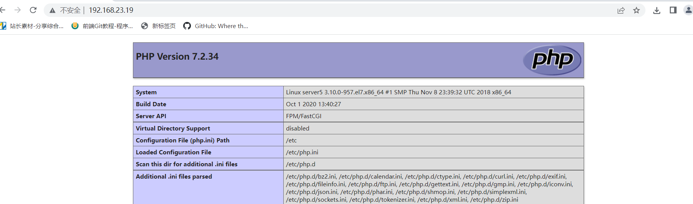

# 1、安装nginx

```
yum install epel-release
yum install -y nginx
systemctl start nginx
netstant -antlp    #查看是否有80端口
#浏览器访问检测
```

# 2、安装mysql

```
wget http://repo.mysql.com/mysql-community-release-el7-5.noarch.rpm
rpm -ivh mysql......
yum install mysql-server mysql  #安装mysql 
systemctl start mysqld    #启动mysq服务
netstat -antlp    #查看是否有3306端口
mysqladmin -uroot password "123"    #修改root密码
mysql -p    #d登录检测
```

# 3、安装PHP

```
rpm -ivh https://mirror.webtatic.com/yum/el7/webtatic-release.rpm
yum -y install mod_php72w php72w-cli php72w-fpm php72w-common php72w-devel
systemctl statr php-fpm    #启动php服务
netstat -antlp    #查看是否有9000端口
```

# 4、配置访问php文件

## 4.1 配置Ngxin根目录

[nginx](https://so.csdn.net/so/search?q=nginx&spm=1001.2101.3001.7020) 默认会引入  /etc/nginx/conf.d/*.conf 下面的配置

所以我们在 /etc/nginx/conf.d/ 下面建立 default.conf。

```
#vim /etc/nginx/conf.d/default.conf
 
server{
    listen 80; #监听80端口
    server_name localhost; #访问的网址 例如：baidu.com   qq.com
    root /var/www/html; #制定根目录 例如：/var/www/html/baidu /var/www/html/qq
    sendfile on;
    #文件上传大小限制
    client_max_body_size    1000m;
 
    location / {
        index index.php index.html index.htm;
        if (-e $request_filename) {
            break;
        }
        if (!-e $request_filename) {
            rewrite ^/(.*)$ /index.php/$1 last;
            break;
        }
    }
    location /api/ {
        index  index.php index.html index.htm;
        #如果请求既不是一个文件，也不是一个目录，则执行一下重写规则
        if (!-e $request_filename){
            #地址作为将参数rewrite到index.php上。
            #  rewrite ^/(.*)$ /index.php?s=$1;
            #若是子目录则使用下面这句，将subdir改成目录名称即可。
            rewrite ^/api/(.*)$ /api/index.php?s=$1 last;
        }
    }
    
    location ~ \.php {
        fastcgi_pass 127.0.0.1:9000;
        fastcgi_index index.php;
        fastcgi_split_path_info ^(.+\.php)(/.+)$;
        fastcgi_param PATH_INFO $fastcgi_path_info;
        fastcgi_param SCRIPT_FILENAME $document_root$fastcgi_script_name;
        fastcgi_param PHP_VALUE "open_basedir=$document_root:/tmp/:/var/www/html";
        fastcgi_param HTTP_PROXY "";
        include fastcgi_params;
    }
    location ~* ^\/upload\/.+\.(html|php)$ {
        return 404;
    }
    location ~* ^\/plugins\/.+\.(html|php)$ {
        return 404;
    }
    location ~* ^\/themes\/.+\.(html|php)$ {
        return 404;
    }
    error_page   500 502 503 504  /50x.html;
    location = /50x.html {
        root   /usr/share/nginx/html;
    }
}
```

## 4.2 修改SELINUX，否则修改的网站目录不生效

```
[root@server5 conf.d]# setenforce 0        #临时修改
[root@server5 conf.d]# getenforce 
Permissive
[root@server5 conf.d]# vim /etc/selinux/config     #永久修改
SELINUX=disabled        
```

## 4.3 创建网站目录以及php文件

```
mKdir /var/www/html -p
vim index.php
<?php
    phpinfo();
?>
```

## 4.4 重启nginx

```
systemctl restart nginx
```

## 4.5 浏览器访问

