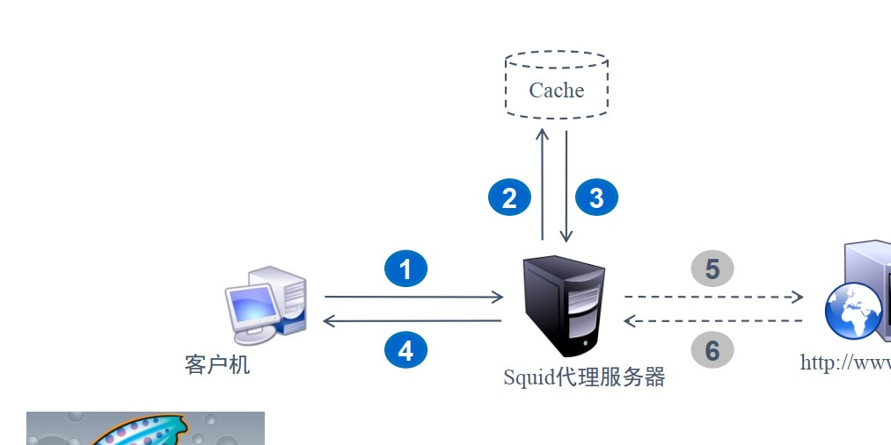
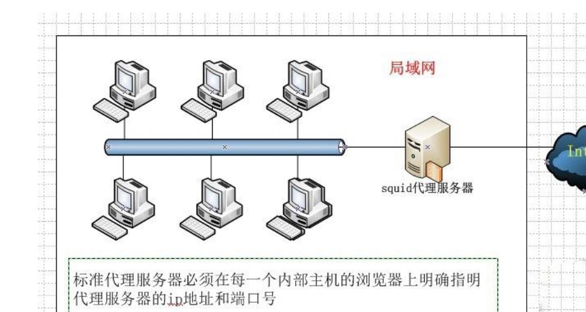
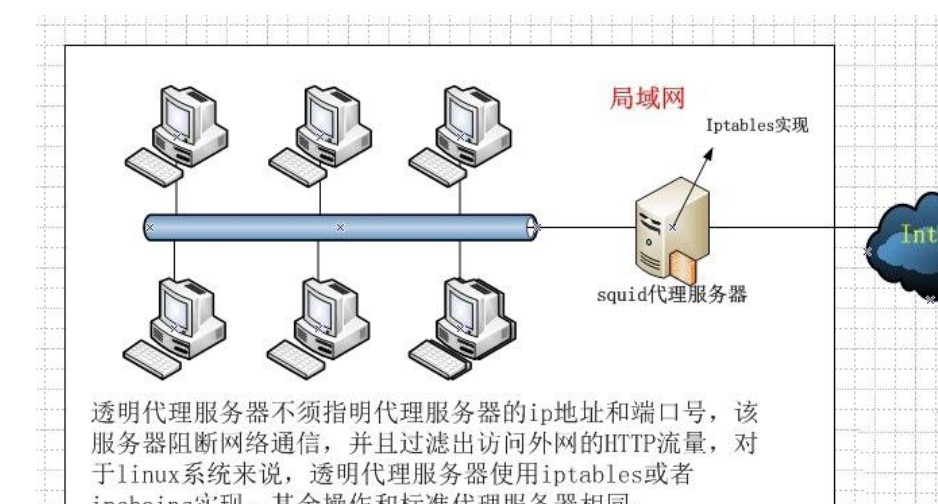
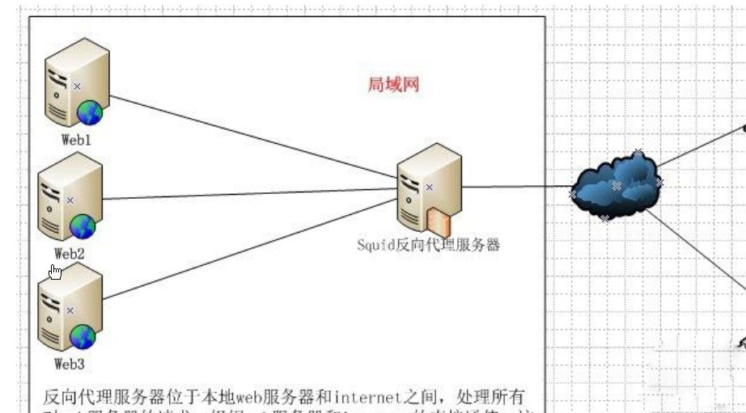

**Squid 简介**

# 1 、Squid 一些概念性解释

**定义：**

**支持的代理协议：**

**存储分类：**

- 索引方式

-  Hash Tables 目录 每个 Digest 的索引信息

-  Digest Tables 索引 不同分区对应的 Object 大概说明

**Squid 工作逻辑结构图：**



# 2 、Squid 工作模式分类

##  ① 传统模式

1 ） 模式说明： 模式说明：此类工作模式为三种模式中最简单的构成，对客户端配置较不友好，主要功能为加速

内网用户的访问速度，减少出口流量

2 ） 工作架构图



## ② 透明模式

1 ）模式说明：此类工作模式配置较为复杂，需要借助防火墙对端口进行重定向操作。但是，对于客

户端来说配置较为友好无需进行任何配置即可使用代理功能，主要功能为加速内网用户的访问速度，

减少出口流量

2 ）工作架构图



##  ③ 反向代理模式

1） 模式说明：反向代理服务器位于本地 WEB 服务器和互联网用户之间，处理公网用户发送的请求

并代理至内网服务中，有效减轻后端真实服务器压力，增加服务并发能力

2 ） 工作架构图



# 3 、Squid 软件及配置说明

## ① 软件介绍

```
软件包：squid-3.1.STABLE21-6.el6
系统服务：squid
主程序：/usr/sbin/squid
主配置文件：/etc/squid/squid.conf
默认监听端口：TCP 3128
默认访问日志：/var/log/squid/access.log
```

**特别说明**

## ② 常见配置选项说明

```
http_port 3128                                 # Squid 启动端口为 3128
access_log /var/log/squid/access.log squid     # 指定 Squid 存储日志目录
cache_mem 64 MB                                 # 指定 Squid 进程能够使用的内存大小
cache_dir ufs /var/spool/squid 100 16 256     # 指定 Squid 对象文件存储路径使用大小限制为
                                              #100MB ，一级目录个数为 16 个，二级目录个数为 256 个
visible_hostname proxy.benet.com             # 指定 Squid 服务器自身的主机名
dns_testnames www.google.com www.163.com     # 指定 Squid 服务器测试本机是否正常时的测试域名
maximum_object_size 4096 KB                     # 指定 Squid 最大允许缓存对象的大小
reply_body_max_size 10 MB                      # 指定允许通过 Squid 的单个元素大小
```