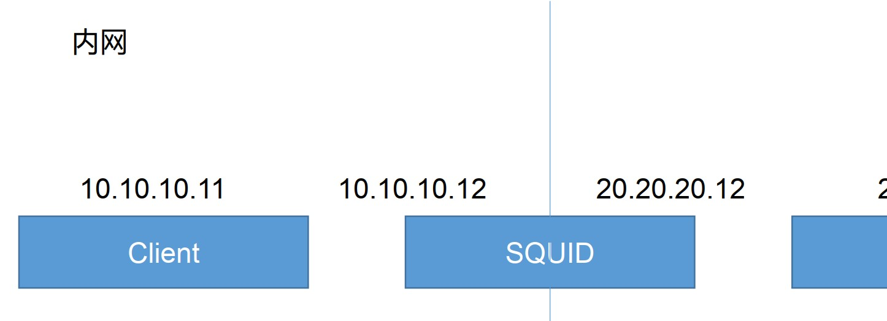
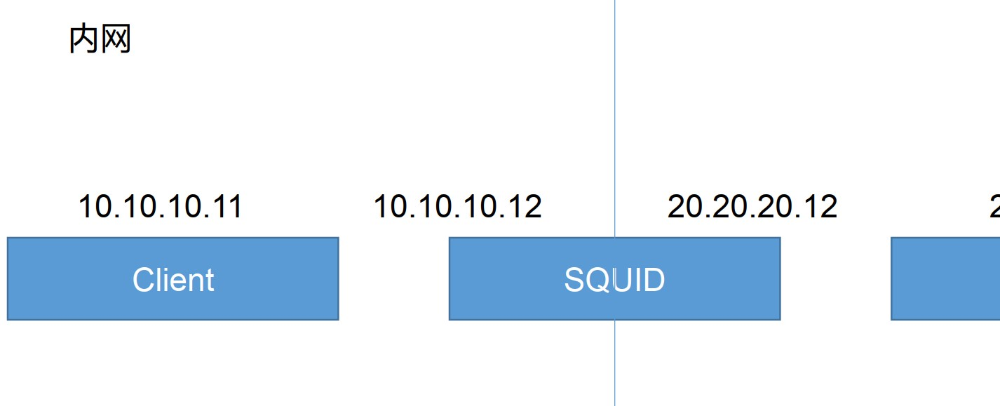
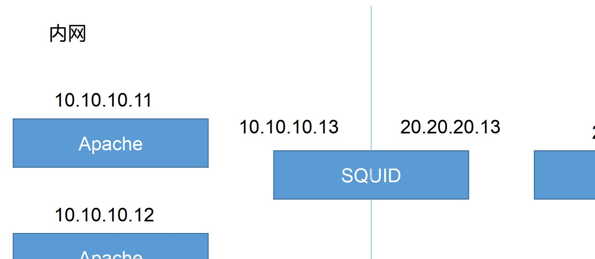

**Squid实验构建**

# **1、传统代理模式**

## ① 实验结构图



**内网服务器**

```
router add default gw 192.168.1.1 # 添加默认路由
```

**网关服务器 （Squid 服务器）**

```
**yum -y install squid 安装 squid 服务**
**vim /etc/squid/squid.conf**
**http_port 3128**
**visible_hostname www.xdl.com**
**service squid start**
**vi /etc/sysctl.conf**
**net.ipv4.ip_forward = 1 开启路由转发**
```

**模拟外网 WEB 服务器.**

```
**vi /var/www/html/index.html**
**zheshi ceshi ye!**
**service httpd start**
```

# 2、透明代理模式

## 1、实验结构图



## 2、构建代码

**内网服务器 内网服务器**

```
**router add default gw 192.168.1.1 # 添加默认路由**
```

**网关服务器 （Squid 服务器）**

```
**yum -y install squid # 安装 squid 服务**
**vim /etc/squid/squid.conf**
**http_port 192.168.1.1：3128 # transparent ip 为网关内网 IP**
**visible_hostname www.xdl.com**
**service squid start**
**vi /etc/sysctl.conf**
**net.ipv4.ip_forward = 1 # 开启路由转发**
**iptables -t nat -A PREROUTING -i eth0(内网网卡) -s 192.168.1.0/24 -p tcp --dport 80 -j REDIRECT**
**--to-ports 3128 # 添加路由规则**
```

**外网服务器模拟 WEB 服务器 服务器**

```
**vi /var/www/html/index.html**
**zheshi ceshi ye!**
**service httpd start**
```

**下载限制测试 下载限制测试**

```
**dd if=/dev/zero of=1.txt bs=1M count=15**
**vim /etc/squid/squid.conf**
**reply_body_max_size 1024x1024x20**
**service Squid reload**
```

# 3、方向代理模式

## 1）实验结构图



## 2）构建代码

**内网 Web 服务器 1**

```
**router add default gw 192.168.1.1 # 添加默认路由**
**vim /var/www/html**
**11111111**
**service httpd start**
```

**内网 Web 服务器 2**

```
**router add default gw 192.168.1.1 # 添加默认路由**
**vim /var/www/html**
**2222222222222**
**service httpd start**
```

**网关服务器（Squid 服务器）**

```
**yum -y install squid # 安装 squid 服务**
**vim /etc/squid/squid.conf**
**http_access allow all**
**http_port 10.0.0.1:80( 网关外网口地址) vhost**
**visible_hostname www.xdl.com**
**cache_peer 192.168.1.2 （内网中网页服务器 IP ） parent 80 0 （网络中是否还有其他代理） originserver round-robin**
**（节点以轮询的方式）**
**cache_peer 192.168.1.3 parent 80 0 originserver round-robin**
**service squid start**
**vi /etc/sysctl.conf**
**service squid reload**
```

# 4、Squid ACL 设置

## 1）ACL 配置

### ① ACL 配置书写规则

**ACL（ Access Control List ，访问控制列表）：**

acl  	列表名称  	列表类型  列表内容 ...

针对已定义的 acl 列表进行限制

http_access  allow  或  deny  列表名称 ...

## ② Squid ACL 支持过滤的类型

src  			源地址 			url_regex 			目标 URL 地址

dst 			目标地址 			Urlpath_regex 		整个目标 URL 路径

port 			目标端口	 		maxconn 			最大并发连接

dstdomain 	目标域 			time 				访问时间

## 2 ）规则总结说明

1）如果仅仅只有 acl 设定没有 http_access 设置默认拒绝

2）如果 http_access deny all 未定义，并且自己定义了一个 acl 范围，默认使用最后一条规则的反向规则