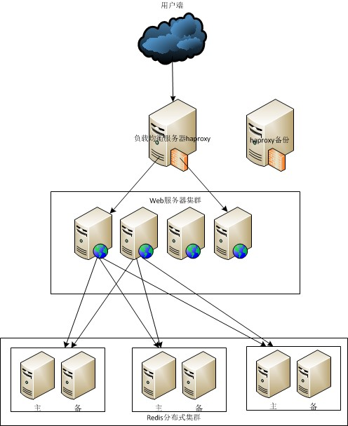
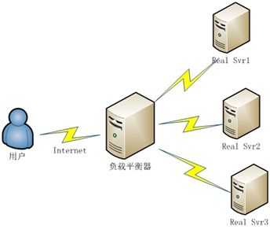

1 、集群是什么？

2 、集群的分类

①负载均衡集群 - LBC

②高可用集群 – HAC

③高性能运算集群 – HPC：

3、总结

# 1 、集群是什么？

定义：一组协同工作的服务器，对外表现为一个整体

集群的意义：更好的利用现有资源实现服务的高度可用

集群扩展方式：

 垂直扩展：更换服务器硬件

 水平扩展：添加更多的服务器节点

常见的集群拓扑：

---

# 2 、集群的分类

## ①负载均衡集群 - LBC (Load-Balance-Cluster）

                                       负载-均衡-集群

使用意图：减轻单台服务器的压力，将用户请求分担给多台主机一起处理

实现方法

 软件：LVS RAC Nginx

 硬件：F5 BIG-IP

负载均衡集群架构拓扑

调度器分类

-  触发条件不同

-  四层：传输层 IP+PORT

-  七层：应用层 URL

-  实现原理不同

-  四层：TCP 连接只建立一次，客户端和正式服务器

-  七层：TCP 连接建立两次，客户端和负载调度器 负载调度器和真实服务器

-  实现场景不同

-  四层：TCP 应用 如：基于 C/S 机构的 ERP 系统

-  七层：HTTP 应用 如：根据用户访问域名的方式，判断用户语言

-  安全性不同

-  四层：转发 SYN 攻击

-  七层：可以拦截 SYN 攻击

使用范围：业务并发较大的应用程序

## ②高可用集群 – HAC（High-Available
-Cluster）

高--可用--集群

使用意图：最大限度的保证用户的应用持久，不间断的提供服务

最大限度

99% 		99 		87.6 小时

99.9% 		999 		8.8 小时

99.99% 	9999	53 分钟

99.999% 	99999 	5 分钟

实现原理：心跳检测

实现方法

-  软件

-  heartbeat linux-HA

-  RHCS

-  ROSE

-  keepalived

-  硬件

-  F5

特殊情况：脑分裂

-  可能出现的问题：数据不完整、数据不可访问

 解决方法：预防：冗余、强制隔离：电源交换机

使用范围：需要持续提供服务的应用程序

## ③高性能运算集群 – HPC：（High-Performance-Cluster）

高-性能-集群

## 

使用意图：提供单台计算机所不具备的计算能力

LBC 与 HAC 的原理对比：

负载均衡集群通过提高单位时间内执行的任务数来提升效率

高性能运算集群通过缩短单个任务的执行时间来提高效率

使用范围：天气计算、火箭弹道演算

---

# 3、总结

负载均衡集群 LBC ：		分担服务的总体压力

高可用集群 HAC ：		尽可能的保障服务状态的可用性

高性能运算集群 HPC：	提供单台服务器提供不了的计算能力

