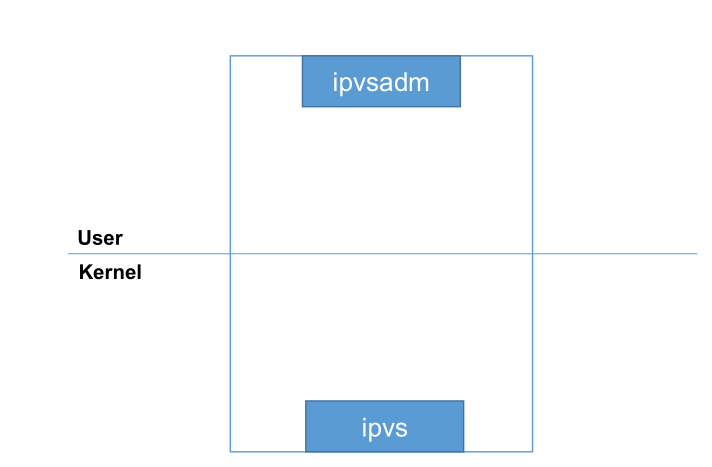

# **1、负载均衡集群原理**

## **1）LVS负载均衡原理：**

**四层工作逻辑：s:source：来源；d:destination：目的地；**

## **2）Nginx负载均衡原理：**

**七层工作原理：**

# **2、LVS 工作方式**

## **1）lvs工作层级**

## **2）LVS工作模式分类**

## **3）LVS NAT模式：****（Network-Address-Translation:网络地址转换）**

DNAT：DEST -NAT：目标地址转换

SNAT：SRC-NAT：源地址转换

**总结：**

- 集群节点处于同一个网络环境中

- 真实服务器必须将网关指向负载调度器

- RIP 通常是私有 IP，仅用于各个集群节点通信

- 负载调度器必须位于 RS 与 DS 之间，充当网关

- 支持端口映射（意思就是能够修改端口）

- 负载调度器必须是 Linux 操作系统，真实服务器随意

- 进出数据报文都要进过负载调度器机器，压力较大

## **4）LVS DR模式：****（Direct-Routing:直接路由）**

**总结：**

- 集群节点处于同一个广播域中

- 真实服务器将网关指向真实路由器

- 负载调度器只负责处理入站请求，压力最小

- 不支持端口映射

- 负载调度器必须是 Linux ，真实服务最好是 Linux

## **5）LVS  TUN模式：（tunel:隧道）**

**总结**

- 集群所有节点都必须直接/间接拥有公网地址

- 真实服务器必须将网关指向真实网关处

- 不支持端口映射

- DS 与 RS 必须开启隧道功能

- 入站由 DS 完成，出站由 RS 完成，

- 负载调度器必须是 Linux 操作系统，真实服务器随意

- 压力较大