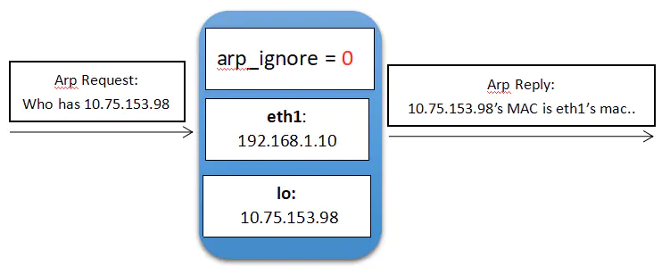
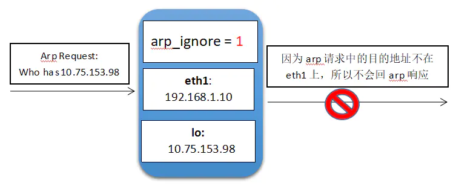
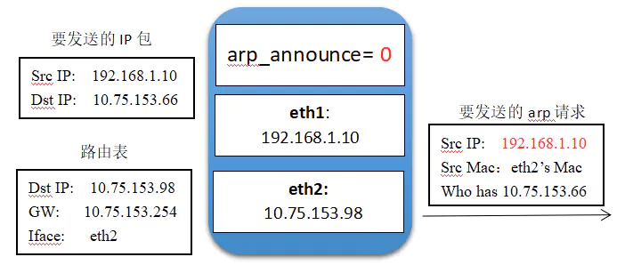
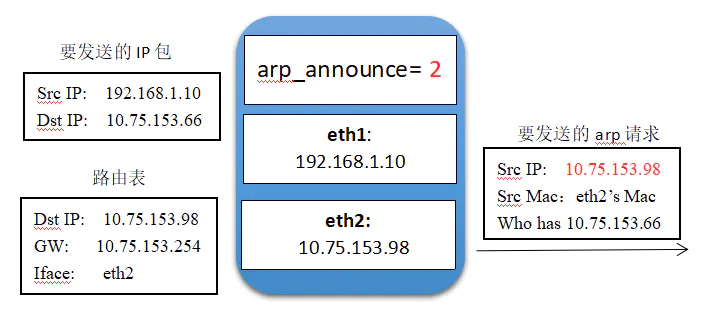

# **一、Arp 通讯行为（****Address-Resolution-Protocol：地址解析协议）可以将ip转换为MACK地址**

## **1）ARP 响应级别**

- **arp-ignore	****（ignore:忽略，理会）**

- **0  只要本机配置有相应的ip地址就响应；**

- **1 仅在请求的目标地址配置的请求到达网络接口上时才给予响应；**

## **2）ARP 通告行为**

- ** arp-announce  **** （announce：宣布）**

- **0 ****允许使用任意网卡上的IP地址作为arp请求的源IP，通常就是使用数据包a的源IP****；**

- **1 ****尽量避免使用不属于该发送网卡子网的本地地址作为发送arp请求的源IP地址**

- **2 ****忽略IP数据包的源IP地址，选择该发送网卡上最合适的本地地址作为arp请求的源IP地址。**

- 

# 二、arp_ignore和arp_announce参数示例



（1）当arp_ignore参数配置为0时，eth1网卡上收到目的IP为环回网卡IP的arp请求，但是eth1也会返回arp响应，把自己的mac地址告诉对端。



（2）当arp_ignore参数配置为1时，eth1网卡上收到目的IP为环回网卡IP的arp请求，发现请求的IP不是自己网卡上的IP，不会回arp响应。



（3）当arp_announce参数配置为0时，系统要发送的IP包源地址为eth1的地址，IP包目的地址根据路由表查询判断需要从eth2网卡发出，这时会先从eth2网卡发起一个arp请求，用于获取目的IP地址的MAC地址。该arp请求的源MAC自然是eth2网卡的MAC地址，但是源IP地址会选择eth1网卡的地址。



（4）当arp_announce参数配置为2时，eth2网卡发起arp请求时，源IP地址会选择eth2网卡自身的IP地址。

# 三、arp_ignore和arp_announce参数在DR模式下的作用

## 1. arp_ignore

因为DR模式下，每个真实服务器节点都要在环回网卡上绑定虚拟服务IP。这时候，如果客户端对于虚拟服务IP的arp请求广播到了各个真实服务器节点，如果arp_ignore参数配置为0，则各个真实服务器节点都会响应该arp请求，此时客户端就无法正确获取LVS节点上正确的虚拟服务IP所在网卡的MAC地址。假如某个真实服务器节点A的网卡eth1响应了该arp请求，客户端把A节点的eth1网卡的MAC地址误认为是LVS节点的虚拟服务IP所在网卡的MAC，从而将业务请求消息直接发到了A节点的eth1网卡。这时候虽然因为A节点在环回网卡上也绑定了虚拟服务IP，所以A节点也能正常处理请求，业务暂时不会受到影响。但时此时由于客户端请求没有发到LVS的虚拟服务IP上，所以LVS的负载均衡能力没有生效。造成的后果就是，A节点一直在单节点运行，业务量过大时可能会出现性能瓶颈。

所以DR模式下要求arp_ignore参数要求配置为1。

## 2. arp_announce

每个机器或者交换机中都有一张arp表，该表用于存储对端通信节点IP地址和MAC地址的对应关系。当收到一个未知IP地址的arp请求，就会再本机的arp表中新增对端的IP和MAC记录；当收到一个已知IP地址（arp表中已有记录的地址）的arp请求，则会根据arp请求中的源MAC刷新自己的arp表。

如果arp_announce参数配置为0，则网卡在发送arp请求时，可能选择的源IP地址并不是该网卡自身的IP地址，这时候收到该arp请求的其他节点或者交换机上的arp表中记录的该网卡IP和MAC的对应关系就不正确，可能会引发一些未知的网络问题，存在安全隐患。

所以DR模式下要求arp_announce参数要求配置为2。

# 四、arp_ignore和arp_announce参数的配置方法

arp_ignore和arp_announce参数分别有all,default,lo,eth1,eth2...等对应不同网卡的具体参数。当all和具体网卡的参数值不一致时，取较大值生效。

一般只需修改all和某个具体网卡的参数即可（取决于你需要修改哪个网卡）。下面以修改lo网卡为例：

## 1. 修改/etc/sysctl.conf文件，然后sysctl -p刷新到内存。

```
net.ipv4.conf.all.arp_ignore=1
net.ipv4.conf.lo.arp_ignore=1
net.ipv4.conf.all.arp_announce=2
net.ipv4.conf.lo.arp_announce=2
```

## 2. 使用sysctl -w直接写入内存：

```
sysctl -w net.ipv4.conf.all.arp_ignore=1
sysctl -w net.ipv4.conf.lo.arp_ignore=1
sysctl -w net.ipv4.conf.all.arp_announce=2
sysctl -w net.ipv4.conf.lo.arp_announce=2
```

## 3. 修改/proc文件系统：

```
echo "1">/proc/sys/net/ipv4/conf/all/arp_ignore
echo "1">/proc/sys/net/ipv4/conf/lo/arp_ignore
echo "2">/proc/sys/net/ipv4/conf/all/arp_announce
echo "2">/proc/sys/net/ipv4/conf/lo/arp_announce
```