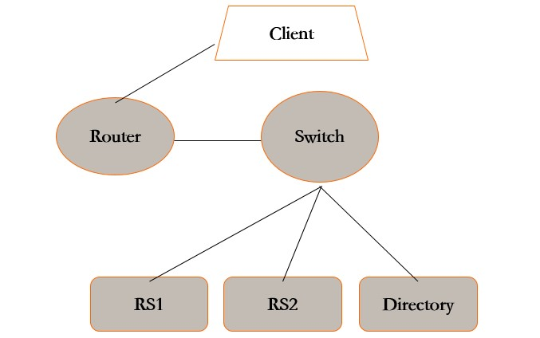
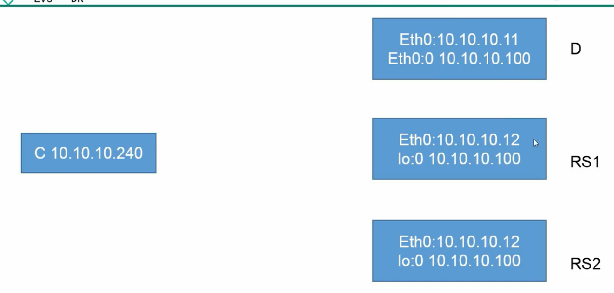
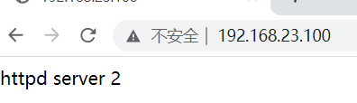

# **1、实验环境**

## **1）ip 地址网段  192.168.23.0/24		255.255.255.0**

一台：负载均衡调节器：192.168.23.11      子网卡ip：192.168.23.100

两台或者更多真实服务器：192.168.23.12  -13

## **2）网络类型 ：仅主机模式   关闭DHCP服务**

## **3）硬件选项：2块网卡（均是仅主机模式），其他随意，能用就行；**

## **4）操作系统配置	桌面版安装；(Alt+Ctrl+F3 :返回字符页面）**

- 修改默认级别（开机默认为字符界面）：vim /etc/inittab;


## **5)****关闭防火墙和永久关闭SELINUX：**

```javascript
service iptables stop		#关闭防火墙
vim /etc/selinux/config
    SELINUX=disabled			#永久关闭SELINUX，下次开机生效；
setenforce 0				#暂时关闭SELINUX，立即生效
```

## **6)配置光盘yum源：**

```javascript
[root@localhost ~]# mkdir /mnt/cdrom
[root@localhost ~]# mount /dev/sr0/  /mnt/cdrom/
mount: block device /dev/sr0 is write-protected, mounting read-only
cd /etc/yum.repos.d/
[root@localhost yum.repos.d]# ls
CentOS-Base.repo  CentOS-Debuginfo.repo  CentOS-fasttrack.repo  CentOS-Media.repo  CentOS-Vault.repo
[root@localhost yum.repos.d]# mkdir back
[root@localhost yum.repos.d]# mv CentOS-Base.repo  CentOS-Debuginfo.repo CentOS-fasttrack.repo CentOS-Vault.repo ./back/
[root@localhost yum.repos.d]# vim CentOS-Media.repo 

name=CentOS-$releasever - Media
baseurl=file:///mnt/cdrom/			#源文件位置
gpgcheck=0					#关闭检查
enabled=1					#启用yum源

[root@localhost yum.repos.d]# yum clean all		#清理缓存
已加载插件：fastestmirror, refresh-packagekit, security
Cleaning repos: c6-media
清理一切
```

## **7）安装 gcc gcc-c++ lrzsz:**

```javascript
[root@localhost yum.repos.d]# yum install gcc gcc-c++ lrzsz
```

# **2、实验架构图**





# **3、Arp 通讯行为（****Address-Resolution-Protocol：地址解析协议）可以将ip转换为MACK地址**

## **1）ARP 响应级别**

- **arp-ignore	****（ignore:忽略，理会）**

- **0  只要本机配置有相应的ip地址就响应；**

- **1 仅在请求的目标地址配置的请求到达网络接口上时才给予响应；**

## **2）ARP 通告行为**

- ** arp-announce  **** （announce：宣布）**

- **0 ****允许使用任意网卡上的IP地址作为arp请求的源IP，通常就是使用数据包a的源IP****；**

- **1 ****尽量避免使用不属于该发送网卡子网的本地地址作为发送arp请求的源IP地址**

- **2 ****忽略IP数据包的源IP地址，选择该发送网卡上最合适的本地地址作为arp请求的源IP地址。**

# **4、试验步骤**

## **1)负载调度器**

**（ipvs,IP-Virtual-Server:IP虚拟服务器）（ipvsadm:IPVS-Advaced-Manager:ipvs高级管理器）**

## **
**

```javascript
service NetworkManager stop 	# 关闭网卡守护进程，NetworkManger只有桌面版才有这个程序；
chkconfig NetworkManager off  	#关闭守护进程自启

cd /etc/sysconfig/network-scripts/
cp ifcfg-eth0 ifcfg-eth0:0 	# 拷贝 eth0 网卡子接口充当集群入口接口
vim ifcfg-eth0:0
    DEVICE=eth0:0
    IPADDR=192.168.23.100
    NETMASK=255.255.255.0             
ifup eth0:0	#启动网卡子接口，service network restart 也可以；ifdown 关闭子网卡
yum install -y ipvsadm-1.26	# 安装 ipvsadm 命令行工具	   
ipvsadm -v 						  # 查看当前 ipvs 集群内容
ipvsadm -A -t 192.168.23.100:80 -s rr 		  # 添加 ipvs TCP 集群，-s:指定算法，rr:轮询算法
ipvsadm -a -t 192.168.23.100:80 -r 192.168.23.12:80 -g  # 添加 ipvsadm 集群子节点，-r:real server,真实服务器
ipvsadm -a -t 192.1658.23.100:80 -r 192.168.23.13:80 -g
[root@localhost ~]# modprobe ip_vs		#将ipvs加载到内核中
[root@localhost ~]# ipvsadm -Ln		#查看集群信息
IP Virtual Server version 1.2.1 (size=4096)
Prot LocalAddress:Port Scheduler Flags
  -> RemoteAddress:Port           Forward Weight ActiveConn InActConn
TCP  192.168.23.100:80 rr
  -> 192.168.23.12:80             Route   1      0          0         
  -> 192.168.23.13:80             Route   1      0          0 ipvsadm -Ln

service ipvsadm save # 保存 ipvs 集群内容至文件，进行持久化存储
chkconfig ipvsadm on # 设置为开机自启
#systemctl enable ipvsadm
```

## **2)真实服务器
**

```javascript
service NetworkManager stop 	#关闭网卡守护进程
chkconfig NetworkManager off  	#关闭守护进程自启

cd /etc/sysconfig/network-scripts/
cp ifcfg-lo ifcfg-lo:0
vim ifcfg-lo:0 		# 拷贝回环网卡子接ifv口
    DEVICE=lo:0
    IPADDR=虚拟 IP
    NETMASK=255.255.255.255
    
vim /etc/sysctl.conf 				# 关闭对应 ARP 响应及公告功能
    net.ipv4.conf.all.arp_ignore = 1		#添加
    net.ipv4.conf.all.arp_announce = 2
    net.ipv4.conf.default.arp_ignore = 1
    net.ipv4.conf.default.arp_announce = 2
 
    net.ipv4.conf.lo.arp_ignore = 1
    net.ipv4.conf.lo.arp_announce = 2
sysctl -p		#刷新内核
ifup lo： 0

route add -host 192.168.23.100 dev lo:0 	# 添加路由记录，当访问 192.168.23.100时 交给 lo:0 网卡接受
[root@localhost network-scripts]# route -n
Kernel IP routing table
Destination     Gateway         Genmask         Flags Metric Ref    Use Iface
192.168.23.100  0.0.0.0         255.255.255.255 UH    0      0        0 lo
192.168.23.0    0.0.0.0         255.255.255.0   U     0      0        0 eth1
169.254.0.0     0.0.0.0         255.255.0.0     U     1002   0        0 eth1
[root@localhost network-scripts]# vim /etc/rc.local  #开机自启
。。。。。。
#添加路由记录，当访问 192.168.23.100时 交给 lo:0 网卡接受
route add -host 192.168.23.100 dev lo:0
service httpd start
```

## **3)测试：关闭所有的防火墙：访问192.168.23.100（负载调节器ip地址）**



