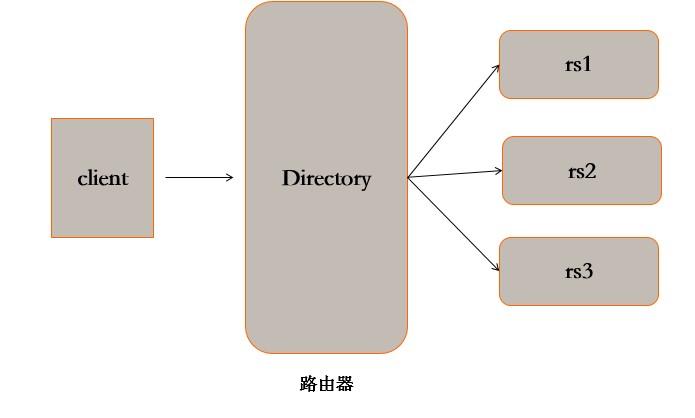
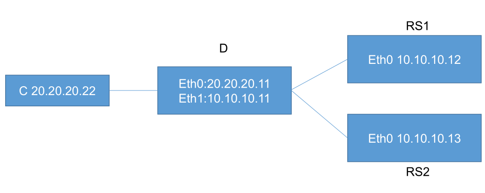

# **1、实验环境**

## **1）ip 地址网段  **

- 负载调节器：192.168.23.0(公网）		

- 真实服务器：100.100.100.0（内网）		（两台或者更多）

## **2）网络类型 ：仅主机模式   关闭DHCP服务**

## **3）硬件选项：负载调节器2块网卡（均是仅主机模式；真实服务器一块网卡；）**

## **4）操作系统配置	桌面版安装（也可以是字符界面）；(Alt+Ctrl+F3 :返回字符页面）**

- 修改默认级别（开机默认为字符界面）：vim /etc/inittab;


## **5)关闭防火墙和永久关闭SELINUX：**

```javascript
service iptables stop		#关闭防火墙
vim /etc/selinux/config
    SELINUX=disabled			#永久关闭SELINUX，下次开机生效；
setenforce 0				#暂时关闭SELINUX，立即生效
```

## **6)配置光盘yum源：**

```javascript
[root@localhost ~]# mkdir /mnt/cdrom
[root@localhost ~]# mount /dev/sr0/  /mnt/cdrom/
mount: block device /dev/sr0 is write-protected, mounting read-only
cd /etc/yum.repos.d/
[root@localhost yum.repos.d]# ls
CentOS-Base.repo  CentOS-Debuginfo.repo  CentOS-fasttrack.repo  CentOS-Media.repo  CentOS-Vault.repo
[root@localhost yum.repos.d]# mkdir back
[root@localhost yum.repos.d]# mv CentOS-Base.repo  CentOS-Debuginfo.repo CentOS-fasttrack.repo CentOS-Vault.repo ./back/
[root@localhost yum.repos.d]# vim CentOS-Media.repo 

name=CentOS-$releasever - Media
baseurl=file:///mnt/cdrom/			#源文件位置
gpgcheck=0					#关闭检查
enabled=1					#启用yum源

[root@localhost yum.repos.d]# yum clean all		#清理缓存
已加载插件：fastestmirror, refresh-packagekit, security
Cleaning repos: c6-media
清理一切
```

## **7）安装 gcc gcc-c++ lrzsz:**

```javascript
[root@localhost yum.repos.d]# yum install gcc gcc-c++ lrzsz
```

# **2、试验构件图**





# **3、试验步骤**

## **1）负载调度器
**

```javascript
service NetworkManager stop	#关闭守护进程
mount /dev/sr0  /mnt/cdrom		#光盘挂载
yum install -y ipvsadm 		#安装ipvsadm
vi /etc/sysctl.conf 	# 开启路由转发功能
net.ipv4.ip_forward=1
sysctl -p
[root@localhost ~]# service iptables start		#开启防火墙规则
[root@localhost ~]# chkconfig iptables on		#开启自启
[root@localhost ~]# iptables -t nat -F			#清空防火墙规则

iptables -t nat -A POSTROUTING -s 100.100.100.0/24  -o eth0 -j SNAT --to-source 192.168.23.11
# 添加防火墙记录，当源地址是 内网网段 并且出口网卡为 eth0 的时候进行 SNAT 转换，
转换源地址为外网卡地址
iptables -t nat -L # 查看记录是否保存成功
[root@localhost ~]# iptables -t nat -L
Chain POSTROUTING (policy ACCEPT)
target     prot opt source               destination         
SNAT       all  --  100.100.100.0/24     anywhere            to:192.168.23.11 	#重点关注
root@localhost ~]# service iptables save		#保存防火墙规则
iptables：将防火墙规则保存到 /etc/sysconfig/iptables：     [确定]

ipvsadm -A -t 192.168.23.11:80 -s rr # 添加 ipvsadm TCP 集群
ipvsadm -a -t 192.168.23.11:80 -r 10.10.10.12:80 -m # 添加 ipvsadm 节点
ipvsadm -a -t 192.168.23.11:80 -r 100.100.100.13:80 -m
ipvsadm -Ln
    IP Virtual Server version 1.2.1 (size=4096)
    Prot LocalAddress:Port Scheduler Flags
      -> RemoteAddress:Port           Forward Weight ActiveConn InActConn
    TCP  192.168.23.11:80 rr
      -> 100.100.100.12:80            Masq    1      0          0         
      -> 100.100.100.13:80          Masq    1      0          0   
service ipvsadm save # 保存 ipvs 集群设置到文件进行持久化
chkconfig ipvsadm on
```

## **2）真实服务器
**

```javascript
service NetworkManager stop	#关闭守护进程
route add default gw IP 地址 	# 指定网关(100.100.100.11)至负载调度器
service httpd start # 开启 Apache 服务器
chkconfig httpd on
```

## **3)测试：**


