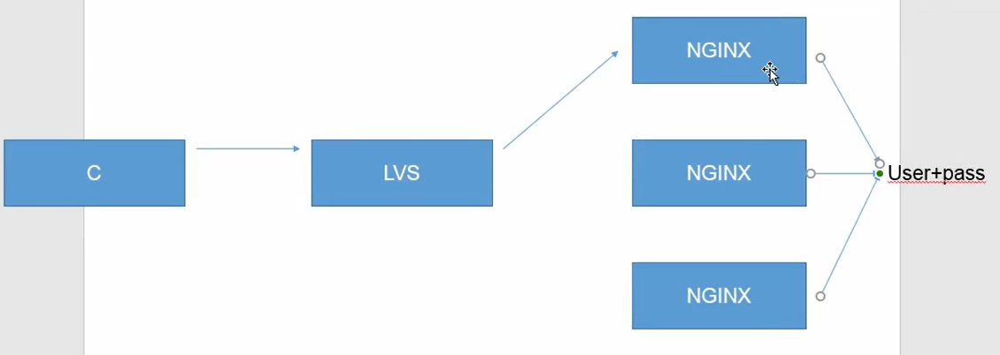
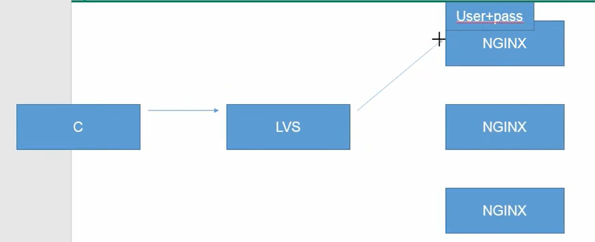
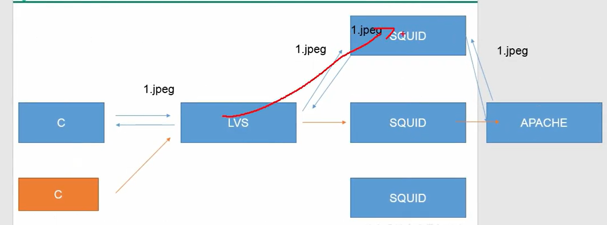

# 1、静态调度算法

特点：只根据算法本身去调度，不考虑服务器本身

- 算法说明

-  RR 轮询：将每次用户的请求分配给后端的服务器，从第一台服务器开始到第 N 台结束，
然后循环

-  WRR 加权轮询：按照权重的比例实现在多台主机之间进行调度

-  SH（source hash）源地址散列：将同一个 IP 的用户请求，发送给同一个服务器

- 

- 

- 

-  DH（destination hash）目标地址散列：将同一个目标地址的用户请求发送给同一个真实服务
器（提高缓存的命中率）

- 

- 

---

# 2、动态调度算法

特点：除了考虑算法本身，还要考虑服务器状态

- 算法说明

-  LC（lest-connection）最少连接：将新的连接请求，分配给连接数最少的服务器 活动连
接 × 256 + 非活动连接

-  WLC 加权最少连接：特殊的最少连接算法，权重越大承担的请求数越多 （活
动连接 × 256 + 非活动连接 ） / 权重

-  SED 最短期望延迟：特殊的 WLC 算法 （活动连接 + 1） * 256 / 权重

-  NQ 永不排队：特殊的 SED 算法，无需等待，如果有真实服务器的连接数等于 0 那就直接
分配不需要运算

-  LBLC 特殊的 DH 算法：即能提高缓存命中率，又要考虑服务器性能

-  LBLCR LBLC+缓存：尽可能提高负载均衡和缓存命中率的折中方案