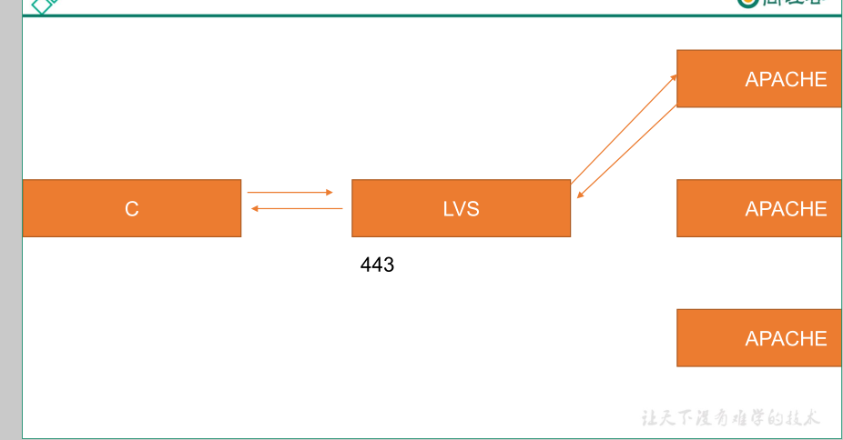

# ①PCC 持久客户端连接（Protracted-Client-Connection)


定义：每客户端持久；将来自于同一个客户端的所有请求统统定向至此前选定的 RS；也就是只要 IP
相同，分配的服务器始终相同


演示代码


```javascript
ipvsadm -A -t 172.16.0.8:0 -s wlc -p 120 
# 添加一个 tcp 负载集群，集群地址为 172.16.0.8 ，
算法为 wlc，持久化时间为 120s
```

# ② PPC持久端口连接(Protracted-Port-Connection)


定义：每端口持久；将来自于同一个客户端对同一个服务(端口)的请求，始终定向至此前选定的 RS


演示代码


```javascript
ipvsadm -A -t 172.16.0.8:80 -s rr -p 120 
# 添加一个 tcp 负载集群，集群地址为 172.16.0.8:80 ，
算法为 rr，持久化时间为 120s
```

#  ③ PFMC持久防火墙标记连接(Protracted-Firewall-Mask-Connection)


定义：将来自于同一客户端对指定服务(端口)的请求，始终定向至此选定的 RS；不过它可以将两个毫
不相干的端口定义为一个集群服务


演示代码


```javascript
iptables -t mangle -A PREROUTING -d 172.16.0.8 -p tcp --dport 80 -j MARK --set-mark 10 
# 添加
一个防火墙规则，当目标地址为 172.16.0.8 并且 目标端口为 80 时给数据包打一个标记，设置
mark 值为 10
```


```javascript
iptables -t mangle -A PREROUTING -d 172.16.0.8 -p tcp --dport 443 -j MARK --set-mark 10 
# 添加
一个防火墙规则，当目标地址为 172.16.0.8 并且 目标端口为 443 时给数据包打一个标记，设置
mark 值为 10
```


```javascript
service iptables save 		
# 保存防火墙规则持久化生效

ipvsadm -A -f 10 -s wlc -p 120 	
# 添加一个负载调度器，当 mark 值为 10 时进行负载均衡使用
wlc 算法，持久化生效时间为 120s
```

