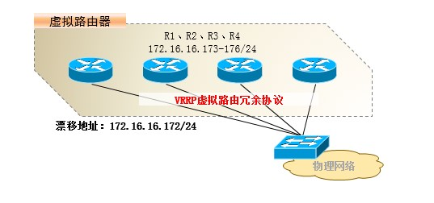
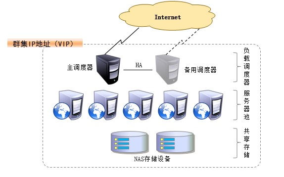
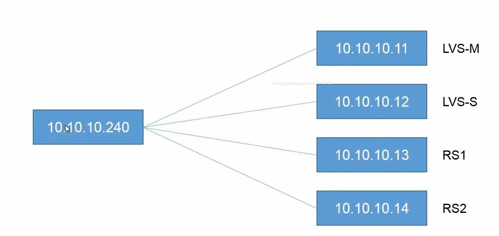

**高可用集群(LVS-DR+keepalived)**

# **1 、Keepalived 相关说明
**

① 软件相关介绍




- 案例环境专为 LVS 和 HA 设计的一款健康检查工具

- 支持故障自动切换（Failover）

- 支持节点健康状态检查（Health Checking）

- 官方网站：http://www.keepalived.org/

② 软件实现原理

**VRRP（Virtual Router Redundancy Protocol，虚拟路由冗余协议）**

一主 + 多备，共用同一个 IP 地址，但优先级不同





**漂移地址：就是 几个路由器会争夺一个ip地址去使用，当一个路由器坏掉之后，这个ip仍然有效，**

**因为被其他的路由器拿过去用了。**



# **2 、Keepalived + LVS 高可用实验构建**

# **
**

## **① 实验构建设计图**







## ** ② 实验构建代码**

## **环境：4台服务器：192.168.23.11  -14 （桌面版）**

## **一台：LVS-1**

## **一台：LVS-2**

## **两台web服务器：web服务器
**

**构建前提**

**先构建 LVS-DR 模式的负载均衡集群，可参照上文进行构建**

### **负载调度器-1 （****yum install -y keepalived****)
**

```javascript
下载keepalived-1.2.2.tar.gz源码包	
yum -y install kernel-devel openssl-devel popt-devel gcc* # 安装相关 keepalived 依赖
tar -zxf keepalived..... # 源码安装 Keepalived 软件
cd keep.....
./configure --prefix=/usr/local/keepalived1.2  --with-kernel-dir=/usr/src/kernels/2.6.32........./
make
make install
cp -a  /usr/local/keepalived1.2/etc/rc.d/init.d/keepalived   /etc/init.d/
chkconfig --add keepalived 	#添加到启动管理
chkconfig keepalived on		# 设置 Keepalived 开机自启

vi /usl/local/keepalived1.2/etc/keepalived/keepalived.conf  # 修改 Keepalived 软件配置
global_defs {			#第一行
    .........			#全部删除
    router_id R1 #R1,命名主机名
}

vrrp_instance VI--1 {	#虚拟路由冗余实例设定，instance:实例
    state MASTER 		# 设置服务类型主/从（MASTER/SLAVE）
    interface eth0 		# 指定那块网卡用来监听(心跳检测)
    virtual_router_id 66 #修改	# 设置组号， 如果是一组就是相同的 ID 号， 一个主里面只能有一个主
    				服务器和多个从服务器
    priority 100 		# 服务器优先级， 主服务器优先级高，最大不超过150
    advert_int 1 		# 心跳时间， 检测对方存活，检测间隔1秒
    authenticetion { 		# 存活验证密码
    	auth_type PASS
    	auth_pass 1111
    }
    virtual_ipaddress {
    192.168.23.100 	      #设置集群地址，也就是飘逸地址
    }
}

virtual_server 192.168.23.100 80 { 	# 设置集群地址 以及端口号
    delay_loop 2			# 健康检查间隔，delay:延迟，loop:环形,检查的是RS
    lb_algo rr 			# 使用轮询调度算法
    lb_kind DR 			# DR 模式的群集
    。。。。。			#删除
    protocol TCP			#使用的协议
    
    real_server 192.168.1.2 80 { 	# 管理的网站节点以及使用端口
    	weight 1 		# 权重， 优先级 在原文件基础上删除修改
    	TCP_CHECK { 		# 状态检查方式
    		connect_port 80 	# 检查的目标端口
    		connect_timeout 3 	# 连接超时（秒）
    		nb_get_retry 3 		# 重试次数
    		delay_before_retry 4 	# 重试间隔（秒）
    	}
    }
    
    real_server 192.168.1.3 80 { 	# 管理的第二个网站节点以及使用端口
    	weight 1 			# 权重， 优先级 在原文件基础上删除修改
    	TCP_CHECK { 			# 状态检查方式
    		connect_port 80 	# 检查的目标端口
    		connect_timeout 3 	# 连接超时（秒）
    		nb_get_retry 3 		# 重试次数
    		delay_before_retry 4 	# 重试间隔（秒）
    	}
    }
}

* 多余删除
[root@localhost ~]# service keepalived start
正在启动 keepalived：

scp keepalived.conf xx.xx.xx.xx： /etc/keepalived/
```



### **负载调度器-2(备份）
**

```javascript
[root@localhost ~]# service NetworkManager stop		#关闭守护进程
停止 NetworkManager 守护进程：            [确定]  
配置子网卡ip：192.168.23.100	#和主LVS的ip相同，仅需便捷eth0:0配置文件；
vim /etc/sysconfig/network-script/ifup-eth
.......
 if ! LC_ALL=C ip addr ls ${REALDEVICE} | LC_ALL=C grep -q "${ipaddr[$idx]}/${prefix[$idx]}" ; then
   if [ "${REALDEVICE}" != "lo" ] && [ "${arpcheck[$idx]}" != "no" ] ; then
        echo $"Determining if ip address ${ipaddr[$idx]} is already in use for device ${REALDEVICE}..."
       #                if ! ARPING=$(/sbin/arping -c 2 -w ${ARPING_WAIT:-3} -D -I ${REALDEVICE} ${ipaddr[$idx]}) ; then	#注释掉
       #                        ARPINGMAC=$(echo $ARPING |  sed -ne 's/.*\[\(.*\)\].*/\1/p')				#注释掉
         #                       net_log $"Error, some other host ($ARPINGMAC) already uses address ${ipaddr[$idx]}."	#注释掉
        #                       exit 1	#注释掉
         #               fi			#注释掉
                        fi
yum -y install kernel-devel openssl-devel popt-devel gcc* # 安装相关 keepalived 依赖
tar -zxf keepalived..... # 源码安装 Keepalived 软件
cd keep.....
./configure --prefix=/usr/local/keepalived1.2  
make
make install
cp -a /usr/local/keepalived1.2/etc/rc.d/init.d/keepalived  /etc/init.d/
#将启动脚本拷贝到启动文件夹下
chkconfig --add keepalived	 #添加启动脚本
chkconfig keepalived on	 # 设置 Keepalived 开机自启

scp /usr/local/keepalived1.2/etc/keepalived/keepalived.conf  \  #换行
root@192.168.23.14:/usr/local/keepalived1.2/etc/keepalived/keepalived.conf
#修改从 负载调度器-1 拷贝的 Keepalived 配置文件 
修改 1：state MASTER 修改至 state SLAVE
修改 2：priority 100 修改至 priority 47 一般建议与主服务器差值为 50
修改 3：router_id R1 修改为 R2  #第二行
yum install -y ipvsadm 
[root@localhost ~]# service ipvsadm start
[root@localhost ~]# chkconfig ipvsadm on
service keepalived start
ipvsadm -Ln   #
[root@localhost ~]# ipvsadm -Ln
IP Virtual Server version 1.2.1 (size=4096)
Prot LocalAddress:Port Scheduler Flags
  -> RemoteAddress:Port           Forward Weight ActiveConn InActConn
TCP  192.168.23.100:80 rr
  -> 192.168.23.12:80             Route   1      0          0         
  -> 192.168.23.13:80  
  

vim /etc/sysctl.conf 修改内核参数。 防止相同网络地址广播冲突， 如果有多快网卡需要设置多行
net.ipv4.conf.eth0.send_redirects = 0
net.ipv4.conf.all.send_redirects = 0
net.ipv4.conf.default.send_redirects = 0
net.ipv4.conf.eth0.send_redirects = 0
sysctl -p 刷新内核参数
modprobe ip_vs 查看内核是否加载， 无法应则以加载
cat /proc/net/ip_vs 参看版本， 确认知否正确加载
cd /mnt/cdrom/Packages/ 进入光盘挂载目录
rpm -ivh ipvsadm-1.26l......... 安装 ipvsadm 管理工具
ipvsadm -v
ipvsadm -A -t 虚拟 IP:80 -s rr
ipvsadm -Ln 查看设置的 ipvsadm 如果没有子项， 那么手动添加
ipvsadm -a -t 虚拟 IP:80 -r 网站 1:80 -g
ipvsadm -a -t 虚拟 IP:80 -r 网站 2:80 -g
```

### **web 服务器**

```javascript
[root@localhost ~]# service NetworkManager stop		#关闭守护进程
停止 NetworkManager 守护进程：            [确定]  
service httpd start	#开启web服务器
chkconfig httpd on `	#开启开机自启
vim /var/www/html/index.html	#编写测试html文件
curl localhost		#测试
```