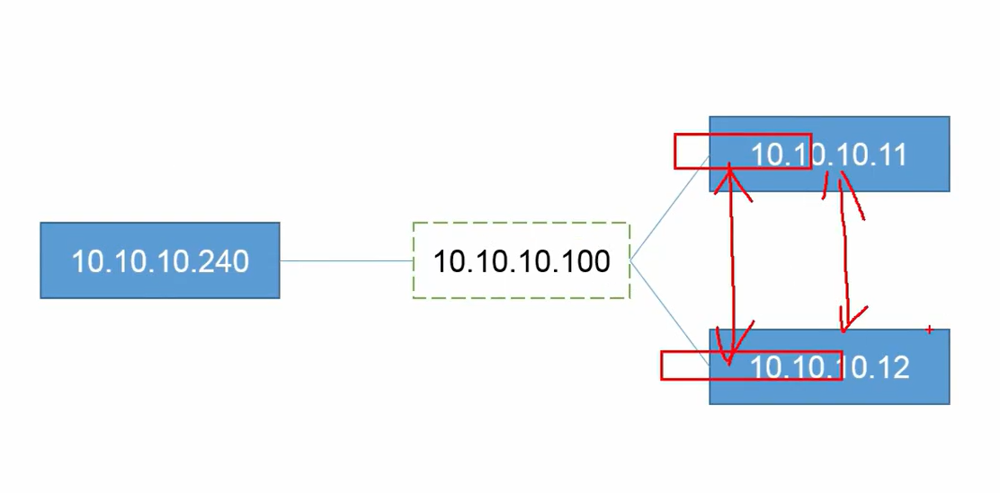
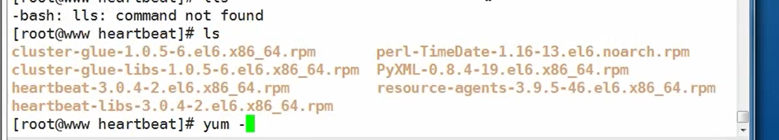

# **高可用集群HeartBeat+Nginx**


# ** ① 实验构建说明（****yum install -y heartbeat)****
**

软件包：软件包版本为 Centos6 系列，如果使用其它版本可以配置 eperl 源下载安装

环境准备

配置时间同步服务

配置主机名解析

实验拓扑结构





# ** **

# **② 实验代码构建.**

## **1）基础准备，准备节点都需要安装
**

```javascript
yum install -y pcre pcre-devel zlib zlib-devel
wget http://nginx.org/download/nginx-1.12.2.tar.gz
useradd -s /sbin/nologin  -M nginx
tar -zxf nginx...tar.gz
cd nginx....
./configure  --prefix=/usr/local/nginx1.12  --user=nginx   --group=nginx
make
make install

 echo $?
  
vim /usr/local/nginx1.12/html/index.html
/usr/local/nginx1.12/sbin/nginx	#启动Nginx服务

cd hearbeat
yum -y install *
cd /usr/share/doc/heartbeat-3.0.4/
cp ha.cf authkeys haresources /etc/ha.d/ 配置文件需拷贝到默认目录下
```



## **2 ）认证服务，节点之间的认证配置，修改 /etc/ha.d/authkeys ，在主上修改
**

```javascript
dd if=/dev/random bs=512 count=1 | openssl md5 # 生成密钥随机数
vim authkeys
auth 1
1 md5 a4d20b0dd3d5e35e0f87ce4266d1dd64
chmod 600 authkeys
```

## **3 ）heartbeat 主配置文件，修改 /etc/ha.d/ ha.cf ， 在主上修改
**

```javascript
bcast eth0
node www.centos1.com 一主一备节点，需注意能后被两台主机之间解析
node www.centos2.com
```

## **4) 配置 haresources 文件，在主上修改
**

```javascript
www.centos1.com IPaddr::10.10.10.100/24/eth0:0
```

## **5) 将主三个配置文件拷贝到从上
**

```javascript
cd /etc/ha.d/
scp ha.cf authkeys haresources root@www.centos1.com:/etc/ha.d/
```

## **6) 启动服务进行验证
**

```javascript
主：service httpd start
主：service heartbeat start
备：service httpd start
备：service heartbeat start
```