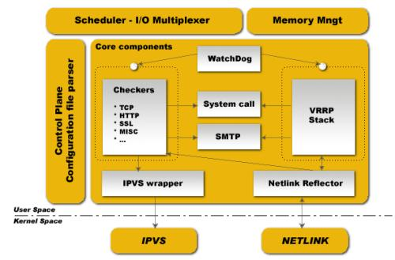

# 1、简介

- Keepalived是Linux下一个轻量级别的高可用解决方案，Keepalived起初是为LVS设计的，专门用

来监控集群系统 中各个服务节点的状态，如果某个服务器节点出现故障，Keepalived将检测到后

自动将节点从集群系统中剔除。

- 后来Keepalived又加入了VRRP的功能，VRRP（VritrualRouterRedundancyProtocol,虚拟路由冗

余协议)出现的目 的是解决静态路由出现的单点故障问题，通过VRRP可以实现网络不间断稳定运

行，因此Keepalvied一方面具有服 务器状态检测和故障隔离功能，另外一方面也有HAcluster功能。

- 健康检查和失败切换是keepalived的两大核心功能。所谓的健康检查，就是采用tcp三次握手，

icmp请求，http请 求，udp echo请求等方式对负载均衡器后面的实际的服务器(通常是承载真实业

务的服务器)进行保活；而失败切换 主要是应用于配置了主备模式的负载均衡器，利用VRRP维持主

备负载均衡器的心跳，当主负载均衡器出现问题时， 由备负载均衡器承载对应的业务，从而在最大

限度上减少流量损失，并提供服务的稳定性。

- 工作原理

- 网络层：通过ICMP协议向后端服务器集群中发送数据报文

- 传输层：利用TCP协议的端口连接和扫描技术检测后端服务器集群是否正常

- 应用层：自定义keepalived工作方式（脚本）

# 2、VRRP协议

- VRRP协议是一种容错的主备模式的协议，保证当主机的下一跳路由出现故障时，由另一台路由器

来代替出现故障的 路由器进行工作，通过VRRP可以在网络发生故障时透明的进行设备切换而不影

响主机之间的数据通信。

- 虚拟路由器：VRRP组中所有的路由器，拥有虚拟的IP+MAC(00-00-5e-00-01-VRID)地址

- 主路由器：虚拟路由器内部通常只有一台物理路由器对外提供服务，主路由器是由选举算法产生，

对外提供各种网 络功能。

- 备份路由器：VRRP组中除主路由器之外的所有路由器，不对外提供任何服务，只接受主路由的通

告，当主路由器挂 掉之后，重新进行选举算法接替master路由器。

- 选举机制

- 优先级

- 抢占模式下，一旦有优先级高的路由器加入，即成为Master

- 非抢占模式下，只要Master不挂掉，优先级高的路由器只能等待

- 三种状态

- Initialize状态：系统启动后进入initialize状态

- Master状态

- Backup状态

- 

# 3、体系结构

- SchedulerI/OMultiplexer是一个I/O复用分发调度器，它负载安排Keepalived所有内部的任务请求

- Memory Mngt是一个内存管理机制，这个框架提供了访问内存的一些通用方法；

- Control Plane 是keepalived的控制版面，可以实现对配置文件编译和解析；

- Core componets

- Watchdog：是计算机可靠领域中极为简单又非常有效的检测工具，Keepalived正是通过它监

控Checkers和 VRRP进程的。

- Checkers:这是Keepalived最基础的功能，也是最主要的功能，可以实现对服务器运行状态检

测和故障隔离。

- VRRP Stack:这是keepalived后来引用VRRP功能，可以实现HA集群中失败切换功能。负责负

载均衡器之间的 失败切换FailOver

- IPVS wrapper:这个是IPVS功能的一个实现，IPVSwarrper模块将可以设置好的IPVS规则发送

的内核空间并且 提供给IPVS模块，最终实现IPVS模块的负载功能。

- Netlink Reflector：用来实现高可用集群Failover时虚拟IP(VIP)的设置和切换

- keepalived运行时会启动三个进程

- core：负责主进程的启动，维护和全局配置文件的加载；

- check：负责健康检查

- vrrp：用来实现vrrp协议