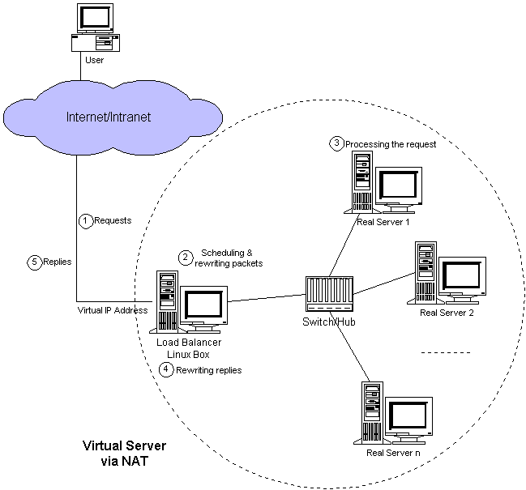
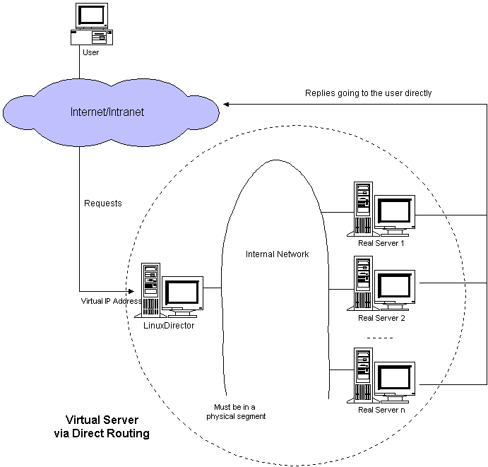
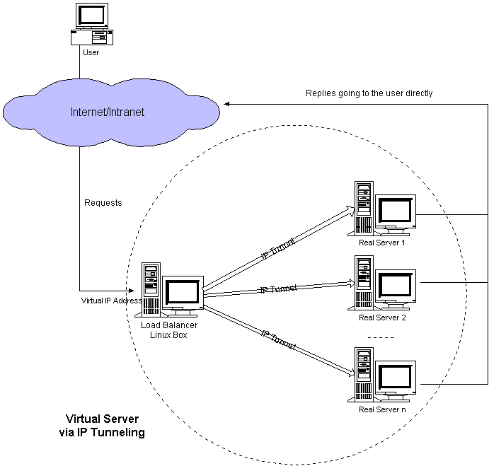

# 1、介绍

- LB集群原理：当用户的请求过来时，会直接分发到Director Server上，然后它把用户的请求根据设

置好的调度算 法，智能均衡地分发到后端真正服务器(real server)上，为了保证用户请求数据一

致，需要共享存储。

- LVS(Linux Virtual Server)Linux虚拟服务器。这是一个由章文嵩博士发起的一个开源项目，并且已

经是 Linux 内核标准的一部分。

- LVS架构从逻辑上可分为调度层、Server集群层和共享存储。

- 官方网是 

# 2、组成

- ipvs(ip virtual server)：工作在内核空间，是真正生效实现调度的代码。

- ipvsadm：工作在用户空间，负责为ipvs内核框架编写规则，定义谁是集群服务，而谁是后端真实

的服务器(Real Server)

- 相关术语介绍

- DS：Directory Server，前端负载均衡节点

- RS：Real Server，后端真实工作服务器

- VIP：用户请求目标的IP地址

- DIP：内部主机通讯的IP地址

- RIP：后端服务器的IP地址

- CIP：客户端的IP地址

# 3、NAT模式

当用户访问服务器集群提供的服务时，发往虚拟IP地址的请求数据包（负载均衡器的外部IP地址）到达

负载均衡器。负载 均衡器检查数据包的目标地址和端口号。如果根据虚拟服务器规则表匹配虚拟服务器

服务，则通过调度算法从集群中选择 真实服务器，并将连接添加到记录已建立连接的哈希表中。然后，

将目标地址和数据包的端口重写为所选服务器的目标地 址和端口，并将数据包转发到服务器。当传入数

据包属于此连接并且可以在哈希表中找到所选服务器时，将重写该数据包 并将其转发到所选服务器。当

回复数据包返回时，负载均衡器将数据包的源地址和端口重写为虚拟服务的源地址和端口。 连接终止或

超时后，连接记录将在哈希表中删除。

- 特点

- RS应该使用私有地址，网关为DIP

- DIP和RIP属于同一个网段

- 请求和响应报文都需要经过DS（性能瓶颈）

- 支持端口映射

- RS可以使用任意操作系统

# 4、DR模式

此请求调度方法类似于IBM的NetDispatcher中实现的方法。虚拟IP地址由真实服务器和负载均衡器共

享。负载均衡器的 接口也配置了虚拟IP地址，用于接受请求数据包，并直接将数据包路由到选定的服务

器。所有真实服务器的非arp别名接 口都配置了虚拟IP地址，或者将发往虚拟IP地址的数据包重定向到本

地套接字，以便真实服务器可以在本地处理数据包。 负载均衡器和真实服务器必须通过HUB/Switch物

理连接其中一个接口，负载均衡器只是将数据帧的MAC地址更改为所选 服务器的MAC地址，然后在LAN

上重新传输。这就是负载均衡器和每个服务器必须通过同一个LAN进行连接的原因。

- 特点

- 保证前端路由将目标地址为VIP报文统统发给Director Server

- RS可以使用私有地址；也可以是公网地址，如果使用公网地址，此时可以通过互联网对RIP进

行直接访问

- RS跟Director Server必须在同一个物理网络中

- 所有的请求报文经由Director Server，但响应报文必须不能经过Director Server

- 不支持地址转换，也不支持端口映射

- RS的网关绝不允许指向DIP(因为我们不允许他经过director)

- RS上的lo接口配置VIP的IP地址

因为ARP广播，想要保证目标地址为VIP报文发给DS，我们就需要只让LVS上响应VIP的arp请求，而real

server 不响应， 即：修改RS上内核参数（arp_ignore和arp_announce）将RS上的VIP配置在lo接口的

别名上，并限制其不能响应对VIP 地址解析请求。

arp_announce通告：0,1,2级

arp_ignore应答：0-8级

# 5、TUN模式

在LVS（NAT）模式的集群环境中，由于所有的数据请求及响应的数据包都需要经过LVS调度器转发，如

果后端服务器的 数量大于10台，则调度器就会成为整个集群环境的瓶颈。我们知道，数据请求包往往远

小于响应数据包的大小。因为响 应数据包中包含有客户需要的具体数据，所以LVS（TUN）的思路就是

将请求与响应数据分离，让调度器仅处理数据请 求，而让真实服务器响应数据包直接返回给客户端。

LVS/TUN工作模式拓扑结构如图3所示。其中，IP隧道（IP tunning）是一种数据包封装技术，它可以将

原始数据包封装并添加新的包头（内容包括新的源地址及端口、目标地址及 端口），从而实现将一个目

标为调度器的VIP地址的数据包封装，通过隧道转发给后端的真实服务器（Real Server），通 过将客户

端发往调度器的原始数据包封装，并在其基础上添加新的数据包头（修改目标地址为调度器选择出来的

真实服务 器的IP地址及对应端口），LVS（TUN）模式要求真实服务器可以直接与外部网络连接，真实

服务器在收到请求数据包后 直接给客户端主机响应数据。

- 特点

- RIP、VIP、DIP全是公网地址

- RS的网关不会也不可能指向DIP

- 所有的请求报文经由Director Server，但响应报文必须不能进过Director Server

- 不支持端口映射 RS的系统必须支持隧道