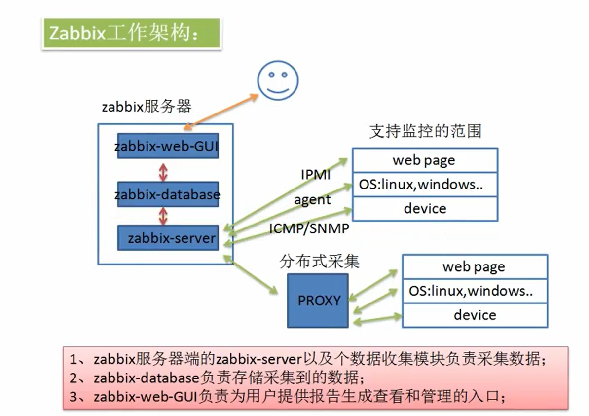
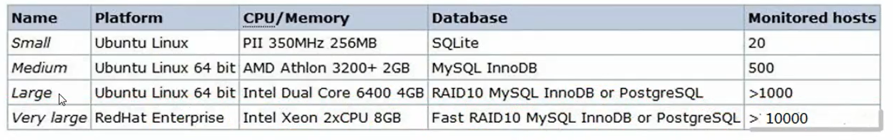
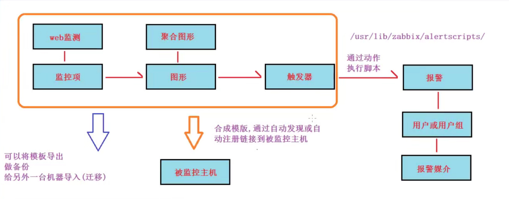

# 1 、Zabbix 介绍

## ①  Zabbix 是什么？

zabbix 是一个基于 WEB 界面的提供分布式系统监视以及网络监视功能的企业级的开源解决方案( 基于 GPL V2 )

zabbix 由 2 部分构成，zabbix server 与可选组件 zabbix agent

## ② Zabbix 工作架构

## ③ Zabbix 进程构成

zabbix 安装完成后会产生 5 个程序：zabbix_agentd、zabbix_get、zabbix_proxy、zabbix_sender、

zabbix_server，zabbix_java_gateway 是可选，这个需要另外安装

- 1 ）**zabbix_agentd ：**客户端守护进程，此进程收集客户端数据，例如 cpu 负载、内存、硬盘使用情况等

- 2 ）**zabbix_get ：**zabbix 工具，单独使用的命令，通常用于排错

- 3） **zabbix_sender：** zabbix 工具，用于发送数据给 server 或者 proxy ，在脚本完成之后使用 sender 主动将数据提交

- 4 ）**zabbix_server ：**zabbix 服务端守护进程，所有的数据都是被提交或主动提交到 zabbix_server 端

- 5 ）**zabbix_proxy ：**zabbix 代理守护进程。功能类似 server，唯一不同的是它只是一个中转站，它需要把收集到的数据提交/被提交到 server 里

- 6 ）**zabbix_java_gateway** ：zabbix2.0 之后引入的一个功能。顾名思义：Java 网关，类似 agentd，但是只用于 Java 方面。需要特别注意的是，它只能主动去获取数据，而不能被动获取数据。它的数据最终会给到 server 或者 proxy

## ④ Zabbix 硬件需求

