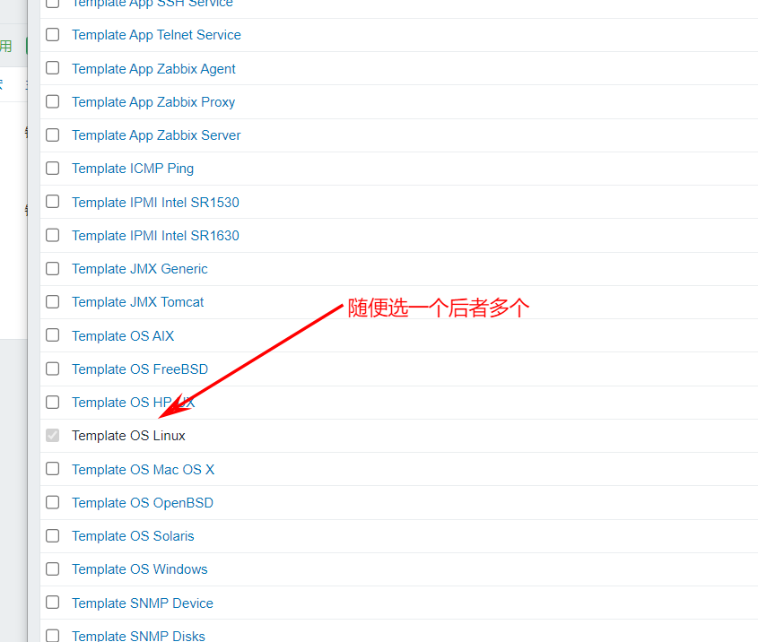

**构建 Zabbix 监控服务器**

# 1、初始化系统设置

```shell
systemctl stop firewalld
systemctl disable firewalld
setenforce 0
sed -i "s/SELINUX=enforcing/SELINUX=disabled/g" /etc/selinux/config
```

## 1.1 安装 LAMP 环境

```shell
wget 
yum clean all
yum makecache
yum -y install mariadb mariadb-server httpd php php-mysql
systemctl enable httpd
systemctl restart httpd
systemctl enable mariadb
systemctl restart mariadb
mysql_secure_installation
```

## 1.2 安装 Zabbix 程序

```auto
rpm -ivh 
rpm --import /etc/pki/rpm-gpg/RPM-GPG-KEY-ZABBIX
yum -y install zabbix-server-mysql zabbix-web-mysql zabbix-agent
```

### 初始化数据库：

```auto
mysql -u root -p
CREATE DATABASE zabbix DEFAULT CHARACTER SET utf8 COLLATE utf8_bin;
grant all privileges on zabbix.* to zabbix@localhost identified by 'zabbix';
```

### 读入数据库

```auto
cd /usr/share/doc/zabbix-server-mysql-3.2.1
zcat create.sql.gz | mysql -uroot -p zabbix
```

### 启动 Zabbix 服务

```auto
vim /etc/zabbix/zabbix_server.conf
DBHost=localhost
DBName=zabbix
DBUser=zabbix
DBPassword=zabbix
ListenIP=0.0.0.0                      #所有人都可访问
DBSocket=/Var/lib/mysq1/mysql.sock    #这里默认的socket路径不对，改成我这个路径
systemctl start zabbix-server
systemctl enable zabbix-server
```

### 编辑 zabbix 前端 php 配置

```auto
vim /etc/httpd/conf.d/zabbix.conf
php_value max_execution_time 300
php_value memory_limit 128M
php_value post_max_size 16M
php_value upload_max_filesize 2M
php_value max_input_time 300
php_value always_populate_raw_post_data -1
php_value date.timezone Asia/Shanghai            #更改时间
```

### 调整时间同步

```auto
yum -y install ntpdate
ntpdate cn.pool.ntp.org
```

### 重启 Apache 服务生效

```auto
systemctl restart httpd
```

## 1.3 修改中文乱码问题

```auto
vim /usr/share/zabbix/include/defines.inc.php
修改 zabbix php 页面配置，将'graphfont' 修改为 msyh
define('ZBX_GRAPH_FONT_NAME', 'msyh');
```

## 1.4 添加本地客户端zabbix-agent

```auto
vi /usr/local/zabbix/etc/zabbix_agentd.configure
LogFile=/tmp/zabbix_agentd.log
Server= 192.168.1.195            #指定zabbix服务器的地址，也就允许连接的地址
ServerActive= 192.168.1.195
Hostname=192.168.1.195
systemctl start zabbix-agent
systemctl enabe zabbix-agent
rpm -ivh 
```


# 2、添加远程客户端

## 2.1 添加远程客户机ip地址

- 回到web管理界面-->点击配置-->点击主机-->点击创建主机


- 填入相关信息，然后点添加


- 添加成功


## 2.2 添加模板

- 点击主机名称


- 选择模板


- 



- 


- 


> 
> **到此添加模板完成！！！**


# 3、zabbix用户与用户群组

**用户(user): **

- 创建用户


- 添加相关信息


- 效果


# 4、主机和主机群组

**主机(host):**

web管理界面--》管理--》主机

前面监控本机和远程机器时操作过，这里不再截图

**主机群组(hostgrou:**

web管理界面--》管理·-》主机群组

- 创建主机群组


- 添加相关信息


- 效果

